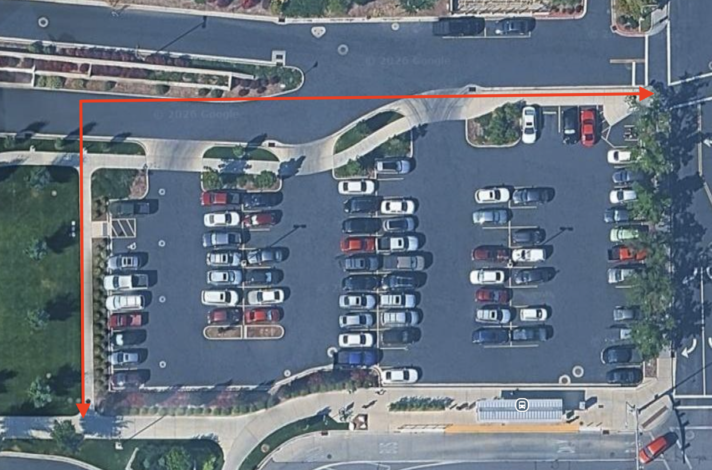

# Measurement Lab

!!! abstract "Key Takeaways"
    - Measurement accuracy depends on both the tool being used and the person collecting or interpreting the measurement.
    - Calibrating your pace provides a simple method for estimating distances in the field.
    - Different measurement methods provide different levels of accuracy, effort, and efficiency.
    - High-resolution drone imagery and GIS software can be used to make detailed measurements without physically measuring every feature in the field.
    - Understanding uncertainty and sources of error is an important part of evaluating any measurement.

---

## Background

Accurate measurement of distance and area is important in engineering, construction, surveying, and site development. Measurements may be used for tasks such as site planning, cost estimation, drainage design, quantity calculations, and infrastructure layout.

There are many different ways to obtain these measurements.

Traditional field methods, such as pacing or using a measuring tape, allow measurements to be made directly at a site. These methods can be quick and inexpensive, but their accuracy may depend heavily on the person performing the measurement and the conditions in the field.

Web-based mapping tools, such as Google Maps, allow measurements to be made remotely using aerial or satellite imagery. These tools are convenient, but the resolution, age, and accuracy of the available imagery may limit the precision of the measurement.

Drone imagery provides another method for collecting measurement data. A series of overlapping aerial photographs can be processed into an orthomosaic, which combines many individual photographs into a single geometrically corrected image. GIS software, such as QGIS, can then be used to measure distances and areas directly from that imagery.

In this lab, you will compare three different methods for estimating area:

* **Human Pacing** – A traditional field estimation method
* **Google Maps** – A web-based aerial imagery measurement method
* **QGIS and Drone Orthomosaic** – A GIS-based measurement using high-resolution drone imagery

The goal is not only to determine which method produces the most accurate result, but also to consider the advantages, limitations, and possible sources of error associated with each method.

---

## Objectives

By completing this lab, students will:

1. Calibrate their walking pace in feet per step.
2. Use pacing to estimate distances and areas in the field.
3. Measure the dimensions of a parking stall and driving lane.
4. Use Google Maps to estimate area from aerial imagery.
5. Use QGIS and a drone-generated orthomosaic to measure area.
6. Compare measurements obtained using different methods.
7. Identify sources of uncertainty and measurement error.
8. Evaluate when different measurement methods may be appropriate.

---

## Required Materials

1. Measuring tape or known-distance reference provided by the TAs
2. Google Maps  (web browser)
3. QGIS software
4. **EB-Parking-1-22-26-orthophoto.tif** (provided below)
5. Lab Worksheet
6. Calculator, if needed

---

## Lab Overview

This lab will focus on comparing several methods for measuring the same physical area.

You will begin by calibrating your walking pace using a known distance. You will then use your calibrated pace to estimate the dimensions of the parking lot east of the Engineering Building.

After completing the field measurements, you will measure the same area using Google Maps.

Finally, you will use a high-resolution orthomosaic collected by a drone and measure the parking lot using QGIS.

Throughout the lab, pay attention to:

* How easy each method is to use
* How much time each method requires
* How clearly you can identify the feature being measured
* Possible sources of measurement error
* How closely the results from the different methods agree

!!! question "Prediction Challenge"
    Before beginning the measurements, rank the three methods from **Most Accurate** to **Least Accurate**.

    - **Human Pacing** (Traditional field method)
    - **Google Maps** (Web-based remote sensing)
    - **GIS (QGIS)** (Professional-grade orthomosaic measurement)

    How much of a difference, in square feet, do you think there will be between your pacing estimate and the QGIS measurement?

---

## Activity Instructions

You may complete this lab using either the **online results table** or a printed **lab worksheet**.

!!! success "Lab Materials"
    [**Open the Measurement Results Table**](#measurement-results)

    **Printable Lab Worksheet:** Coming Soon

Use one of these resources to record your measurements, calculations, observations, and sources of uncertainty as you work through the lab.

Make sure you keep your results organized, as you will use them later to compare the different measurement methods and complete the lab questions.

### Part 1 – Pace Calibration

Before using pacing to estimate a distance, you first need to determine the approximate length of your normal walking pace.

The TAs will establish a straight 100-ft reference distance.

1. Walk the 100-ft distance at your normal walking pace.
2. Count the number of steps you take.
3. Record the number of steps.
4. Repeat the measurement at least three (3) times.
5. Calculate your average number of steps over the 100-ft distance.

Use the following equation to calculate your pace length:

$$
\text{Feet per step} = \frac{100\text{ ft}}{\text{average number of steps}}
$$

Record your calculated pace length. You will use this value during the next part of the lab.

!!! note "Walk Normally"
    Do not intentionally stretch or shorten your stride while calibrating your pace. The goal is to determine the approximate distance you travel during a normal step.

---

### Part 2 – Parking Lot Measurement by Pacing

You will now use your calibrated pace to estimate the dimensions of the parking lot located just east of the Engineering Building.

The parking lot is not a perfect rectangle. For this activity, you will measure the approximate length and width shown in the image below and treat the lot as a rectangle.

1. Pace the designated length of the parking lot.
2. Record the number of steps.
3. Pace the designated width of the parking lot.
4. Record the number of steps.
5. Convert both measurements from steps to feet using your calibrated pace length.

Use:

$$
\text{Distance} = (\text{number of steps})(\text{feet per step})
$$

Estimate the parking lot area using:

$$
A_{\text{lot,pacing}} =
(\text{length in ft})(\text{width in ft})
$$

Record your estimated area.

#### Parking Stall Measurement

Select a single parking stall as directed by the instructor or TA.

1. Measure or estimate the length of the parking stall.
2. Measure or estimate the width.
3. Calculate the approximate area.

$$
A_{\text{stall}} =
(\text{length})(\text{width})
$$

### Parking Stall Count Estimate

Next, use the parking stalls to create another rough estimate of the parking lot area.

1. Count the number of parking stalls visible within the designated parking lot.
2. Use the area of the parking stall you measured earlier.
3. Estimate the total area occupied by the parking stalls using:

$$
A_{\text{stall estimate}} =
(\text{number of stalls})(\text{area of one stall})
$$

4. Record your result.

!!! question "What Is Missing?"
    Does this value represent the total area of the parking lot?

    Consider what parts of the parking lot are not included when you estimate the area using only the parking stalls.

#### Driving Lane Measurement

Measure the width of the driving lane located between the rows of parking stalls.

Record this value on your worksheet.

!!! note "Uncertainty Log"
    While completing your field measurements, identify at least two possible sources of error or uncertainty.

Examples might include:

* Changes in your stride length
* Walking around a parked vehicle
* Pavement slope
* Difficulty determining the exact beginning or ending point
* Losing count of your steps

Record your observations on your worksheet.

---

### Part 3 – Google Maps Measurement 

You will now estimate the same areas using aerial imagery available through Google Maps.

1. Open Google Maps.
2. Navigate to the parking lot east of the Engineering Building.
3. Switch to satellite imagery.
4. Right-click on the map and select Measure distance.
5. Use the measurement tool to trace the boundary of a single parking stall.
6. Record the approximate area of the parking stall in square feet.
7. Trace the boundary of the entire parking lot.
8. Record the total parking lot area in square feet.

When tracing the parking lot, measure the asphalt area only.

Avoid including:

* Sidewalks
* Grass
* Landscaping
* Adjacent roads

Zoom in as closely as necessary to identify the parking lot boundary.

!!! question "Image Interpretation"
    How easy is it to determine exactly where the pavement ends using the available Google Maps imagery?

    Consider how uncertainty in identifying the boundary could affect your calculated area.

---

### Part 4 – Drone Orthomosaic Measurement in QGIS

For the final measurement method, you will use high-resolution aerial imagery collected by a drone.

The individual drone photographs have already been processed into an orthomosaic. An orthomosaic combines multiple overlapping photographs into a single geometrically corrected image that can be used for mapping and measurement.

!!! success "Download the Lab Image"
    [**Download EB-Parking-1-22-26-orthophoto.tif**](https://byu.sharepoint.com/:i:/s/CEDroneClass/IQBihTemBdyeQoa21AmGFfznAev9rZIMYF_WNmvkp7KsD3s?download=1){target="_blank"}

#### Load the Orthomosaic

1. Open QGIS.
2. Load EB-Parking-1-22-26-orthophoto.tif.
3. Locate the parking lot used during the previous portions of the lab.
4. Zoom in and examine the image resolution.

#### Measure a Parking Stall

1. Locate the same or a similar parking stall measured previously.
2. Use the Polygon tool to trace the parking stall boundary.
3. Use the Field Calculator to determine the area.
4. Record the area in square feet.

#### Measure the Parking Lot

1. Trace the boundary of the entire parking lot using the Polygon tool.
2. Follow the edge of the asphalt as closely as possible.
3. Calculate the area using the Field Calculator.
4. Record the total area in square feet.

!!! note "Look Closely"
    Compare the level of detail visible in the drone orthomosaic with the imagery available in Google Maps.

    Consider whether the higher-resolution imagery makes it easier to determine exactly where the feature being measured begins and ends.

---

## Measurement Results

Record your results below.

| Measurement Method       | Parking Stall Area (ft²) | Parking Lot Area (ft²) |
|--------------------------|-------------------------:|-----------------------:|
| Pacing                   |                          |                        |
| Google Maps              |                          |                        |
| QGIS / Drone Orthomosaic |                          |                        |

---

## Compare Your Results

After completing all measurement methods, compare your results.

Record and compare:

* Parking stall area from pacing
* Parking stall area from Google Maps
* Parking stall area from QGIS
* Parking lot area from pacing
* Parking lot area from the parking stall count estimate
* Parking lot area from Google Maps
* Parking lot area from QGIS

Consider:

* Which measurements are closest to each other?
* Which method produced the largest area?
* Which produced the smallest?
* Why is the parking stall count estimate different from the full parking lot measurements?
* What sources of uncertainty affected each method?
* Are the differences large enough to matter in an engineering application?

!!! question "Return to Your Prediction"
    Compare your results with the prediction you made at the beginning of the lab.

    Was your original ranking of the three primary measurement methods correct?

    Was the difference between the pacing and QGIS measurements larger or smaller than you expected?

---

## In Lab Reflection

Before leaving the lab, consider the following questions:

* **Prediction Check**: Did the measurement methods rank in accuracy the way you predicted at the beginning of the lab? Why or why not?
* **The Winner**: Which method produced the largest value? Which produced the smallest?
* **Accuracy vs. Effort**: Which method required the most effort? Which was the fastest or easiest to complete?
* **Field Measurement**: What were the largest sources of error or uncertainty when using pacing?
* **Resolution Impact**: How did the resolution of the drone imagery affect your ability to identify and measure the parking lot boundary compared with Google Maps?
* **The "Ground Truth"**: If the measurements do not match, which result do you trust most? What evidence supports your choice?
* **Choosing a Method**: In what situation might pacing be appropriate? When might Google Maps be sufficient? When would drone imagery and GIS be worth the additional time and effort?
* **Engineering Impact**: How could measurement uncertainty affect an engineering or construction decision?

You will be asked to answer these questions in the Learning Suite quiz associated with this lab.

---

## Homework

Complete the questions associated with this lab in Learning Suite.

Use your measurements and observations from the lab to support your responses.

Be prepared to discuss:

* Differences between the three measurement methods
* Sources of measurement error
* Accuracy versus effort
* The advantages of high-resolution drone imagery
* How measurement uncertainty could affect engineering decisions

---

## Looking Ahead

In the next lab, you will apply concepts introduced in the upcoming lecture to plan an actual aerial mapping mission.

Working in groups, you will create a flight plan for a short mapping mission at **Rock Canyon Park**. Your group will need to make decisions about how the drone should fly while working within the time and operational constraints of the mission.

You will consider factors such as:

* Mission objective
* Flight altitude
* Camera angle
* Front overlap
* Side overlap
* Flight speed
* Total flight time
* Battery usage
* Terrain elevation
* Coordination with other flight groups

These decisions directly affect both the efficiency of the flight and the quality of the imagery collected.

For example, changing the flight altitude can affect image detail, the number of photographs required, and the total mission duration. Changing image overlap can affect how well photographs can be matched together when creating a model or orthomosaic. 

The goal of the next lab is to move from **using completed drone imagery** to understanding how a mapping mission is designed before the aircraft ever leaves the ground.

As you prepare for the next lab, begin thinking about an important question:

!!! question "Planning Tradeoffs"
    If you want higher-quality imagery, what changes might you make to the flight plan?

    What tradeoffs could those changes create in flight time, battery usage, number of photographs, or processing requirements?