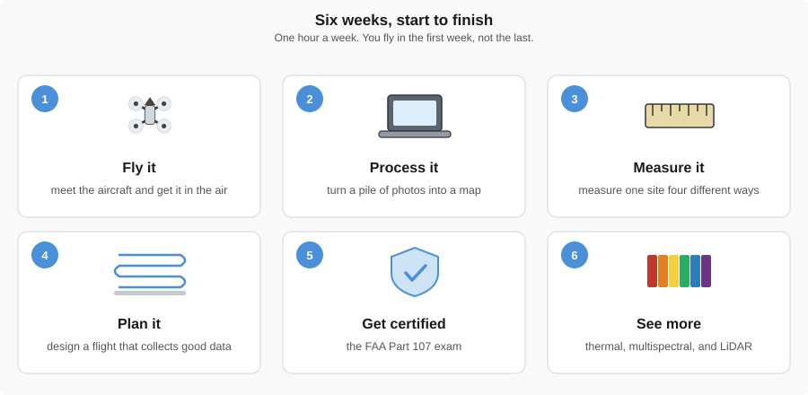
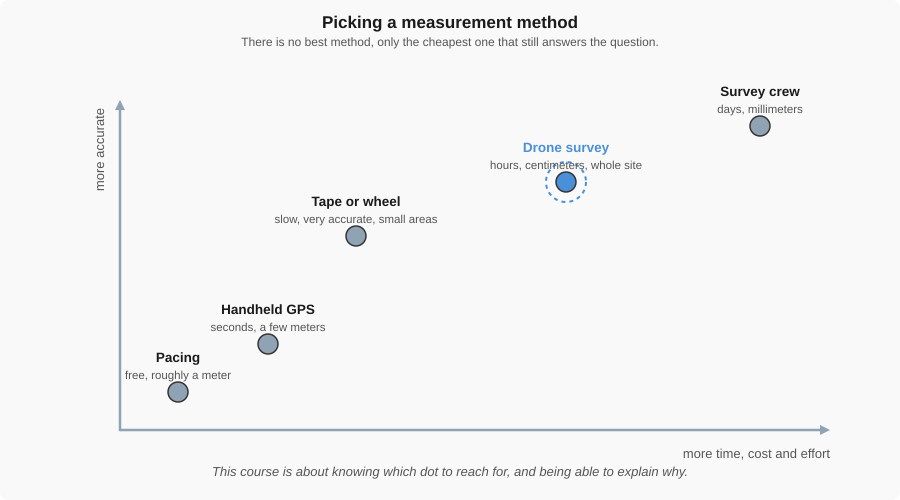
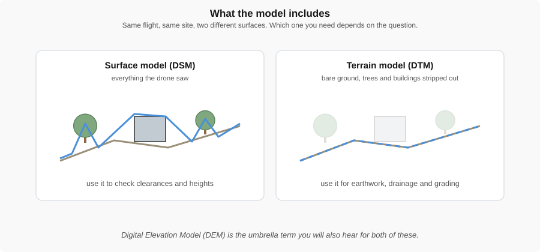

# Welcome to Drone Measurements

{ width="100%" }

You will fly a drone in the first week of this class. By the end of the semester you will be able to
put one over a construction site, turn what it saw into a map, measure something off that map, and
defend the number when a client asks where it came from.

That last part is what makes this an engineering course rather than a flying course.

!!! abstract "Key Takeaways"
    - **A drone is a measuring instrument.** It happens to fly. What matters is the data it brings
      back.
    - **Accuracy is something you buy.** More of it costs more time, money, and effort. Deciding how
      much you actually need is part of the job.
    - **You have to be able to defend the number.** Anyone can produce a measurement. An engineer
      can explain why it is good enough for the decision being made.

---

## What you'll do this semester

{ width="100%" }

*Six weeks, one hour each. Every week builds on the one before it.*

Each week is a short lecture followed by something you actually do: a flight, a lab, or a piece of
software. The [flight checklists](../flight_check_list/index.md) and
[Flight Basics](flight_basics.md) are there whenever you need them.

---

## Why engineers care

Every project has a budget and a deadline. A measurement ten times more accurate than the decision
requires is wasted money. One that is not accurate enough is worse than useless, because it still
looks like an answer.

{ width="100%" }

*A drone sits between a tape measure and a survey crew: it covers a whole site quickly and gets
close to survey accuracy.*

Drones did not replace any of the older methods. They filled a gap nothing else covered well, which
is large areas, quickly, at an accuracy good enough for most civil work. That is why they turned up
on construction sites so fast.

---

## What you get from a flight

A drone flight produces photographs. Software turns those photographs into things you can measure.

{ width="100%" }

*The same set of photos becomes a map, then a surface, then a number you can put in a report.*

{ width="100%" }

*Whether you keep the trees and buildings or strip them out depends entirely on the question you
are answering.*

---

!!! question "Activity: The Right Tool for the Job"
    As an engineer, you must decide how much accuracy you actually need. Match the following scenarios to the most appropriate measurement method:

    **Scenarios:**
    1.  **Site Reconnaissance:** You need to see if a remote 100-acre field has large boulders or trees before sending a crew.
    2.  **Structural Monitoring:** You are checking if a bridge support beam has settled by more than 5 millimeters in the last year.
    3.  **Earthwork Volume:** You need to estimate the volume of a 50-foot tall dirt stockpile for a weekly billing report.

    **Methods:**
    - **A. Manual/Approximate:** Pacing or simple aerial photos.
    - **B. High-Precision Drone Survey:** Orthomosaic and 3D reconstruction with ground control points.
    - **C. Specialized Survey:** High-order GPS or total station.

    *Think about it:* Why would using a high-precision drone survey for Scenario #1 be a waste of resources? Why would Scenario #2 require even more than a standard drone?

---

## What you need

- **Nothing to buy.** Aircraft, controllers, and batteries are provided.
- **A laptop** that can run QGIS, which is free.
- **Closed-toe shoes and a jacket.** Some of this class happens outside.
- **No prior experience.** Most students arrive having never flown anything.

??? note "Course learning objectives"
    By the end of this course, students will be able to:

    - Apply drone-based measurement techniques to civil engineering problems
    - Evaluate the accuracy and limitations of different measurement methods
    - Integrate drone-derived data into engineering analysis and design workflows
    - Make informed, ethical, and defensible engineering decisions based on measured data

---

Next up: [Flight Basics](flight_basics.md), which covers the aircraft, the controller, and how to
get it into the air and back again.
