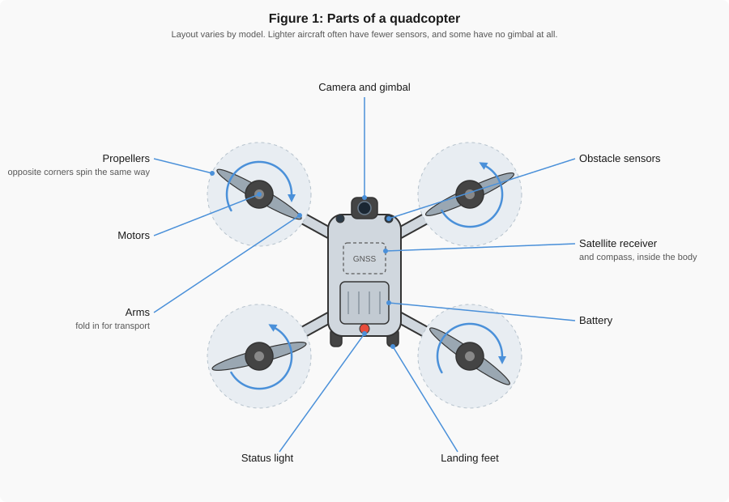
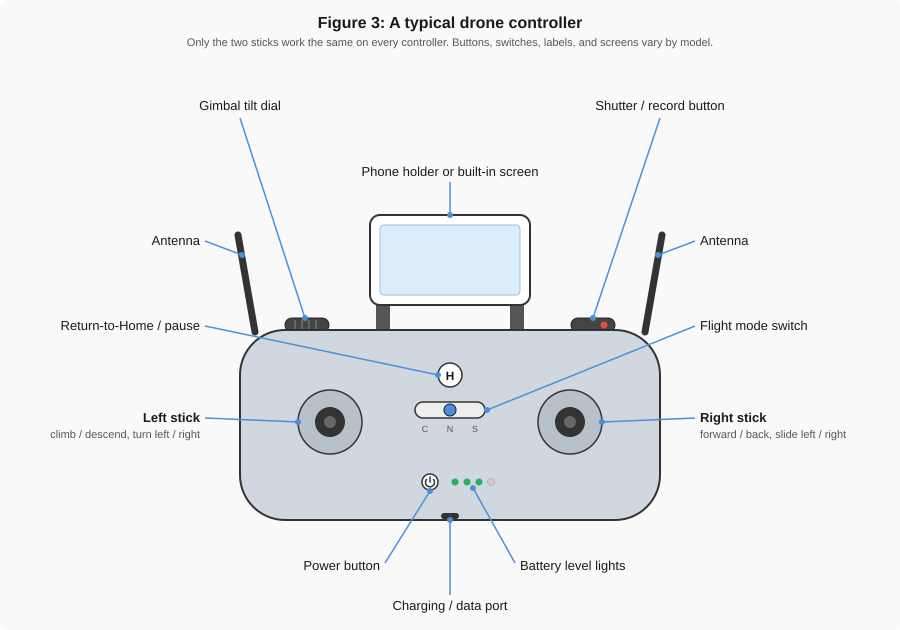

# Flight Basics

!!! abstract "Key Takeaways"
    - **A drone is a flying sensor platform.** For engineering work, the camera, the satellite
      receiver, and the gimbal decide the quality of your data. Everything else exists to hold
      them steady in the air.
    - **Four rotors, two spinning each way.** Speeding some up and slowing others produces every
      motion the aircraft can make.
    - **Left stick controls altitude and heading. Right stick moves the aircraft.** Both are
      relative to the nose of the drone, not to where you are standing.
    - **Return to Home is the safety net.** Know what triggers it, and where "home" is, before
      you take off.

!!! note "Not every drone is the same"
    This page describes controls and features that are common across small drones. Inexpensive
    models may have no satellite positioning, no obstacle sensors, and no gimbal. Professional
    aircraft add interchangeable sensors and redundant systems. **Only the two control sticks work
    the same way on nearly every aircraft.** Button names, switch positions, and screens vary from
    model to model, so always check the manual for the drone you are actually flying.

---

## Parts of the Aircraft

{ width="100%" }

*Figure 1: The main parts of a small quadcopter, seen from above. Propellers on opposite corners
spin the same direction, which is what lets the aircraft turn without tipping.*

| Part | What it does | What happens when it fails |
|------|--------------|----------------------------|
| Propellers | Push air downward to create lift | A chipped or bent blade causes vibration, which blurs photos and shortens flight time |
| Motors | Spin the propellers; changing their speeds steers the aircraft | The aircraft cannot hold a level hover |
| Battery | Powers everything, and usually sets the limit on flight time | Sudden power loss, or a forced landing somewhere you did not choose |
| Camera and gimbal | Collect the data; the gimbal holds the camera steady and level | Tilted horizons and motion blur, which make measurements unusable |
| Satellite receiver and compass | Tell the aircraft where it is and which way it is facing | The aircraft drifts, or flies the wrong direction during Return to Home |
| Obstacle sensors | Detect objects in the flight path and stop or steer around them | Collisions with obstacles the pilot did not notice |
| Status light | Reports what the aircraft is doing: ready, waiting, or in an error state | You take off before the drone is actually ready |

!!! tip "Which parts decide your data quality"
    Three parts do most of the work for engineering measurements. The **camera** sets how much
    detail you capture, the **gimbal** keeps that detail sharp and level, and the **satellite
    receiver** records where each photo was taken. Everything else exists to hold those three
    steady in the air.

---

## Cameras, Sensors, and Payloads

*[Figure 3 — payload icon strip. Standard camera, thermal, multispectral, LiDAR, gas detector,
delivery or drop mechanism.]*

---

## How a Drone Flies

*[Figure 4 — aircraft axes. Pitch, roll, and yaw arrows on the aircraft outline.]*

*[Figure 5 (optional) — hover balance. Four thrust arrows against one weight arrow.]*

*[Figure 6 — differential thrust, four panels: hover, climb, pitch forward, yaw right. Motor speed
shown by arrow size.]*

---

## The Controller

{ width="100%" }

*Figure 7: A typical controller. The two sticks work the same way on nearly every aircraft. Buttons
and switches are named differently from one manufacturer to the next.*

| Control | What it does | Also called |
|---------|--------------|-------------|
| Left stick | Climbs, descends, and turns the nose left or right | Throttle and yaw |
| Right stick | Moves the aircraft forward, back, left, and right | Pitch and roll |
| Power button | Turns the controller on and shows its battery level | — |
| Return to Home | Pauses the flight, or sends the aircraft back to where it took off | RTH, Home, or the house symbol |
| Flight mode switch | Changes the speed limit and how much the aircraft helps you | Cine / Normal / Sport, or Beginner / Normal |
| Gimbal tilt dial | Tilts the camera up and down during flight | Gimbal wheel, camera dial |
| Shutter and record | Takes a photo, or starts and stops video | — |
| Antennas | Carry the radio link to the aircraft; point the flat face toward the drone | — |

!!! note "Phone or built-in screen"
    Some controllers clamp your phone and run the flight app on it. Others have a screen built in
    and need no phone at all. The sticks and buttons work the same way in both cases; only the
    display is different.

---

## Stick Controls

*[Figure 8 — stick inputs to aircraft motion, eight mini panels.]*

*[Figure 9 — nose-in reversal. Two panels: aircraft facing away, then facing the pilot, same stick
input, opposite apparent motion.]*

---

## Automated Flight Functions

*[Figure 10 — home point and position hold. Satellites, aircraft, home marker, and the drift arrow
that appears when the satellite signal is lost.]*

*[Figure 11 — obstacle sensor coverage, top view, with the blind zones shaded.]*

*[Figure 12 — battery states bar: normal, warning, forced return, forced landing.]*

*[Figure 13 — Return to Home profile, side view, showing the climb to a safe altitude over a tree
line before flying home.]*

---

## A Basic Flight, Start to Finish

*[Figure 14 — flight sequence strip, nine icons from unfold to power off.]*

*[Figure 15 (optional) — box and hover practice pattern, top view.]*

---

## Rules in One Screen

*[Reuse Figure 13 (visual line of sight) and Figure 14 (400 ft AGL) from
[Week 5](../week_05/FAA_Exam_Planning_and_Overview.md).]*

---

## Check Your Understanding

*[Five questions, including the numbered controller figure used for the homework.]*

---

## Resources

*[Pre-class videos, plus manufacturer references for the controllers used in class.]*
