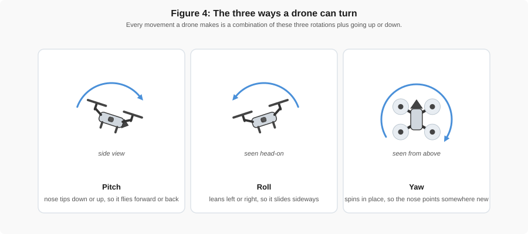
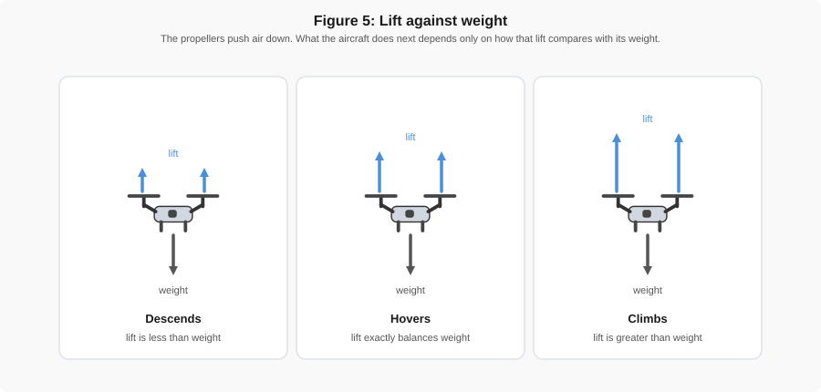
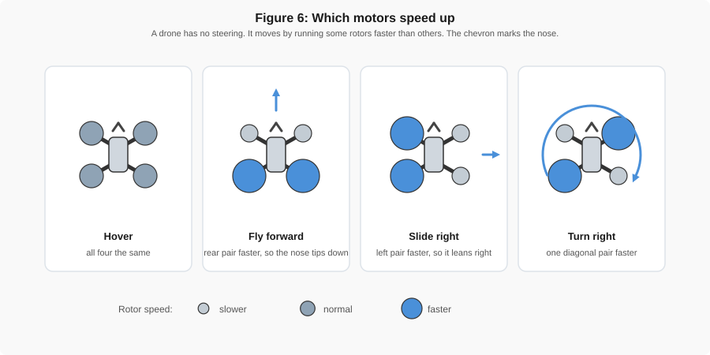
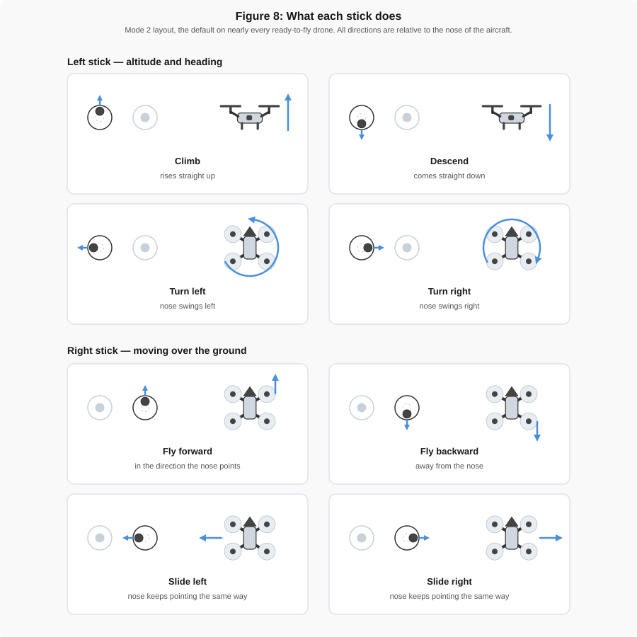
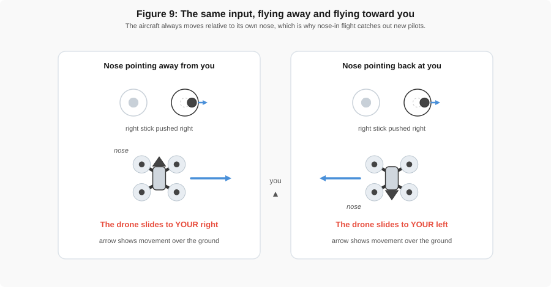
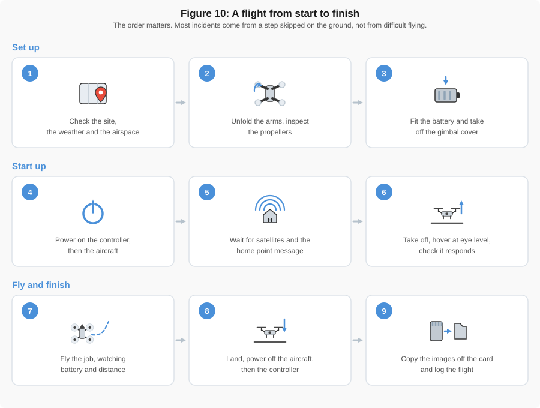

# Flight Basics

!!! abstract "Key Takeaways"
    - **A drone is a flying sensor platform.** For engineering work, the camera, the satellite
      receiver, and the gimbal decide the quality of your data. Everything else exists to hold
      them steady in the air.
    - **Four rotors, two spinning each way.** Speeding some up and slowing others produces every
      motion the aircraft can make.
    - **Left stick controls altitude and heading. Right stick moves the aircraft.** Both are
      relative to the nose of the drone, not to where you are standing.
    - **Return to Home is the safety net.** Know what triggers it, and where "home" is, before
      you take off.

!!! note "Not every drone is the same"
    This page describes controls and features that are common across small drones. Inexpensive
    models may have no satellite positioning, no obstacle sensors, and no gimbal. Professional
    aircraft add interchangeable sensors and redundant systems. **Only the two control sticks work
    the same way on nearly every aircraft.** Button names, switch positions, and screens vary from
    model to model, so always check the manual for the drone you are actually flying.

---

## Parts of the Aircraft

{ width="100%" }

*Figure 1: The main parts of a small quadcopter, seen from above. Propellers on opposite corners
spin the same direction, which is what lets the aircraft turn without tipping.*

| Part | What it does | What happens when it fails |
|------|--------------|----------------------------|
| Propellers | Push air downward to create lift | A chipped or bent blade causes vibration, which blurs photos and shortens flight time |
| Motors | Spin the propellers; changing their speeds steers the aircraft | The aircraft cannot hold a level hover |
| Battery | Powers everything, and usually sets the limit on flight time | Sudden power loss, or a forced landing somewhere you did not choose |
| Camera and gimbal | Collect the data; the gimbal holds the camera steady and level | Tilted horizons and motion blur, which make measurements unusable |
| Satellite receiver and compass | Tell the aircraft where it is and which way it is facing | The aircraft drifts, or flies the wrong direction during Return to Home |
| Obstacle sensors | Detect objects in the flight path and stop or steer around them | Collisions with obstacles the pilot did not notice |
| Status light | Reports what the aircraft is doing: ready, waiting, or in an error state | You take off before the drone is actually ready |

!!! tip "Which parts decide your data quality"
    Three parts do most of the work for engineering measurements. The **camera** sets how much
    detail you capture, the **gimbal** keeps that detail sharp and level, and the **satellite
    receiver** records where each photo was taken. Everything else exists to hold those three
    steady in the air.

---

## Cameras, Sensors, and Payloads

For engineering work the sensor **is** the instrument, and the aircraft is the tripod that carries
it. On most small drones the camera is fixed in place and the whole airframe is built around it.
Larger professional aircraft take **interchangeable payloads**, so one aircraft can carry whichever
sensor the job needs.

{ width="100%" }

*Figure 3: Common drone payloads. Which one you need depends entirely on what you are trying to
measure.*

| Payload | Answers the question | Covered in |
|---------|----------------------|------------|
| Standard camera | What does the site look like, and what are its dimensions? | Weeks 2 to 4 |
| Thermal | Where is heat escaping, or where is moisture trapped? | [Week 6](../week_06/Thermal.md) |
| Multispectral | How healthy is the vegetation, and where is bare ground? | [Week 6](../week_06/Multispectral.md) |
| LiDAR | What is the ground surface underneath the trees? | [Week 6](../week_06/LiDAR.md) |
| Gas detector | Is there a leak, and where is it coming from? | not covered in this course |

Other payloads exist for specific jobs, including speakers, spotlights, and release mechanisms for
delivering small loads.

!!! tip "Choosing a payload is an engineering decision"
    Every step up in capability costs money, weight, flight time, and processing effort. A standard
    camera answers most civil engineering questions perfectly well. Reach for thermal,
    multispectral, or LiDAR when the question genuinely requires it, and be ready to explain why it
    did.

---

## How a Drone Flies

A drone has no wings, no rudder, and nothing that steers. It has four propellers that only spin
faster or slower. Everything the aircraft does comes from that one control.

{ width="100%" }

*Figure 4: The three rotations. Every flight path is some combination of these, plus climbing and
descending.*

### Staying in the air

Propellers push air downward, and the air pushes back. That upward push is **lift**. Whether the
aircraft rises, holds still, or sinks depends only on how lift compares with the weight of the
aircraft.

{ width="100%" }

*Figure 5: Lift greater than weight means climbing, lift equal to weight means hovering, and lift
less than weight means descending.*

### Steering without a rudder

To move in any direction, the flight controller speeds some rotors up and slows others down. You
never do this yourself; you move a stick, and the aircraft works out the rotor speeds hundreds of
times a second.

{ width="100%" }

*Figure 6: Speeding up the rear pair tips the nose down and the aircraft moves forward. Speeding up
one diagonal pair turns it. Speeding up all four makes it climb.*

!!! note "Why the propellers spin in opposite directions"
    A spinning propeller tries to twist the aircraft the opposite way. Two propellers turn one
    direction and two turn the other, so in a steady hover those twists cancel out. Speeding up one
    diagonal pair unbalances them on purpose, and the aircraft yaws. This is also why a propeller
    fitted in the wrong position will not fly.

!!! warning "Everything costs battery"
    Fighting wind, climbing, and flying fast all mean running the motors harder. A drone in a stiff
    breeze can use its battery far faster than the remaining-time estimate suggests, because that
    estimate assumes calm conditions.

---

## The Controller

{ width="100%" }

*Figure 7: A typical controller. The two sticks work the same way on nearly every aircraft. Buttons
and switches are named differently from one manufacturer to the next.*

| Control | What it does | Also called |
|---------|--------------|-------------|
| Left stick | Climbs, descends, and turns the nose left or right | Throttle and yaw |
| Right stick | Moves the aircraft forward, back, left, and right | Pitch and roll |
| Power button | Turns the controller on and shows its battery level | — |
| Return to Home | Pauses the flight, or sends the aircraft back to where it took off | RTH, Home, or the house symbol |
| Flight mode switch | Changes the speed limit and how much the aircraft helps you | Cine / Normal / Sport, or Beginner / Normal |
| Gimbal tilt dial | Tilts the camera up and down during flight | Gimbal wheel, camera dial |
| Shutter and record | Takes a photo, or starts and stops video | — |
| Antennas | Carry the radio link to the aircraft; point the flat face toward the drone | — |

!!! note "Phone or built-in screen"
    Some controllers clamp your phone and run the flight app on it. Others have a screen built in
    and need no phone at all. The sticks and buttons work the same way in both cases; only the
    display is different.

---

## Stick Controls

Nearly every ready-to-fly drone uses the **Mode 2** layout. The left stick handles altitude and
heading, and the right stick moves the aircraft over the ground. Both sticks spring back to centre
when you let go, and the aircraft simply holds position.

{ width="100%" }

*Figure 8: The eight stick inputs. In each panel the dark stick is the one you move; the pale one
stays where it is.*

!!! warning "The nose decides left and right, not you"
    Stick directions are relative to the **nose of the aircraft**, not to where you are standing.
    While the drone flies away from you, its left matches your left. Turn it around to face you and
    everything reverses: pushing right sends it to your left. This single fact causes more beginner
    crashes than anything else.

{ width="100%" }

*Figure 9: The same stick input gives opposite results depending on which way the nose points.*

!!! tip "Two habits that prevent most crashes"
    Keep the nose pointed away from you while you are learning, and use small stick movements. The
    controls are far more sensitive than they look, and a gentle push is almost always enough.

!!! note "The flight mode changes how the sticks feel"
    Many drones have two or three flight modes, commonly labelled **Cine**, **Normal**, and
    **Sport**, though some manufacturers use names such as Beginner and Normal instead. The same
    stick movement produces a different result in each one:

    - **Cine** slows everything down and softens the response, for smooth video.
    - **Normal** is the everyday setting and what you will use for most measurement flights.
    - **Sport** raises the speed limit and makes the aircraft respond sharply. On many models it
      also **turns obstacle sensing off** and lengthens the braking distance.

    Check which mode the switch is in before you take off. More on this in
    [Automated Flight Functions](#automated-flight-functions) below.

---

## A Basic Flight, Start to Finish

Every flight follows the same nine steps, whether it is a two-minute check or a full survey. Run
them in the same order every time, especially on the flights that feel routine.

{ width="100%" }

*Figure 10: A flight from start to finish. The three phases are setting up on the ground, starting
up and checking, then flying and packing away.*

!!! note "Why the power order matters"
    Turn the **controller on first and off last**. If the aircraft is powered while the controller
    is not, it has nothing to listen to. Depending on the model it may sit there refusing to arm,
    or it may start a Return to Home you did not ask for.

The detailed item-by-item lists live on the checklist pages:
[Pre-Flight](../flight_check_list/pre_flight/pre_general.md) and
[Post-Flight](../flight_check_list/post_flight/post_general.md). Figure 10 is the shape of the
flight; the checklists are what you actually tick off.

### Your first flights

Before flying any real task, get comfortable with the controls somewhere open, well away from
people, cars, buildings, and trees. The box is the standard first exercise.

{ width="100%" }

*Figure 11: Fly one side, stop in a hover at the corner, then fly the next side. Slow and
deliberate beats fast and smooth at this stage.*

!!! tip "Hover before you go anywhere"
    After take-off, hold a hover at about eye level for a few seconds and try a small input on each
    stick. You are checking that the aircraft responds the way you expect and is not drifting. If
    something feels wrong, land while the drone is still two metres away and at head height, not
    when it is a hundred metres out.

---

## Automated Flight Functions

*[Figure 12 — home point and position hold. Satellites, aircraft, home marker, and the drift arrow
that appears when the satellite signal is lost.]*

*[Figure 13 — obstacle sensor coverage, top view, with the blind zones shaded.]*

*[Figure 14 — battery states bar: normal, warning, forced return, forced landing.]*

*[Figure 15 — Return to Home profile, side view, showing the climb to a safe altitude over a tree
line before flying home.]*

---

## Rules in One Screen

*[Reuse Figure 13 (visual line of sight) and Figure 14 (400 ft AGL) from
[Week 5](../week_05/FAA_Exam_Planning_and_Overview.md).]*

---

## Check Your Understanding

*[Five questions, including the numbered controller figure used for the homework.]*

---

## Resources

*[Pre-class videos, plus manufacturer references for the controllers used in class.]*
