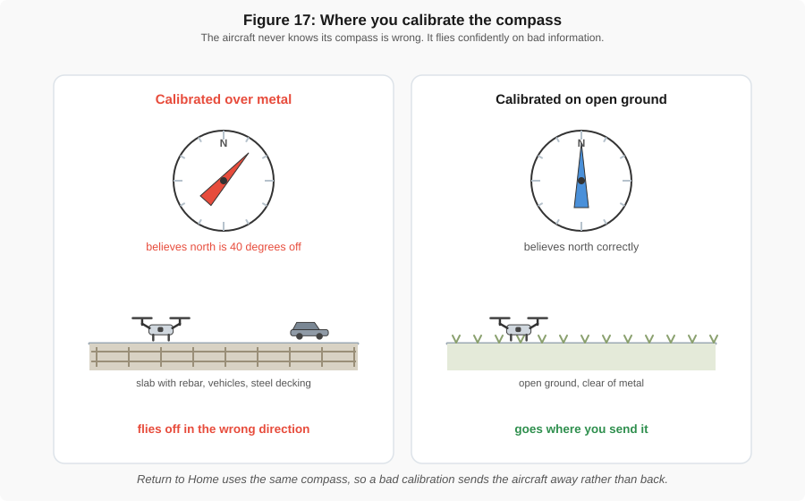
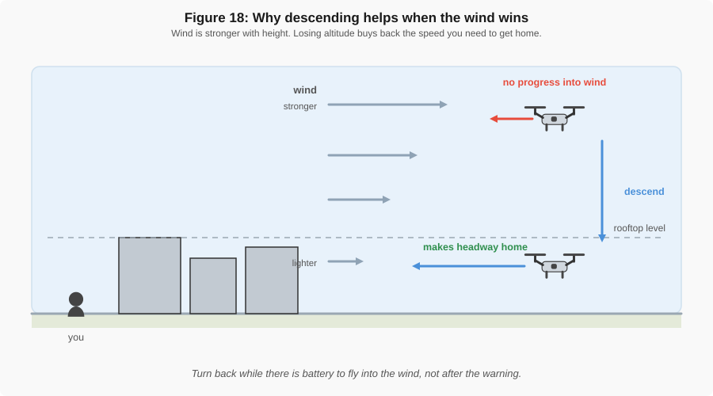
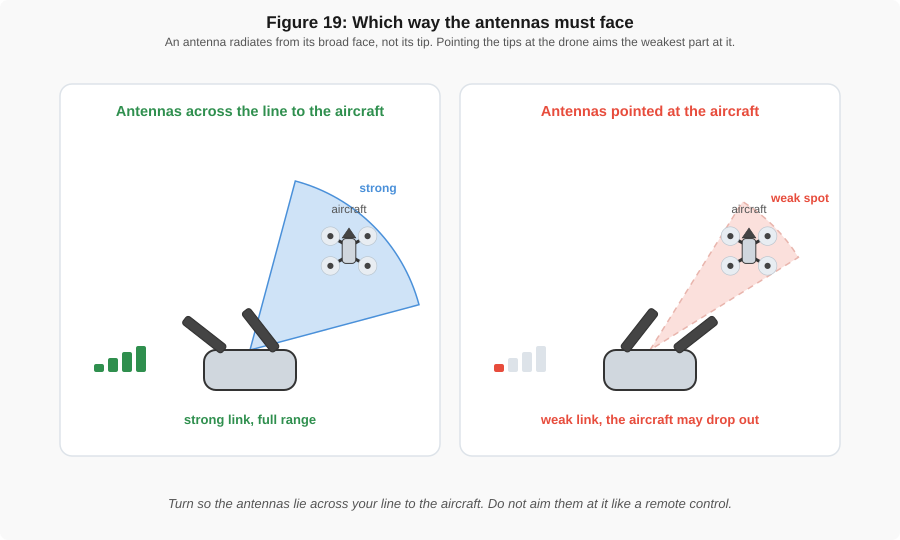

# Common Flight Issues

!!! abstract "Key Takeaways"
    - Most problems announce themselves **on the ground**, before take-off, where they cost nothing.
    - The app's warning message almost always names the cause. Read it before you start guessing.
    - When something is wrong in the air, **land early**. Altitude and distance are the two things
      that turn a small problem into a lost aircraft.
    - Nearly every fly-away traces back to a compass calibrated near metal, or a take-off before the
      home point was set.

This page covers what goes wrong and what to do about it. For what the parts and controls actually
do, see [Flight Basics](flight_basics.md).

---

## Before take-off

| Symptom | Likely cause | What to do |
|---------|--------------|------------|
| "Compass error", or a request to calibrate | Metal nearby: rebar, steel decking, vehicles, buried services | Move to open ground well away from metal, then calibrate. Never calibrate standing on a slab with rebar in it. |
| No home point, or very few satellites | Indoors, under cover, or close to buildings and trees | Wait, and move to open sky. Do not take off until the app confirms the home point is recorded. See [holding position](flight_basics.md#knowing-where-it-is). |
| Propellers will not spin | Not armed, gimbal cover still on, battery low, or a warning waiting to be acknowledged | Read the app's message. It nearly always names the reason. |
| Gimbal error at start-up | Cover left on, or the gimbal was knocked in transit | Power down, remove the cover, set the aircraft level on the ground, and restart. |
| Will not climb past a certain height | An altitude limit set in the app, or a geofence ceiling | Check the flight limits in the app settings. |
| Aircraft refuses to take off at all | Geofenced zone, such as near an airport | Check the airspace. This is the aircraft doing its job, not a fault. |

Of these, the compass is the one worth being fussy about. Where you stand when you calibrate decides
whether the aircraft knows which way it is facing.

{ width="100%" }

*Figure 17: The aircraft cannot tell that its compass is wrong. It simply flies on the heading it
believes, which is why this is the usual cause of a fly-away.*

---

## In the air

| Symptom | Likely cause | What to do |
|---------|--------------|------------|
| Drifts instead of holding position | Satellite signal lost, or a compass error | Land while you still can. Recalibrate on open ground before flying again. |
| Wind warning, and it cannot hold position | Wind stronger than the aircraft can fight | Descend below rooftop level where the wind is lighter, and fly home **into** the wind while there is still battery to do it. |
| Controller signal lost | Something between you and the aircraft, antennas pointed wrong, or simply too far | Raise altitude, turn so the flat faces of the antennas point at the aircraft. If it does not recover, let Return to Home run. See Figure 19. |
| Return to Home starts on its own | Low battery, or lost signal | Let it run, unless it is heading somewhere unsafe. See [what Return to Home does](flight_basics.md#return-to-home). |
| Came back to the wrong place | Home point recorded before a proper satellite fix, or updated mid-flight | Confirm the home point before every take-off, not just the first one of the day. |
| Flew into something the sensors should have seen | The obstacle is in a blind direction, or is a surface the sensors cannot detect | Check [where the sensors actually look](flight_basics.md#seeing-obstacles). Sensors are a backstop, not a substitute for looking. |
| Flight time much shorter than expected | Cold battery, wind, or high elevation and temperature | Warm batteries before flying, plan shorter legs, and land earlier than you think you need to. See [the battery bands](flight_basics.md#watching-the-battery). |

Two of those rows are worth a picture, because in both cases the right action feels wrong.

{ width="100%" }

*Figure 18: Descending when you are struggling against the wind seems like the wrong instinct. It
works because wind is lighter close to the ground.*

{ width="100%" }

*Figure 19: An antenna is deaf along its own axis. Aiming the tips at the aircraft points its
weakest direction straight at what you are trying to reach.*

---

## In the data

| Symptom | Likely cause | What to do |
|---------|--------------|------------|
| Video has a rippling, wobbling look | A chipped or unbalanced propeller | Replace the **whole set** of propellers, not the one that looks damaged. |
| Photos blurred, or horizons tilted | Gimbal fault, or vibration from a damaged propeller | Check the gimbal moves freely and inspect every blade before flying again. |
| Images missing from the card | Card full, too slow, or pulled while the aircraft was powered | Format the card in the aircraft before each flight, and check the image count **before leaving the site**. |
| Photos have no position recorded | Flown without a satellite fix | The images are still pictures, but they cannot be used for measurement. Refly. |

---

## Fly-aways

!!! warning "Almost every fly-away has the same two causes"
    A fly-away is an aircraft flying somewhere you did not command and not coming back. It is rarely
    a mysterious failure. It is nearly always one of these:

    - **The compass was calibrated near metal.** The aircraft believes it is facing one way when it
      is facing another, so every correction it makes is wrong, and it flies off with confidence.
      Construction sites are the worst possible place for this.
    - **It took off before the home point was recorded.** There is then nowhere for Return to Home
      to return to, or worse, home is set to somewhere you have never been.

    Both are prevented by the same two habits: calibrate on open ground away from metal, and wait
    for the home point confirmation every single time.

---

## When to stop flying

Land, or do not take off, if any of these are true:

- The compass or satellite status is not clean.
- The wind is stronger than you can comfortably fly in, or gusting.
- You cannot see the aircraft without help.
- The battery is into its warning band and you are not already on the way back.
- You are unsure what the aircraft is doing.

The last one matters most. A drone doing something you do not understand will not start making
sense at a greater distance.
