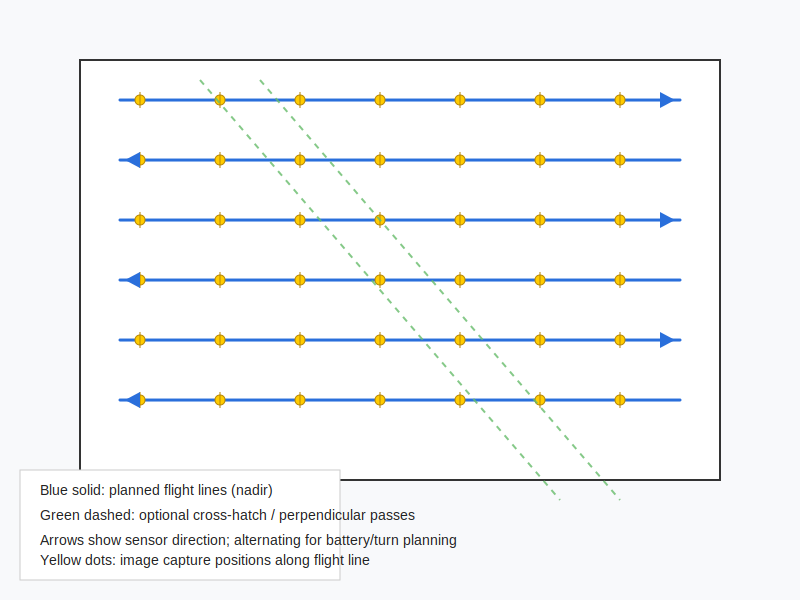
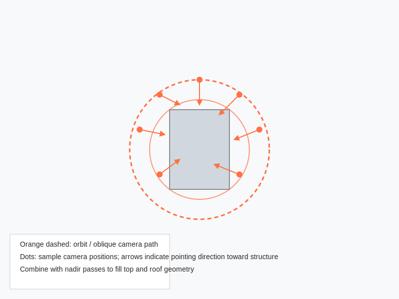

# Week 4 — Mission Planning for SfM Mapping

This note covers practical mission planning for drone photogrammetry using Structure-from-Motion (SfM) reconstruction workflows.

## Key Takeaways
- **Planning is the Foundation:** A bad flight cannot be fixed by good software. Focus on consistent exposure and high overlap.
- **Overlap Strategy:** Aim for **80% forward** and **70% side** overlap for most projects.
- **Altitude vs. Detail:** Lower altitude gives higher detail (GSD) but requires more time and battery.
- **Motion Blur:** Use a fast shutter speed to keep images crisp as the drone moves.

---

## I. Core Concepts
- **Structure-from-Motion (SfM):** A method that reconstructs 3D structures from overlapping 2D images.
- **GSD (Ground Sample Distance):** The ground distance represented by one pixel. For example, 2 cm GSD means each pixel represents 2 cm on the ground.
- **Nadir vs. Oblique:**
    - **Nadir:** Straight down (best for maps).
    - **Oblique:** Angled (best for building sides/facades).

---

## II. Mission Parameters (Instructional Guide)
To ensure consistent results across all student teams, your instructor will provide a set of specific parameters. Enter these into your flight planning app (e.g., DJI GS Pro, DroneDeploy).

### What Your Instructor Provides:
- **Area Definition:** KML file or center coordinates.
- **Altitude:** Usually 100 m AGL.
- **Overlap:** Forward and side percentages.
- **Gimbal Angle:** 0° (Nadir) or 15°–45° (Oblique).
- **Camera Settings:** RAW vs JPEG, fixed ISO/Shutter.

### Sample Parameter Table
| Parameter | Example Value |
| :--- | :--- |
| **Altitude** | 100 m AGL |
| **Forward Overlap** | 80% |
| **Side Overlap** | 70% |
| **Flight Speed** | 5 m/s |
| **Camera** | RAW, Manual Exposure |

---

## III. Flight Strategy and Best Practices
- Overlap (forward/along-track): 75–85% recommended for detailed mapping and complex structures.
- Sidelap (between adjacent flight lines): 60–75% is common; increase toward 80% for difficult surfaces or tall vegetation.
- Nadir (straight down) vs oblique images:
  - Nadir images provide uniform top-down coverage and are essential for planar surfaces.
  - Oblique images (15°–45° off-nadir) help capture vertical faces, building facades, and reduce reconstruction gaps for structures.
  - For structures or facades, combine a nadir survey with one or more oblique passes or orbit shots.
- Gimbal angle:
  - Use 0° (nadir) for orthomosaic-focused surveys.
  - Use 15°–35° for mixed nadir/oblique surveys; 45° or higher for targeted facades (but be careful of extreme foreshortening).
- Camera overlap strategy:
  - For urban/structural surveys: 80% forward, 70% side is a good starting point.
  - For open/flat terrain: 70% forward, 60% side may be sufficient.
- Flight-line spacing and cross-hatch:
  - Use a cross-hatch (orthogonal) set of flights or extra perpendicular passes over complex sites to improve tie points and reduce systematic errors.

## Camera settings and image quality
- Use manual exposure to avoid changes between images; lock shutter speed and ISO where lighting is consistent.
- Keep ISO low to minimize noise; increase shutter speed to avoid motion blur (higher speed for windy conditions or fast rotorcraft).
- Disable aperture/ISO auto modes, HDR, and other in-camera processing that changes image appearance between frames.
- Use consistent white balance (manual) if possible.

## IV. Estimating Image Count and GSD
### GSD (Ground Sample Distance) Calculation
The higher you fly, the more ground each pixel covers, and the less detail you capture.

**Conceptual Formula:**
`GSD ∝ (Flight Height × Sensor Size) / (Focal Length × Image Pixels)`

### Tradeoffs
- **Lower Altitude:** Better detail (1 cm GSD) but more photos, more batteries, and much longer computer processing time.
- **Higher Altitude:** Less detail (5 cm GSD) but fast collection and processing.

---

## V. Student Activity: The Tradeoff Game

### Scenario
You are asked to map a 50-acre construction site to check for surface drainage issues and identify small cracks in concrete (approx. 5 mm wide).

### Question 1: GSD Selection
If you fly at an altitude that gives you a 5 cm GSD, will you be able to see the 5 mm cracks in your map? Why or why not?

### Question 2: The Tradeoff
Your drone can cover the site in 20 minutes at 120 m altitude (4 cm GSD), or in 60 minutes at 40 m altitude (1 cm GSD). If the battery only lasts 25 minutes, what is your plan to complete the mission?

---

## VI. Example Mission Diagrams
Below are common patterns for data collection.

*Figure 1: Grid flight plan with alternating flight-line directions. Cross-hatch passes (green) improve accuracy.*

### Activity: Grid Strategy
In Figure 1, if you were mapping a flat parking lot, would you need the green dashed cross-hatch passes? What if you were mapping a dense forest with tall trees? Explain your reasoning.

*Figure 2: Orbit and oblique passes around a structure.*

### Activity: Orbit Strategy
In Figure 2, why would we use an orbit instead of a standard grid? If the structure is very tall (like a silo), would one orbit at a single altitude be enough to capture the entire side?

---

## VII. Preflight Checklist for SfM Mapping
- [ ] **Batteries:** Charged and spares available.
- [ ] **SD Card:** Empty and high-speed.
- [ ] **Camera Settings:** RAW, Fixed White Balance, Manual Exposure.
- [ ] **Lighting:** Avoid low sun (long shadows) and high noon (glare). Overcast is often ideal!
- [ ] **Safety:** Verify TFRs and NOTAMs.
