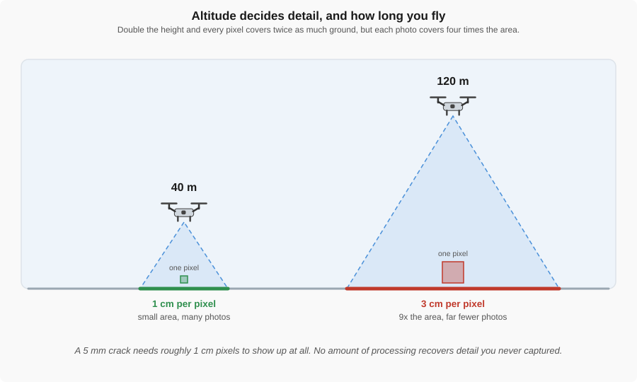
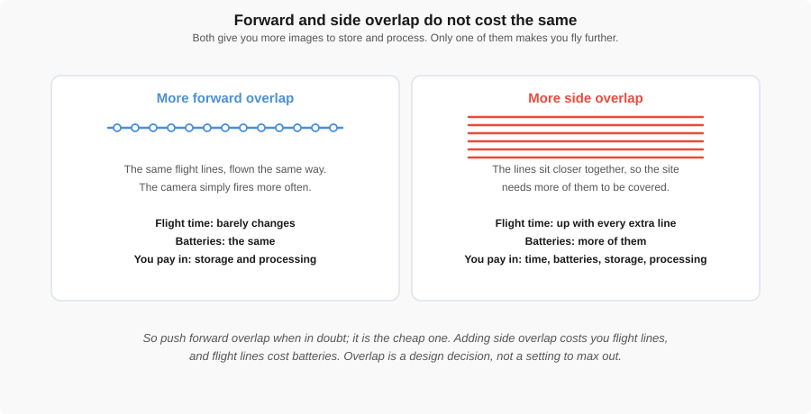
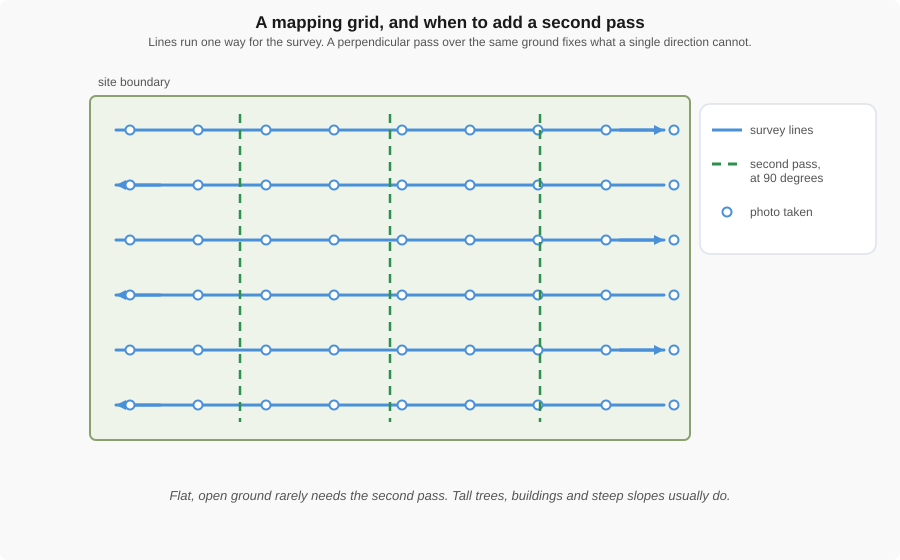
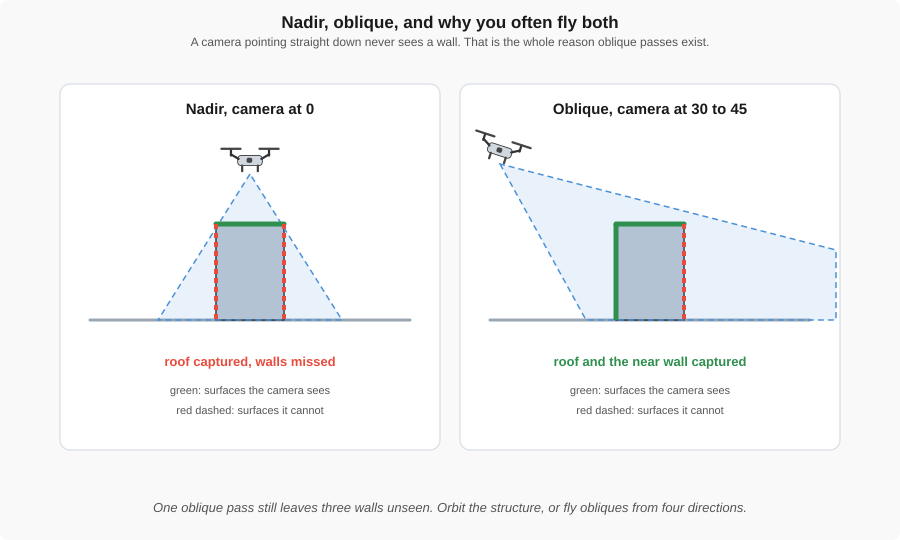
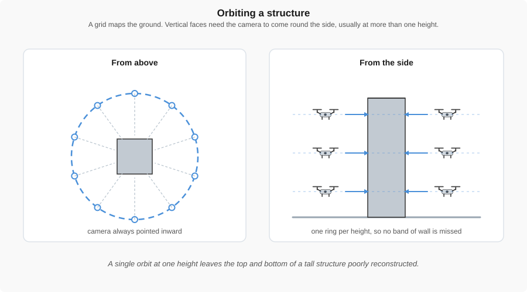
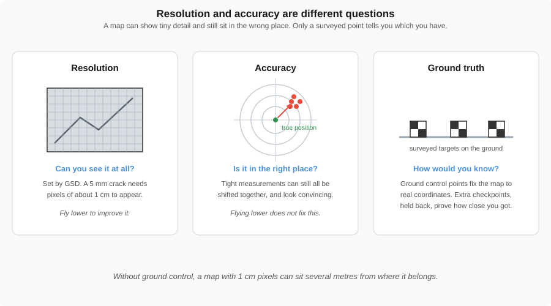

# Planning the Flight

!!! abstract "Key Takeaways"
    - **A bad flight cannot be fixed by good software.** Every decision here is made before you take
      off, and none of them can be undone afterwards.
    - **80% forward and 70% side overlap** is the usual starting point for mapping.
    - **Fly as high as the required detail allows.** Height buys you speed; detail costs you time.
    - **Resolution is not accuracy.** A map full of fine detail can still sit in the wrong place.

This page follows the order you actually decide things in. [How Photos Become 3D](SfM_Workflow.md)
explains why these choices matter.

---

## I. How high should you fly?

Altitude sets **Ground Sample Distance (GSD)**, the real-world size of one pixel. A GSD of 2 cm
means one pixel covers 2 cm of ground.

{ width="100%" }

*Figure 4: Flying twice as high doubles the size of every pixel, but each photo covers four times
the area.*

`GSD ∝ (flight height × sensor size) / (focal length × image width in pixels)`

Everything except height is fixed by the camera, so in practice **height is the dial you turn**.

| | Lower | Higher |
|---|-------|--------|
| Detail | Better, 1 cm GSD | Worse, 5 cm GSD |
| Photos needed | Many | Far fewer |
| Flight time | Long, several batteries | Short |
| Processing | Hours | Minutes |

The rule: work out the smallest thing you must see, pick a GSD that resolves it, and fly at the
highest altitude that still delivers that GSD. Anything lower is time you have spent for nothing.

---

## II. How much overlap?

Overlap is what puts each ground point into several photos. The two kinds do not cost the same.

{ width="100%" }

*Figure 5: More forward overlap is more photos on the same flight lines. More side overlap means
more flight lines, and every extra line costs a battery.*

| Site | Forward | Side |
|------|---------|------|
| Open, flat ground with varied texture | 70% | 60% |
| **General mapping, start here** | **80%** | **70%** |
| Tall vegetation, complex structures | 85% | 80% |
| Repeating patterns: parking lots, row crops, grass | 85% | 80% |

Sites full of repeating detail need the extra overlap for a different reason: the software
mismatches near-identical features, and extra views outvote the bad matches. See
[what makes a good tie point](SfM_Workflow.md#what-makes-a-good-tie-point).

Push forward overlap when in doubt; it is the cheap one. Going past about 85% buys very little and
costs a slower flight and far more images to store and process. **Overlap is a design decision, not
a setting to max out.**

---

## III. What pattern should you fly?

{ width="100%" }

*Figure 6: Parallel lines with alternating direction. A second pass at ninety degrees is added only
when the site needs it.*

A simple back-and-forth grid handles most sites. A **cross-hatch**, a second set of lines flown at
ninety degrees to the first, doubles your flight time and is worth it when:

- the site has **tall vegetation** or dense canopy
- there are **buildings or structures** with vertical faces
- the ground is **steeply sloping**
- the surface is full of **repeating patterns**, such as stall lines or row crops, because seeing
  them from a second direction helps the software tell one from another
- a first flight produced a model with holes or warping in it

On open ground with varied texture and nothing tall on it, a second pass is time you do not need to
spend.

!!! question "Activity: grid strategy"
    A flat parking lot has no tall objects and no slope, which argues against a second pass. It is
    also covered in identical white stall lines, which argues for one.

    Which way would you go? And once you had flown it, what would you look at to find out whether
    you had chosen correctly?

---

## IV. Do you need the sides of things?

A camera pointing straight down is called **nadir**. It is ideal for maps and useless for walls.

{ width="100%" }

*Figure 7: A nadir camera sees the roof and nothing else. Tilting it to 30 or 45 degrees brings the
near wall into view.*

- **Nadir, 0°:** orthomosaics, terrain, volumes. The default for mapping.
- **Oblique, 15° to 45°:** building faces, retaining walls, anything vertical.
- **Both:** a nadir grid for the ground, plus oblique passes or an orbit for the structures.

One oblique pass only captures the walls facing the camera. For a whole structure, orbit it.

{ width="100%" }

*Figure 8: The camera points inward and circles the structure. Tall structures need a ring at more
than one height.*

!!! question "Activity: orbit strategy"
    Look at Figure 8. Why use an orbit instead of extending the grid? If the structure were a tall
    silo, would a single orbit at one altitude capture the whole side? What would you add?

---

## V. How will you know it worked?

This is the question that turns a nice-looking model into a defensible measurement.

{ width="100%" }

*Figure 9: Three different questions. Flying lower answers the first one only.*

- **Resolution** is set by GSD and answers "can I see it at all".
- **Accuracy** is how close your measurement is to the truth. Flying lower does **not** fix it.
- **Ground truth** is an independently surveyed point. **Ground control points (GCPs)** tie the map
  to real coordinates. **Checkpoints**, held back from processing, prove how close you got.

Without ground control, a map with 1 cm pixels can sit several meters from where it belongs, and it
will look completely convincing while doing so. When someone asks whether your data is any good, the
answer is your checkpoint residuals, not your GSD.

---

## VI. Camera settings

Consistency matters more than perfection. The software compares photos against each other, so
anything that changes between frames makes its job harder.

- **Manual exposure.** Lock shutter speed and ISO so brightness does not jump between photos.
- **Fast shutter.** The aircraft is moving. A slow shutter smears every feature you were relying on.
- **Low ISO.** Noise looks like texture to a feature detector, and it is texture that lies.
- **Manual white balance.** Auto white balance shifts colors from frame to frame.
- **No HDR or in-camera processing.** These alter images unpredictably between frames.
- **RAW if you have the storage,** JPEG if you do not.

!!! tip "The best mapping weather is overcast"
    Flat light means no hard shadows, and no shadows means no false features moving across your
    site as the sun tracks. Avoid low sun angles and harsh midday glare.

---

## VII. Mission parameters

Your instructor will provide the specific values for each exercise. Enter them into the flight
planning app.

| Parameter | Typical value |
|-----------|---------------|
| Area | KML file or center coordinates |
| Altitude | 100 m AGL |
| Forward overlap | 80% |
| Side overlap | 70% |
| Flight speed | 5 m/s |
| Gimbal angle | 0° nadir, or 15° to 45° oblique |
| Camera | RAW, manual exposure, fixed white balance |

!!! question "Activity: the tradeoff game"
    You must map a 50-acre construction site, checking surface drainage **and** identifying concrete
    cracks about 5 mm wide.

    1. **GSD.** At an altitude giving 5 cm GSD, will the cracks appear in your map? Why not?
    2. **The tradeoff.** The site takes 20 minutes at 120 m (4 cm GSD), or 60 minutes at 40 m
       (1 cm GSD). Your battery lasts 25 minutes. What is your plan?
    3. **Think further.** Does the whole site need 1 cm GSD, or only part of it?

---

## VIII. Preflight checklist

- [ ] **Batteries:** charged, with spares for every planned line
- [ ] **SD card:** empty, high speed, and formatted in the aircraft
- [ ] **Camera:** RAW, fixed white balance, manual exposure, fast shutter
- [ ] **Ground control:** targets placed and surveyed, if the job needs accuracy
- [ ] **Lighting:** avoid low sun and harsh midday glare; overcast is ideal
- [ ] **Airspace:** TFRs and NOTAMs checked
- [ ] **Aircraft:** the [general pre-flight checklist](../flight_check_list/pre_flight/pre_general.md)
      still applies
