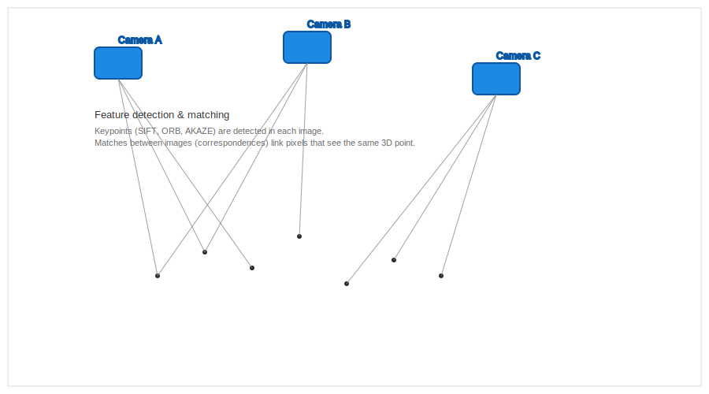
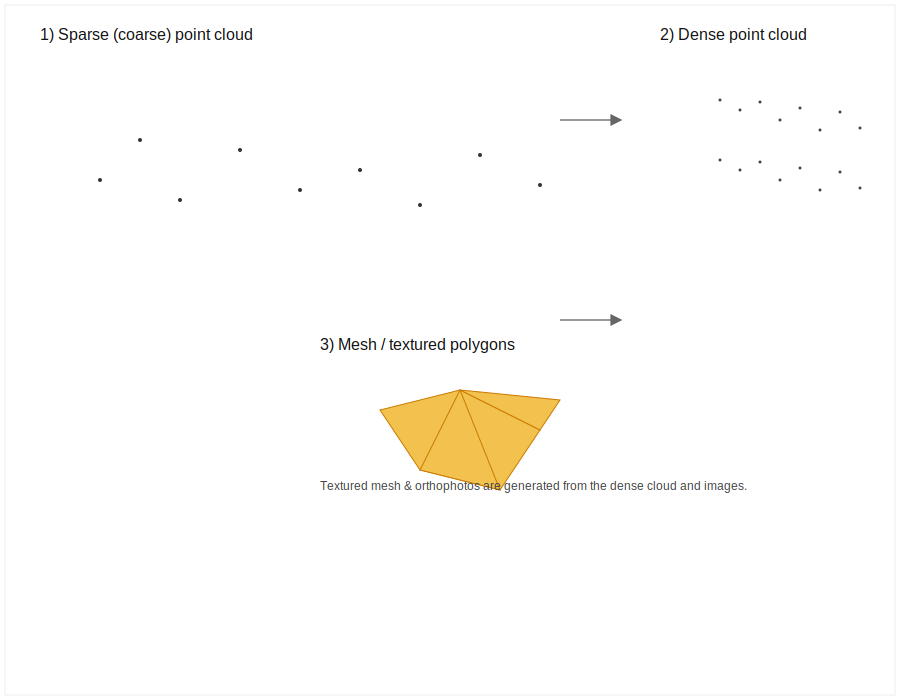

# Structure-from-Motion (SfM) — Workflow Overview

This note explains the core steps in a typical Structure-from-Motion (SfM) photogrammetry pipeline, from feature detection and matching through sparse and dense reconstruction to mesh and orthophoto generation.

## Key Takeaways
- **3D from 2D:** SfM is the process of estimating 3D structures from 2D image sequences by finding matching features in overlapping photos.
- **Overlap is Critical:** For the math to work, every point on the ground should be seen in at least 5–9 different photos.
- **The "Tie Point":** A tie point is a unique visual feature (like a rock or a corner of a building) that the computer can identify in multiple images to "tie" them together.
- **Accuracy through Math:** "Bundle Adjustment" is the heavy-duty math step that fixes small errors in camera positions to make the final model accurate.

---

## I. High-Level Pipeline
1. **Image Acquisition:** Capture overlapping images with GPS/IMU data.
2. **Feature Detection & Matching:** Detect unique "keypoints" and match them between image pairs.
3. **Sparse Reconstruction:** Estimate initial camera positions and create a "skeleton" of 3D points (tie points).
4. **Bundle Adjustment:** Refine camera positions and points to minimize errors.
5. **Dense Reconstruction:** Create a high-density point cloud by matching almost every pixel.
6. **Mesh & Texturing:** Build a surface over the points and "paint" it with the original photos.
7. **Georeferencing:** Align the model to real-world coordinates using GCPs or RTK.

---

## II. Feature Detection and Matching

Feature detectors find distinctive keypoints in each image and compute descriptors. Matching algorithms pair keypoints across images to form correspondences; these correspondences are the basis for estimating relative camera geometry and triangulating 3D points.

Why matches matter
- A single 3D point must be observed in at least two images to be triangulated.
- Robust matching (with RANSAC) rejects outliers and inconsistent matches, improving the stability of pose estimation.

---

## III. Sparse Reconstruction and Bundle Adjustment

After finding matches, the software estimates where the cameras were in 3D space.

- **Initial Estimation:** From matched pairs, SfM estimates the relative rotations and translations between cameras.
- **Triangulation:** These correspondences yield a sparse (coarse) point cloud of tie points.
- **Bundle Adjustment:** This is the most critical step. It jointly refines all camera poses and 3D points to minimize "reprojection error." This step is computationally expensive but essential for internal consistency.

---

## IV. Dense Reconstruction and Mesh Generation

- Using the refined camera poses, multi-view stereo algorithms compute dense depth estimates for pixels and generate a dense point cloud.
- The dense cloud is then meshed into polygons (e.g., via Poisson surface reconstruction or Delaunay triangulation) and textured using the original photos to create realistic 3D models.
- Orthophotos and digital surface models (DSMs) are created by projecting/orthorectifying the imagery onto the mesh or rasterizing the dense point cloud.

---

## V. Practical Tips for Success
- **Image Quality:** Blurry or dark photos will cause the matching step to fail.
- **Texture Matters:** Surfaces like smooth snow, shiny glass, or moving water are extremely difficult for SfM to reconstruct.
- **Varying Perspectives:** Adding "oblique" (angled) photos helps reconstruct the vertical sides of buildings and reduces gaps in the model.

---

## VI. Student Activity: The "Feature Detection" Challenge

### Objective
Understand how a computer "sees" features compared to a human.

### Task
Look at the two images below (or any two overlapping photos from your last flight).
1. **Identify 3 "Easy" Features:** Find three points that are easy for a human to match (e.g., a specific yellow flower, a manhole cover, a corner of a sidewalk).
2. **Identify 3 "Hard" Features:** Find three areas that would be difficult for a computer to match (e.g., a patch of uniform green grass, the middle of a paved road, a shadow that might move between photos).
3. **Reflection:** If you were flying over a forest vs. a rocky canyon, which would have more "reliable" tie points? Why?

---

## Appendix: Technical Deep Dive (Optional)
### Common Algorithmic Building Blocks
- **Detectors:** SIFT, ORB, AKAZE.
- **Estimation:** RANSAC for outlier rejection.
- **Solvers:** Ceres Solver, g2o.
- **Surface:** Poisson reconstruction, Delaunay triangulation.

