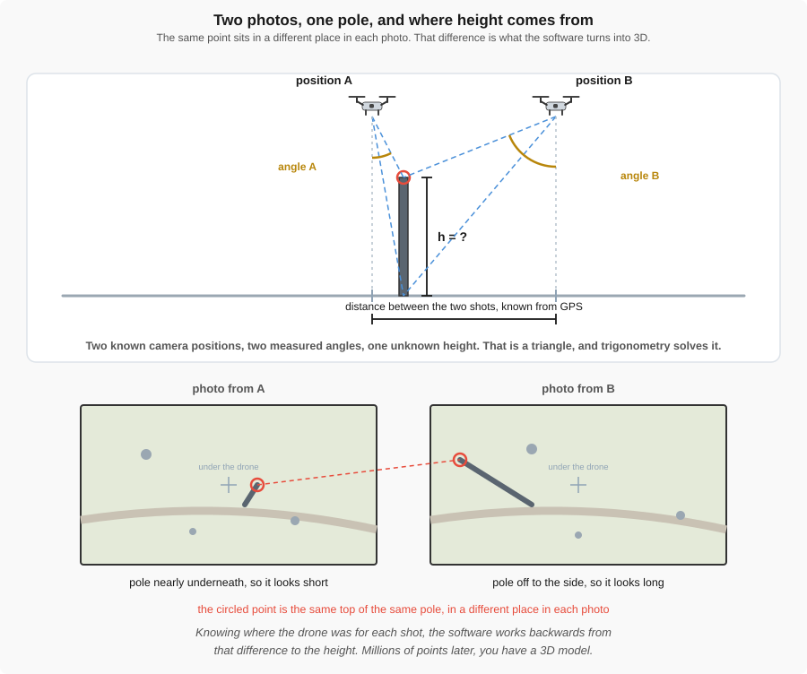
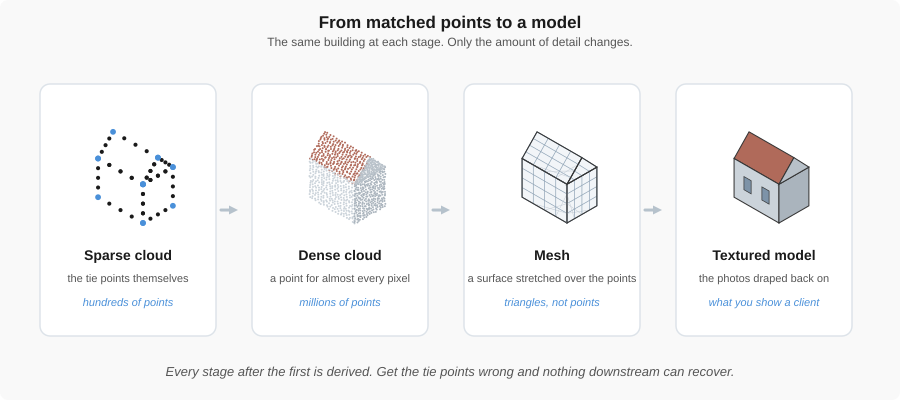

# How Photos Become 3D

!!! abstract "Key Takeaways"
    - **Structure from Motion (SfM)** turns ordinary overlapping photos into a 3D model by finding
      the same point in several of them.
    - A point photographed **once** is useless. The same point photographed from several positions
      becomes a measurement.
    - The software solves for **where the camera was** and **what the scene looks like** at the same
      time.
    - Knowing roughly where the drone was, from GPS, makes that solve faster and puts the answer in
      the right place on Earth.

This page is about why you fly the way you do in the next section. You do not need the algorithms;
you need to know what the software is trying to do, so that you give it what it needs.

---

## Where 3D comes from

A single photo is flat. Two photos of the same thing, taken from different places, are not.

{ width="100%" }

*Figure 1: The same pole looks short from almost overhead and long from off to the side. That
difference is the measurement.*

If you already know where the drone was for each photo, the only unknowns left are the height and
position of the pole, and two photos are enough to solve for them. Two known camera positions, two
measured angles, one unknown height: that is a triangle.

### What if you do not know where the drone was?

In practice you rarely know the camera positions exactly. Then you are solving a bigger problem:
**where each photo was taken from, and where everything in the scene is, at the same time.**

That is still solvable, but it needs more to work with. The same point has to appear in several
photos, and each pair of photos needs several points in common, not just one. Given enough shared
points across enough photos, there is only one arrangement of cameras and 3D points that explains
every photo at once, and the software searches for it.

This is what Structure from Motion does, and it is why the name mentions structure *and* motion: it
recovers the shape of the scene and the path of the camera together. Robotics calls the same problem
**SLAM**, simultaneous localization and mapping.

!!! warning "Shape is not size"
    With no known positions at all, the software recovers the **shape** of everything and the
    relative arrangement of the cameras, but not the **size**, and not where any of it sits on
    Earth. A model of a building can come out perfectly proportioned and twice life size.

    Something has to supply the missing scale and position. Usually that is the drone's GPS. It does
    not have to be perfect: a rough position for each photo gives the software a starting point near
    the answer, so it solves faster and drifts less. With **RTK GPS**, where each photo's position is
    known to a few centimeters, the camera positions are close to known before processing begins.

---

## Why overlap is the whole game

Everything above depends on one thing: the same point appearing in many photos. That is what overlap
buys you, and it is the single most important number you set before a flight.

{ width="100%" }

*Figure 2: Overlap is not wasted effort. It is what puts every ground point into five to nine
different photos.*

A **tie point** is a feature the software recognizes in more than one photo. More overlap means more
tie points, and more tie points means a better solve. Too little overlap and the reconstruction
develops holes that no amount of processing will fill.

### What makes a good tie point

The software is not looking for *texture*. It is looking for a point it can identify **uniquely** and
then find again in another photo. Those are not the same thing, and the difference is where most
reconstructions go wrong.

| Kind of surface | Examples | What the software does |
|-----------------|----------|------------------------|
| **Uniquely identifiable** | A manhole cover, a rock, a building corner, a crack, a painted arrow or number | Matches it correctly. This is what you want. |
| **Nothing to identify** | Blank asphalt, fresh snow, still water, plain roofs, glass | Finds nothing. You get holes. |
| **Identifiable but repeated** | Parking stall lines, lane dashes, grass, row crops, tiled roofs | Matches confidently and **wrongly**. |

!!! warning "A repeating pattern is worse than a blank one"
    A blank surface fails honestly. The software finds nothing, and you get a hole you can see and
    deal with.

    A repeating pattern fails quietly. Every dash in a lane line looks like every other dash, so a
    segment in one photo gets matched to the wrong segment in the next. Parking lot stall lines do
    this constantly. So does grass: one clump looks distinctive on its own, but the field is full of
    clumps that are equally distinctive and look just like it. Row crops are the same problem planted
    in neat rows.

    The result is not a gap. It is a model that is confidently wrong, sometimes with a whole section
    shifted or warped, and nothing on screen tells you. Only a checkpoint catches it.

    **What helps:** more overlap, so a bad match is outvoted by good ones; a cross-hatch pass, so the
    pattern is seen from a second direction; and ground control, so the error has something to show
    up against.

!!! tip "This is why overcast days are good for mapping"
    Flat light means a feature looks the same in every photo. Bright sun creates hard shadows that
    move as you fly, and a shadow edge is exactly the kind of false feature that fools the matcher.

---

## From points to products

Once the cameras and the tie points agree, the rest is mechanical.

{ width="100%" }

*Figure 3: A sparse cloud of tie points is thickened into a dense cloud, meshed into a surface, and
covered with the original photographs.*

1. **Feature detection and matching.** Find distinctive points in each photo and match them between
   photos.
2. **Sparse reconstruction.** Work out camera positions and a skeleton of 3D tie points.
3. **Bundle adjustment.** Adjust every camera position and every point together until the whole set
   is as consistent as it can be. This is the step that makes the model accurate.
4. **Dense reconstruction.** Using the solved camera positions, match almost every pixel to build a
   dense point cloud.
5. **Mesh and texture.** Build a surface over the points and drape the photographs over it.
6. **Georeferencing.** Tie the result to real-world coordinates using GPS and ground control.

See [Aerial Measurement Products](../week_01/data_products.md) for what each of those outputs is
used for.

---

!!! question "Activity: think like the software"
    Look at two overlapping photos from a flight, or at the site outside your classroom.

    1. **Find three easy features.** Points a computer could identify and find again: a manhole
       cover, a corner of a sidewalk, a painted arrow or number.
    2. **Find three hard ones.** Two kinds count here. Areas with nothing to match at all, such as
       blank asphalt or a puddle, and areas full of things that look identical to each other, such
       as stall lines or mown grass. Which kind worries you more, and why?
    3. **Then decide.** You are asked to map a rocky canyon and a snowfield on the same day. Which
       one worries you, and what would you change about the flight to compensate?

---

??? note "Optional: what the algorithms are called"
    You will meet these names in software documentation. You do not need them for this course.

    - **Feature detectors:** SIFT, ORB, AKAZE. These find and describe distinctive keypoints.
    - **Outlier rejection:** RANSAC. Throws out matches that do not fit the emerging geometry.
    - **Bundle adjustment solvers:** Ceres Solver, g2o. These minimize reprojection error, the gap
      between where a point should appear in a photo and where it actually does.
    - **Surface reconstruction:** Poisson reconstruction, Delaunay triangulation. These turn a cloud
      of points into a continuous surface.
    - **Open-source pipeline:** COLMAP, if you want to see the whole process end to end.
