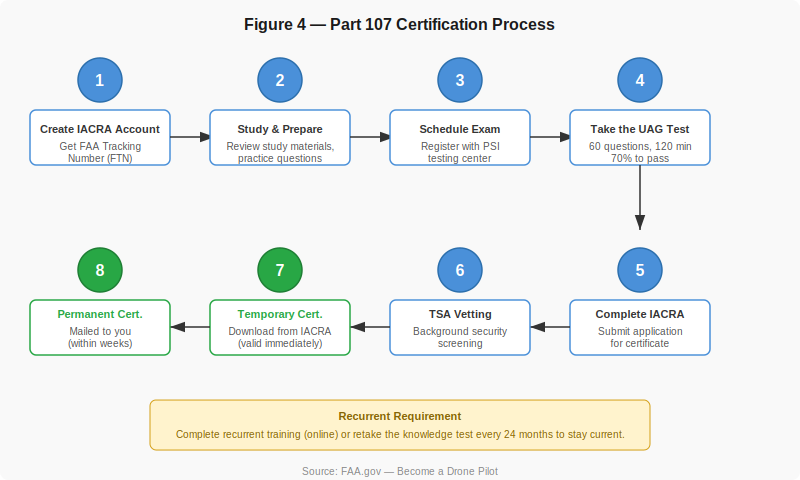
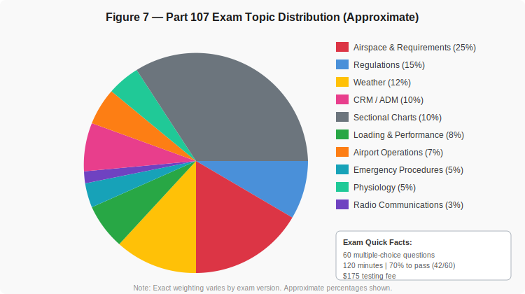
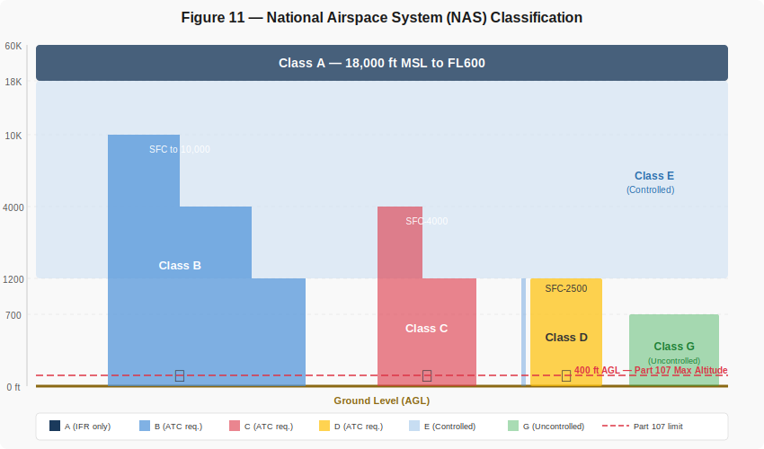
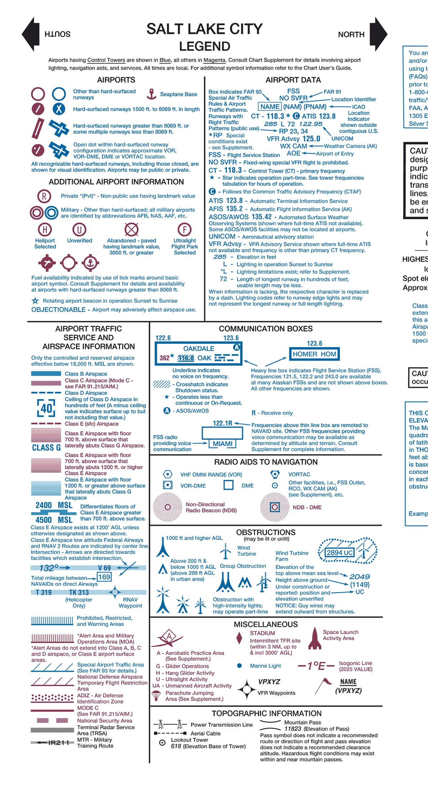
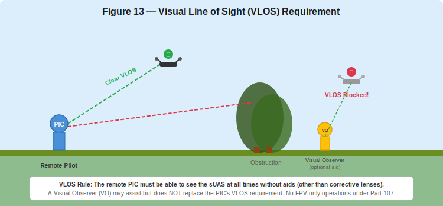
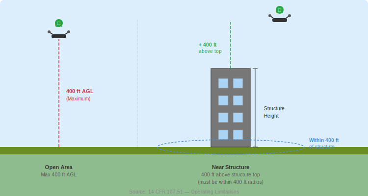
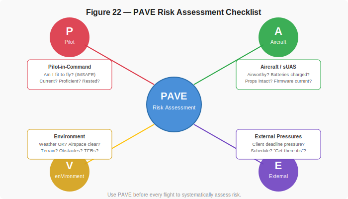
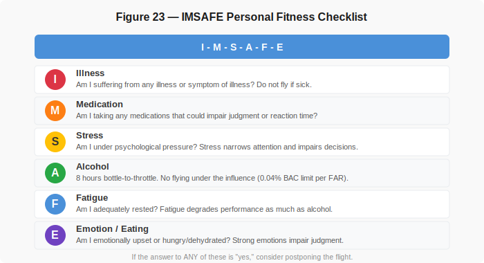
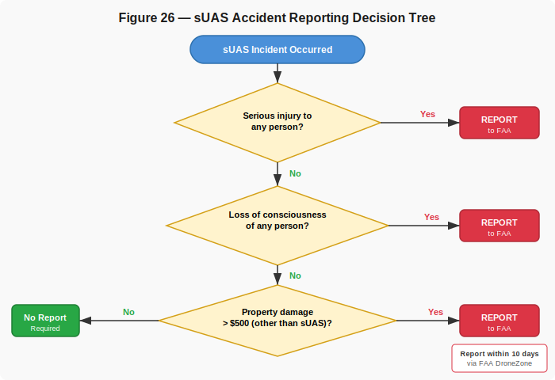

# Test Prep Part 2 — Introduction to the FAA Part 107 Remote Pilot License Exam

This reading provides a comprehensive overview of the FAA Part 107 Remote Pilot Certificate exam — what it covers, who needs it, and how to prepare. Use this alongside Test Prep Part 1 (concise study notes) for a complete review.

!!! tip "Essential Download — FAA Testing Supplement"
    During the actual Part 107 exam you will be given a printed testing supplement containing sectional chart excerpts, airport diagrams, weather reports, and chart legends. Many exam questions refer directly to figures in this booklet. Download the same supplement now so you can practice with it as you study:

    **[Download local copy — FAA-CT-8080-2H (PDF, reduced resolution)](images/sport_rec_private_akts_FAA-CT-8080-2H_small.pdf)** | **[Official FAA source (full resolution)](https://www.faa.gov/training_testing/testing/supplements)**

    On the FAA page, look for the PDF titled **"FAA-CT-8080-2H"** under the *Pilots & Instructors* section. This is the only supplement you need for the Part 107 exam. The local copy above is compressed for convenience — download from the FAA link for the full-resolution version.

---

## I. What is FAA Part 107?

### A. Regulatory Background

The Federal Aviation Administration (FAA) governs all civil aviation in the United States, including small unmanned aircraft systems (sUAS). The primary regulation for commercial drone operations is **14 CFR Part 107**, formally titled the "Small Unmanned Aircraft Rule."

**14 CFR Part 107** was enacted on **August 29, 2016**, and established a regulatory framework that allows commercial drone operations without requiring a traditional pilot's license. Before Part 107, commercial drone operators needed a manned aircraft pilot certificate and a Section 333 exemption — a slow and expensive process.

**Purpose of Part 107:**

- Provide a clear, accessible path for commercial sUAS operations
- Establish safety standards for drone flights in the National Airspace System (NAS)
- Define pilot certification, operating rules, and aircraft requirements for drones under 55 lbs

### Recreational vs. Part 107 vs. Public COA

It is important to understand when Part 107 applies versus other regulatory paths:

| | **Section 44809 (Recreational)** | **Part 107 (Commercial)** | **Public COA (Government)** |
|---|---|---|---|
| **Who** | Hobbyists flying for fun | Anyone flying for work, business, or compensation | Federal, state, and local government agencies |
| **Certificate** | TRUST completion (free online test) | Remote Pilot Certificate (FAA knowledge test) | Certificate of Authorization or Part 107 |
| **Key Rules** | Community-based guidelines, VLOS, under 55 lbs | Part 107 operating rules (detailed below) | Agency-specific; may have broader authority |
| **Compensation** | Not allowed | Allowed | Government operations |

**When is Part 107 required?** Any time you fly a drone for commercial purposes — including real estate photography, construction surveying, agricultural inspection, mapping, or any operation where you receive compensation or the flight furthers a business interest. If you are a civil engineering student using drones for project work or research, Part 107 applies.


*Figure 1: Decision flowchart showing the three main regulatory pathways for UAS operations in the United States.*


*Figure 3: The FAA regulatory hierarchy — Part 107 sits within Title 14 of the Code of Federal Regulations under the FAA.*

### Practice Questions — Regulations

!!! note "Question 1.1"
    A construction company hires you to photograph a building site from the air using a small drone. Under what regulatory authority must you operate?

    - (A) Section 44809 (Recreational)
    - (B) 14 CFR Part 107
    - (C) No special authority is needed if the drone is under 55 lbs

    **Answer: (B).** Any time you fly a drone for compensation or to further a business interest, Part 107 applies — even if someone else is paying you. Section 44809 is only for purely recreational flights with no business purpose.

!!! note "Question 1.2"
    Your neighbor offers to pay you $50 to take aerial photos of their house to post on a real estate listing. Do you need a Part 107 Remote Pilot Certificate?

    - (A) No, because the flight is over private property
    - (B) No, because the payment is under $100
    - (C) Yes, because you are receiving compensation for the flight

    **Answer: (C).** There is no minimum dollar threshold — any compensation makes the flight a commercial operation requiring Part 107 certification. The location of the flight (private vs. public property) does not change the regulatory requirement.

---

## II. Eligibility & Certification Process

### A. Eligibility Requirements

To obtain a Remote Pilot Certificate under Part 107, you must:

- Be at least **16 years old**
- Be able to read, speak, write, and understand **English**
- Be in a **physical and mental condition** to safely operate a small UAS
- Pass the **initial aeronautical knowledge test** (UAG — Unmanned Aircraft General)
- Pass a **TSA security background check**

There is no flight experience or flight hours requirement. You do not need a medical certificate (unlike manned aircraft pilot certificates). However, you must self-assess your fitness to fly before each operation.

### B. Steps to Certification

The certification process involves several steps, typically completed over a few weeks:

**Step 1 — Create an IACRA Account**
Register at the FAA's Integrated Airman Certification and Rating Application (IACRA) system at [iacra.faa.gov](https://iacra.faa.gov). You will receive a **FAA Tracking Number (FTN)**, which you need to schedule your exam.

**Step 2 — Study and Prepare**
Review study materials covering the exam knowledge areas (see Section III below). Use FAA study guides, practice question banks, and the resources listed at the end of this document.

**Step 3 — Schedule the Exam**
Register for the "Unmanned Aircraft General – Small (UAG)" knowledge test through a PSI testing center. Tests are available at PSI locations nationwide. The exam costs approximately **$175**.

**Step 4 — Take the UAG Knowledge Test**
The exam is administered at the testing center on a computer. You have 120 minutes to answer 60 multiple-choice questions. You need a score of **70% (42 correct)** to pass.

**Step 5 — Complete IACRA Application**
After passing, log back into IACRA and submit your application for a Remote Pilot Certificate (14 CFR Part 107).

**Step 6 — TSA Security Vetting**
The TSA conducts a background security check. This typically takes a few days to a few weeks.

**Step 7 — Receive Temporary Certificate**
Once TSA vetting is complete, you can download a temporary certificate from IACRA. This is valid immediately and allows you to operate commercially.

**Step 8 — Receive Permanent Certificate**
Your permanent Remote Pilot Certificate card is mailed to you, typically within several weeks.


*Figure 4: Step-by-step certification process from IACRA registration through permanent certificate.*

### C. Recurrent Training Requirements

Your Remote Pilot Certificate does not expire, but you must maintain **currency** to exercise its privileges. Every **24 months**, you must either:

- Complete the **FAA recurrent online training** (free, at [faasafety.gov](https://www.faasafety.gov)), or
- Retake the UAG knowledge test at a PSI testing center

If you let your currency lapse, you cannot legally operate under Part 107 until you complete recurrent training. There is no penalty for lapsing — just complete the training before your next flight.

### Practice Questions — Eligibility & Certification

!!! note "Question 2.1"
    What is the minimum age to obtain a Remote Pilot Certificate under Part 107?

    - (A) 14 years old
    - (B) 16 years old
    - (C) 18 years old

    **Answer: (B).** Part 107 requires applicants to be at least 16 years old. There is no requirement for a medical certificate, but applicants must be able to read, speak, write, and understand English and be in a physical and mental condition to safely operate a small UAS.

!!! note "Question 2.2"
    A remote pilot passed the initial Part 107 knowledge test 30 months ago and has not completed any recurrent training. Can they legally conduct a commercial sUAS operation today?

    - (A) Yes, the certificate never expires
    - (B) No, they must complete recurrent training or retake the knowledge test before flying
    - (C) Yes, but only if they fly below 200 ft AGL

    **Answer: (B).** While the Remote Pilot Certificate itself does not expire, the pilot must maintain currency by completing recurrent training or retaking the knowledge test every 24 calendar months. At 30 months without recurrent training, this pilot's currency has lapsed and they cannot legally exercise Part 107 privileges until they complete training.

---

## III. Structure of the Part 107 Exam

### A. Exam Format

| Detail | Value |
|---|---|
| Exam code | UAG (Unmanned Aircraft General – Small) |
| Number of questions | 60 multiple-choice |
| Time allowed | 120 minutes |
| Passing score | 70% (42 of 60 correct) |
| Fee | ~$175 |
| Location | PSI testing centers nationwide |
| Aids allowed | FAA-provided testing supplement (sectional chart excerpts, weather data, legends) |
| Aids NOT allowed | Personal notes, phones, calculators, electronic devices |

You are provided a **testing supplement** that includes sectional chart excerpts, a chart legend, airport diagrams, and sample weather reports. Many questions will reference figures in this supplement, so practice reading sectional charts beforehand.

### B. Major Knowledge Areas

The exam covers the following topics with approximate weightings:


*Figure 7: Approximate distribution of exam topics. Airspace and regulations together account for roughly 40% of the exam.*

**Summary of knowledge areas:**

1. **Regulations (15%)** — Part 107 rules, certificate requirements, waivers, registration
2. **Airspace Classification & Requirements (25%)** — NAS classes, controlled vs. uncontrolled, authorization requirements
3. **Weather (12%)** — METARs, TAFs, weather theory, hazards to sUAS
4. **Crew Resource Management / ADM (10%)** — Risk management, PAVE, IMSAFE, decision-making
5. **Sectional Charts (10%)** — Reading and interpreting aeronautical charts
6. **Loading & Performance (8%)** — Density altitude, weight and balance, CG
7. **Airport Operations (7%)** — Traffic patterns, markings, NOTAMs
8. **Emergency Procedures (5%)** — Lost link, flyaways, emergency landing
9. **Physiology (5%)** — Hypoxia, hyperventilation, spatial disorientation, vision
10. **Radio Communications (3%)** — Phraseology, frequencies, light gun signals

### C. Sample Question

Below is an example of the type of question you may encounter:

!!! note "Example Exam Question"
    **Refer to [FAA-CT-8080-2H](https://www.faa.gov/training_testing/testing/supplements), Figure 26, Area 2.**
    What is the floor of Class B airspace in the area surrounding Dallas/Fort Worth International Airport?

    - (A) Surface
    - (B) 3,000 ft MSL
    - (C) 4,000 ft MSL

    *Answer: The floor varies by sector. You must read the sectional chart excerpt in the testing supplement to determine the altitude shown for the specific area referenced.*

    To follow along, download **FAA-CT-8080-2H**: **[Local copy (PDF, reduced resolution)](images/sport_rec_private_akts_FAA-CT-8080-2H_small.pdf)** | **[Official FAA source (full resolution)](https://www.faa.gov/training_testing/testing/supplements)** (listed under *Pilots & Instructors*).

---

## IV. Airspace Fundamentals (Core Exam Topic)

Airspace is the single most heavily tested topic on the Part 107 exam. You must understand the National Airspace System classification, know which airspace types require ATC authorization, and be able to identify airspace boundaries on a sectional chart.

### A. National Airspace System (NAS)

The NAS divides airspace into six classes:


*Figure 11: Vertical profile of the National Airspace System showing all airspace classes. Note the Part 107 400 ft AGL limit at the bottom.*

| Class | Type | Altitude | ATC Auth. for sUAS? | Notes |
|---|---|---|---|---|
| **A** | Controlled | 18,000 ft MSL – FL600 | N/A | IFR only. No Part 107 ops. |
| **B** | Controlled | Surface – varies | **Yes** | Busiest airports (e.g., SLC, ATL). "Inverted wedding cake" shape. |
| **C** | Controlled | Surface – typically 4,000 ft AGL | **Yes** | Medium-traffic airports. Core + shelf. |
| **D** | Controlled | Surface – typically 2,500 ft AGL | **Yes** | Towered airports. |
| **E** | Controlled | Varies (700 ft, 1,200 ft, or surface) | **Yes** (if surface area) | Most airspace above 1,200 ft AGL. |
| **G** | **Uncontrolled** | Surface – varies | **No** | Default airspace. Most sUAS ops happen here. |

**Key rule:** You need ATC authorization (via LAANC or FAA DroneZone) to fly in **any controlled airspace** (B, C, D, and surface E). Class G is uncontrolled — no ATC authorization needed, but all Part 107 rules still apply.

### B. Sectional Charts

Sectional charts are the standard visual flight rules (VFR) aeronautical charts. On the Part 107 exam, you will be asked to interpret them. Key features to identify:

- **Class B airspace**: Solid **blue** lines with altitude figures (e.g., "100/40" means ceiling 10,000 ft MSL, floor 4,000 ft MSL)
- **Class C airspace**: Solid **magenta** lines
- **Class D airspace**: Dashed **blue** lines
- **Class E surface area**: Dashed **magenta** lines
- **Airport symbols**: Blue for towered, magenta for non-towered
- **Obstructions**: Marked with tower symbols showing MSL and AGL heights
- **Special-use airspace**: Restricted (R), Prohibited (P), MOAs, Warning areas

The figure below shows an excerpt of the Salt Lake City sectional chart. Notice the SLC Class B airspace depicted by concentric solid blue lines with altitude labels, restricted areas R-6404 and R-6402 shown with hatched brown boundaries, towered airports in blue, non-towered airports in magenta, and terrain elevation contours across the Wasatch Front corridor from Ogden down to Provo.


*Figure 10: Excerpt from the FAA Salt Lake City Sectional Aeronautical Chart showing Class B airspace, restricted areas, airports, and terrain along the Wasatch Front. Source: [FAA VFR Raster Charts](https://www.faa.gov/air_traffic/flight_info/aeronav/digital_products/vfr/) (public domain). Not for navigation.*

The chart legend below shows the standard symbols used on all FAA sectional charts. Practice matching these symbols to what you see on the chart excerpt above — identify the airport types, airspace boundaries, obstruction markers, and communication frequencies.


*Figure 10b: Sectional chart legend from the Salt Lake City chart showing airport symbols, airspace depictions, communication boxes, radio aids, obstructions, and topographic information. Source: [FAA VFR Raster Charts](https://www.faa.gov/air_traffic/flight_info/aeronav/digital_products/vfr/) (public domain).*

Practice reading the legend and identifying these features on actual charts before the exam. The FAA testing supplement provides the chart excerpts you will use during the test.

### C. LAANC Authorization

**Low Altitude Authorization and Notification Capability (LAANC)** is an automated system that provides near-real-time airspace authorization for Part 107 operators in controlled airspace. Through LAANC-approved apps (such as Aloft, AirMap, or DJI FlySafe), you can:

- Request authorization to fly in controlled airspace
- Receive approval in seconds (for altitudes at or below the published LAANC ceiling grid)
- See the maximum altitudes approved for specific grid cells near airports

If you need to fly above the LAANC ceiling grid, you must submit a manual authorization request through the FAA DroneZone portal, which can take up to 90 days.

### Practice Questions — Airspace

!!! note "Question 4.1"
    You want to fly your sUAS at 200 ft AGL near a small airport. On the sectional chart, the airport is surrounded by a dashed magenta line. What class of airspace are you in, and do you need ATC authorization?

    - (A) Class D — yes, authorization required
    - (B) Class E surface area — yes, authorization required
    - (C) Class G — no authorization required

    **Answer: (B).** A dashed magenta line on a sectional chart indicates a Class E surface area. Because this is controlled airspace extending to the surface, you must obtain ATC authorization (via LAANC or FAA DroneZone) before flying your sUAS there. Remember: dashed *blue* = Class D, solid *blue* = Class B, solid *magenta* = Class C.

!!! note "Question 4.2"
    A remote pilot plans to operate an sUAS in Class G airspace at 350 ft AGL. Which statement is correct?

    - (A) No ATC authorization is needed, but all Part 107 operating rules still apply
    - (B) ATC authorization is required for any flight above 200 ft AGL
    - (C) Class G airspace does not exist below 1,200 ft AGL

    **Answer: (A).** Class G is uncontrolled airspace — no ATC authorization is needed to fly there. However, the remote pilot must still comply with all Part 107 rules: VLOS, 400 ft AGL max altitude, 3 SM visibility, cloud clearance, daylight operations, yield right of way, etc.

---

## V. Operating Rules Under Part 107

### A. Key Operational Limitations

Part 107 establishes the following operating rules for sUAS:

| Rule | Requirement |
|---|---|
| **Maximum altitude** | 400 ft above ground level (AGL) |
| **Structure exception** | May fly above 400 ft if within 400 ft of a structure (and not higher than 400 ft above the structure's top) |
| **Visual line of sight** | PIC must maintain unaided VLOS with the sUAS at all times |
| **Time of day** | Daylight or civil twilight (with anti-collision lighting visible for 3 statute miles) |
| **Maximum speed** | 100 mph (87 knots) groundspeed |
| **Minimum visibility** | 3 statute miles from the control station |
| **Cloud clearance** | 500 ft below clouds, 2,000 ft horizontally from clouds |
| **Right of way** | Must yield to all manned aircraft |
| **People** | Do not fly over non-participating persons (unless they are under cover or inside a vehicle) |
| **Moving vehicles** | Do not fly over moving vehicles on public roads (unless briefly transiting) |
| **Multiple aircraft** | One pilot, one drone at a time (unless waiver obtained) |
| **Aircraft weight** | Under 55 lbs (including payload) at takeoff |


*Figure 13: The remote PIC must maintain direct visual contact with the sUAS at all times. A Visual Observer may assist but does not replace the PIC's VLOS obligation.*


*Figure 14: In open areas, the maximum altitude is 400 ft AGL. Near a structure, you may fly up to 400 ft above the structure's top, provided you remain within 400 ft horizontally of the structure.*

### B. Waivers

The FAA may grant **waivers** for certain Part 107 restrictions if the applicant demonstrates the operation can be conducted safely. Waiver applications are submitted through the FAA DroneZone.

**Waiverable provisions include:**

| Waiverable | Not Waiverable |
|---|---|
| Operations at night (107.29) | Registration requirement |
| Operations over people (107.39) | Hazardous materials |
| Operations beyond VLOS (107.31) | Yielding right of way to manned aircraft |
| Multiple aircraft operations (107.35) | Airworthiness of the sUAS |
| Operations from a moving vehicle (107.25) | Remote PIC certification |
| Altitude above 400 ft (107.51) | ATC authorization in controlled airspace |
| Minimum visibility / cloud clearance (107.51) | Operating in a careless or reckless manner |

*Figure 15: Table of waiverable vs. non-waiverable Part 107 provisions. Note that waivers for BVLOS and over-people operations require substantial safety documentation.*

!!! warning "Important"
    A waiver does not guarantee approval. You must submit a detailed safety case explaining how you will mitigate risks. Waiver processing typically takes 90 days or more.

### Practice Questions — Operating Rules

!!! note "Question 5.1"
    A remote PIC is conducting a Part 107 flight at 300 ft AGL. The current weather reports visibility of 2 statute miles. Is this operation legal?

    - (A) Yes, as long as the pilot maintains VLOS with the sUAS
    - (B) No, Part 107 requires a minimum visibility of 3 statute miles
    - (C) Yes, visibility requirements only apply in controlled airspace

    **Answer: (B).** Part 107.51 requires a minimum flight visibility of 3 statute miles from the control station, regardless of airspace class. At 2 SM visibility, the pilot must not fly unless they obtain a waiver for reduced visibility operations. This rule applies in both controlled and uncontrolled airspace.

!!! note "Question 5.2"
    You are hired to inspect a 500-foot-tall radio tower. What is the maximum altitude at which you may legally operate your sUAS near this structure without a waiver?

    - (A) 400 ft AGL
    - (B) 500 ft AGL (top of the tower)
    - (C) 900 ft AGL

    **Answer: (C).** Under Part 107.51, a drone may fly higher than 400 ft AGL if it remains within 400 ft of a structure. In this case, the tower is 500 ft tall, and you may fly up to 400 ft above the top of the structure — a maximum of 900 ft AGL. The sUAS must remain within a 400-foot horizontal radius of the structure at all times while above 400 ft AGL.

!!! note "Question 5.3"
    Which of the following Part 107 restrictions can the FAA grant a waiver for?

    - (A) Operating beyond visual line of sight
    - (B) Yielding right of way to manned aircraft
    - (C) Requiring the remote PIC to hold a certificate

    **Answer: (A).** BVLOS operations (107.31) are waiverable with an approved safety case. Yielding right of way to manned aircraft and the requirement for a Remote Pilot Certificate are **not** waiverable under any circumstances — these are fundamental safety and legal requirements that cannot be set aside.

---

## VI. Weather & Aviation Weather Services

Weather is a critical factor in sUAS operations. Wind, visibility, cloud ceiling, and temperature all affect flight safety and aircraft performance. The Part 107 exam tests your ability to interpret aviation weather products.

### A. Basic Weather Theory

**Key concepts:**

- **Atmospheric stability**: Stable air resists vertical motion (smooth flying conditions, fog/stratus possible). Unstable air promotes vertical motion (turbulence, cumulus clouds, thunderstorms).
- **Lapse rate**: Temperature decreases approximately 2C per 1,000 ft in standard atmosphere. When the actual lapse rate exceeds the standard rate, the atmosphere is unstable.
- **Dew point**: The temperature at which air becomes saturated and moisture condenses. When temperature and dew point converge (spread < 4F), expect fog or low clouds.
- **Fog formation**: Radiation fog forms on clear, calm nights. Advection fog forms when warm, moist air moves over a cold surface. Both can reduce visibility to zero.
- **Convection**: Heating of the surface causes thermals and turbulence. Strong convection produces cumulonimbus clouds (thunderstorms) — a serious hazard to all aircraft.

### B. METARs and TAFs

**METAR** (Meteorological Terminal Aviation Routine Weather Report) provides current observed conditions at an airport. You will be expected to decode METARs on the exam.

**Sample METAR with labeled components:**

```
METAR KSLC 121756Z 17010KT 10SM FEW080 SCT150 BKN250 27/06 A3012 RMK AO2
```

| Component | Meaning |
|---|---|
| `METAR` | Report type (routine observation) |
| `KSLC` | Station identifier (Salt Lake City International) |
| `121756Z` | Date/time: 12th day, 17:56 UTC (Zulu) |
| `17010KT` | Wind from 170 at 10 knots |
| `10SM` | Visibility: 10 statute miles |
| `FEW080` | Few clouds at 8,000 ft AGL |
| `SCT150` | Scattered clouds at 15,000 ft AGL |
| `BKN250` | Broken clouds at 25,000 ft AGL |
| `27/06` | Temperature 27C / Dew point 6C |
| `A3012` | Altimeter setting: 30.12 inHg |
| `RMK AO2` | Remarks: automated station with precipitation sensor |

*Figure 16: Annotated METAR example. Practice decoding METARs until you can identify key elements quickly.*

**TAF** (Terminal Aerodrome Forecast) provides a forecast of conditions at an airport, typically covering a 24- to 30-hour period. TAFs use similar encoding to METARs but include change groups (FM, TEMPO, BECMG, PROB) indicating expected condition changes over time.

**Other weather products to know:**

- **AIRMET** — Advisories for moderate icing, turbulence, sustained surface winds > 30 kt, mountain obscuration, and IFR conditions
- **SIGMET** — Significant meteorological information for severe conditions (severe icing, severe turbulence, volcanic ash)
- **Convective SIGMET** — Thunderstorm-related warnings
- **PIREPs (UA)** — Pilot reports of actual conditions (turbulence, icing, cloud tops)

!!! tip "Study Tip"
    The best way to learn METAR/TAF decoding is practice. Visit [AviationWeather.gov](https://www.aviationweather.gov) and decode several real METARs for airports in your area.

### Practice Questions — Weather

!!! note "Question 6.1"
    Given the following METAR, what is the reported visibility and wind?

    `METAR KPVU 151845Z 27015G25KT 4SM -RA BKN020 OVC040 18/15 A2985 RMK AO2`

    - (A) 4 statute miles visibility; wind from 270 at 15 knots gusting to 25 knots
    - (B) 4 nautical miles visibility; wind from 150 at 27 knots
    - (C) 15 statute miles visibility; wind from 270 at 4 knots

    **Answer: (A).** In a METAR, `4SM` means 4 statute miles visibility. The wind group `27015G25KT` decodes as: wind **from** 270 degrees (west) at 15 knots, **gusting** to 25 knots. Also note: `-RA` means light rain, `BKN020` means broken clouds at 2,000 ft AGL (the ceiling), and `18/15` shows the temperature/dew point spread is only 3C — conditions are moist and could deteriorate further.

!!! note "Question 6.2"
    On a clear, calm night, the surface temperature is 58F and the dew point is 56F. What weather phenomenon is most likely to develop by early morning?

    - (A) Thunderstorms
    - (B) Radiation fog
    - (C) High-altitude turbulence

    **Answer: (B).** Radiation fog forms on clear, calm nights when the ground cools by radiating heat, lowering the air temperature to the dew point. A temperature/dew point spread of only 2F means the air is nearly saturated. As the surface continues to cool overnight, the temperature will likely reach the dew point, producing ground-level fog. This could reduce visibility well below the 3 SM minimum required for Part 107 operations.

---

## VII. Loading, Performance & sUAS Limitations

### A. Aircraft Performance Factors

Even though sUAS are much lighter than manned aircraft, the same physics applies. Understanding performance factors helps you operate safely.

**Density Altitude**

Density altitude is the altitude at which the aircraft "thinks" it is flying based on air density. High density altitude means thinner air and reduced performance.

Density altitude increases with:

- **Higher temperature** — hot air is less dense
- **Higher elevation** — less air above means less pressure
- **Higher humidity** — moist air is less dense than dry air
- **Lower barometric pressure** — less molecular density

*Figure 19: At high density altitudes (hot, high, humid conditions), your sUAS will have reduced thrust, shorter battery life, and decreased maneuverability. Always account for these conditions in your flight planning.*

**Practical impacts on sUAS:**

- Reduced motor thrust and lift capacity
- Shorter hover time and flight duration
- Increased battery consumption
- Longer takeoff and climb times

**Weight and Balance / Center of Gravity (CG)**

The center of gravity is the point where the aircraft balances. For sUAS:

- Adding payload (camera, sensor, delivery package) shifts the CG
- A CG outside the acceptable range causes instability, difficulty hovering, or loss of control
- Always verify your total takeoff weight is under 55 lbs
- Secure all payloads to prevent shifting during flight

*Figure 20: The CG must remain within the manufacturer's specified envelope. Adding a heavy sensor package to one side of the drone without counterbalancing can cause control problems.*

**Temperature Effects on Batteries**

- **Cold temperatures** reduce battery voltage and capacity — expect shorter flight times in winter
- **Hot temperatures** can cause batteries to overheat, leading to thermal cutoffs or swelling
- Store and transport batteries at room temperature
- Warm batteries to at least 60F (15C) before flight in cold conditions

### Practice Questions — Loading & Performance

!!! note "Question 7.1"
    A remote pilot is planning a flight at a field site at 6,500 ft elevation on a hot summer day (95F). Compared to flying the same sUAS at sea level on a standard day, the pilot should expect:

    - (A) Increased battery life due to thinner air reducing drag
    - (B) Decreased aircraft performance — reduced thrust and shorter flight time
    - (C) No change, because sUAS performance is not affected by altitude

    **Answer: (B).** High elevation and high temperature both increase density altitude, meaning the air is thinner. The drone's propellers produce less thrust in thinner air, the motors work harder to maintain hover, and battery consumption increases. At 6,500 ft on a 95F day, the density altitude could exceed 10,000 ft — a significant performance reduction. Always plan for shorter flights and reduced payload capacity in hot, high conditions.

!!! note "Question 7.2"
    A remote pilot attaches a heavy LiDAR sensor to the left side of a quadcopter without adding counterweight. What is the most likely effect?

    - (A) The sUAS will fly faster due to reduced drag
    - (B) The center of gravity shifts, causing the aircraft to drift or tilt and potentially become unstable
    - (C) Battery life will increase because the motors compensate automatically

    **Answer: (B).** An asymmetric payload shifts the center of gravity away from the aircraft's geometric center. The flight controller will attempt to compensate by increasing power to motors on the heavy side, but this reduces overall efficiency, shortens flight time, and may exceed the controller's ability to stabilize — especially in wind. Always mount payloads symmetrically or add counterweight to keep the CG within the manufacturer's limits.

---

## VIII. Aeronautical Decision-Making & Safety

Good decision-making is as important as technical knowledge. The FAA emphasizes Aeronautical Decision-Making (ADM) and Crew Resource Management (CRM) as core competencies for remote pilots.

### A. Risk Management

**PAVE Checklist**

PAVE is a structured framework for pre-flight risk assessment. Before every flight, evaluate each element:


*Figure 22: The PAVE checklist systematically evaluates four risk categories before flight.*

- **P — Pilot**: Am I physically and mentally fit? Current and proficient?
- **A — Aircraft**: Is the sUAS airworthy? Batteries charged? Props inspected?
- **V — enVironment**: What is the weather? Airspace? Terrain? Obstacles? NOTAMs?
- **E — External Pressures**: Is there schedule pressure? Client demands? "Get-there-itis"?

If any element raises concern, mitigate the risk or make a no-go decision.

**IMSAFE Checklist**

IMSAFE is a personal fitness self-assessment:


*Figure 23: The IMSAFE checklist for self-assessing personal fitness to fly.*

- **I** — Illness: Am I sick?
- **M** — Medication: Am I taking anything that impairs judgment?
- **S** — Stress: Am I under unusual psychological pressure?
- **A** — Alcohol: Have I consumed alcohol in the last 8 hours? Am I below 0.04% BAC?
- **F** — Fatigue: Am I adequately rested?
- **E** — Emotion/Eating: Am I emotionally upset? Hungry or dehydrated?

If the answer to any IMSAFE question is "yes" (or "no" for rest/eating), seriously consider postponing the flight.

### B. Crew Resource Management (CRM)

CRM applies to sUAS operations even with a single pilot. Key principles:

**Communication:**

- Brief all crew members (visual observers, ground crew, client) before the flight
- Establish clear roles: who monitors airspace, who watches for people/obstacles, who communicates with ATC
- Use standard terminology and hand signals
- Debrief after the flight to capture lessons learned

**Task Delegation:**

- Do not overload yourself — use visual observers to help scan for traffic
- Assign a dedicated person to monitor the flight app / telemetry
- If you are overwhelmed, land the aircraft and reassess

**Hazardous Attitudes:**

The FAA identifies five hazardous attitudes that lead to poor decisions:

| Hazardous Attitude | Example | Antidote |
|---|---|---|
| **Anti-authority** | "Rules don't apply to me" | "Follow the rules — they exist for a reason" |
| **Impulsivity** | "Do something — quick!" | "Not so fast — think first" |
| **Invulnerability** | "It won't happen to me" | "It could happen to me" |
| **Macho** | "I can handle it" | "Taking chances is foolish" |
| **Resignation** | "What's the use?" | "I'm not helpless — I can make a difference" |

*Figure 24: Recognize these attitudes in yourself and apply the antidotes before making flight decisions.*

### Practice Questions — ADM & Safety

!!! note "Question 8.1"
    What does the "V" in the PAVE checklist stand for, and what factors does it address?

    - (A) Velocity — groundspeed and wind limitations
    - (B) enVironment — weather, airspace, terrain, obstacles, and NOTAMs
    - (C) Visibility — minimum flight visibility requirements

    **Answer: (B).** The "V" in PAVE stands for en**V**ironment and covers all external conditions affecting the flight: current and forecast weather, airspace classification and restrictions, terrain and obstacles at the operating site, and any active NOTAMs or TFRs. A thorough environmental assessment is critical — conditions that seem flyable on the ground may not be safe at altitude.

!!! note "Question 8.2"
    A remote pilot has a client deadline to deliver aerial survey data by tomorrow. The weather forecast calls for gusty winds and low visibility in the morning, but the pilot thinks, "I've flown in worse — I can handle it." Which hazardous attitude does this represent, and what is the antidote?

    - (A) Resignation — "I'm not helpless, I can make a difference"
    - (B) Anti-authority — "Follow the rules, they exist for a reason"
    - (C) Macho — "Taking chances is foolish"

    **Answer: (C).** The "macho" attitude leads pilots to take unnecessary risks to prove they can handle difficult conditions. The antidote is recognizing that "taking chances is foolish." This scenario also involves external pressure (the "E" in PAVE) — the client deadline is pushing the pilot toward a risky decision. The correct action is to delay the flight until conditions improve and communicate the delay to the client.

!!! note "Question 8.3"
    A remote pilot had three beers at dinner last night and stopped drinking at 10:00 PM. Their planned flight is at 5:30 AM the next morning. Under FAA regulations, can they legally fly?

    - (A) Yes, as long as they feel fine
    - (B) No, because the 8-hour "bottle-to-throttle" rule has not been met
    - (C) Yes, the alcohol restriction only applies to manned aircraft pilots

    **Answer: (B).** The FAA requires at least 8 hours between consuming alcohol and operating any aircraft, including sUAS ("8 hours bottle to throttle"). From 10:00 PM to 5:30 AM is only 7.5 hours — the pilot must wait until at least 6:00 AM. Additionally, the pilot must not have a blood alcohol content of 0.04% or higher, and the "F" in IMSAFE (Fatigue) should also be considered after a late night.

---

## IX. Maintaining Currency & Responsibilities

### A. Recurrent Training

Your Remote Pilot Certificate is permanent, but you must maintain **currency** to legally exercise its privileges:

- Complete **recurrent training every 24 months** from the date of your initial test or last recurrent completion
- Recurrent training is available **free online** at [FAASafety.gov](https://www.faasafety.gov) (look for the Part 107 Recurrent Training course)
- Alternatively, you may retake the UAG knowledge test at a PSI center
- You do NOT need to retake the full knowledge test if you complete the online training

| Timeline Event | Action Required |
|---|---|
| Month 0 | Pass initial UAG knowledge test |
| Month 24 | Complete recurrent training or retake test |
| Month 48 | Complete recurrent training or retake test |
| Every 24 months thereafter | Repeat |

*Figure 25: Currency is maintained on a rolling 24-month cycle. Mark your calendar.*

### B. Recordkeeping & Reporting

**Accident Reporting Requirements**

Under 14 CFR 107.9, the remote PIC must report to the FAA within **10 days** if an sUAS operation results in:

- **Serious injury** to any person (requiring hospitalization, surgery, or resulting in death)
- **Loss of consciousness** of any person
- **Property damage** (other than to the sUAS) exceeding **$500**

Reports are filed through the **FAA DroneZone** portal.


*Figure 26: Use this decision tree to determine whether an incident requires FAA reporting.*

!!! warning "Key Point"
    Damage to your own drone does NOT trigger reporting — only damage to other people's property exceeding $500, or injury/loss of consciousness of any person.

**Remote ID Requirements**

As of March 16, 2024, all drones operating under Part 107 must comply with **Remote ID** requirements:

- **Standard Remote ID**: The sUAS broadcasts identification and location data via radio frequency
- **Remote ID Broadcast Module**: An add-on device that broadcasts identification data for drones that lack built-in Remote ID
- **FAA-Recognized Identification Areas (FRIAs)**: Designated areas where drones without Remote ID may operate (being phased out)

Remote ID allows law enforcement and other airspace participants to identify and locate drones in flight. Ensure your sUAS is Remote ID compliant before every operation.

*Figure 27: Remote ID broadcasts the drone's serial number, location, altitude, velocity, and control station location in real time.*

### C. Registration

All sUAS weighing more than **0.55 lbs (250 grams)** and less than 55 lbs must be **registered with the FAA** through [FAA DroneZone](https://faadronezone.faa.gov). Registration:

- Costs $5 for Part 107 (per aircraft)
- Is valid for 3 years
- Requires the registration number to be displayed on the aircraft

### Practice Questions — Currency & Responsibilities

!!! note "Question 9.1"
    During an sUAS mapping operation, the drone strikes a parked car, causing $750 in damage to the vehicle. The drone is also damaged, but no one is injured. Is the remote PIC required to report this to the FAA?

    - (A) No, because no one was injured
    - (B) Yes, because property damage (other than to the sUAS) exceeds $500
    - (C) No, because the total damage is under $1,000

    **Answer: (B).** Under 14 CFR 107.9, the remote PIC must report any accident to the FAA within 10 days if it causes serious injury, loss of consciousness, or damage to property (other than the sUAS itself) exceeding $500. The $750 damage to the parked car triggers the reporting requirement. Damage to your own drone does not count toward the $500 threshold.

!!! note "Question 9.2"
    A remote pilot's sUAS does not have built-in Remote ID capability. Which of the following is a compliant way to operate under current regulations?

    - (A) Operate normally — Remote ID is optional for Part 107 pilots
    - (B) Attach an FAA-compliant Remote ID broadcast module to the sUAS
    - (C) File a Remote ID exemption through IACRA before each flight

    **Answer: (B).** As of March 16, 2024, all sUAS operating under Part 107 must comply with Remote ID. If the drone lacks built-in Standard Remote ID, the pilot can attach an FAA-compliant Remote ID broadcast module that transmits identification and location data. Remote ID is not optional — operating without it is a regulatory violation. There is no per-flight exemption process.

---

## Key Takeaways

1. **Part 107 is required** for any commercial or business-related drone operation
2. **Pass the UAG knowledge test** (60 questions, 70% to pass) and complete TSA vetting
3. **Airspace is the #1 exam topic** — know the classes, know when you need ATC authorization, and practice reading sectional charts
4. **Operating rules**: 400 ft AGL, VLOS, daylight, 100 mph, 3 SM visibility, yield to manned aircraft
5. **Use PAVE and IMSAFE** before every flight for structured risk assessment
6. **Maintain currency** with recurrent training every 24 months
7. **Report accidents** within 10 days if serious injury, loss of consciousness, or $500+ property damage occurs
8. **Remote ID and registration** are required for all Part 107 operations

---

## References

- [14 CFR Part 107 — Small Unmanned Aircraft Systems](https://www.ecfr.gov/current/title-14/chapter-I/subchapter-F/part-107) — Full regulatory text
- [FAA Remote Pilot Study Guide](https://www.faa.gov/regulations_policies/handbooks_manuals/aviation/media/remote_pilot_study_guide.pdf) — Official FAA study guide
- [FAA Airman Knowledge Testing Supplement](https://www.faa.gov/training_testing/testing/supplements) — Contains the figures used in the actual exam
- [AviationWeather.gov](https://www.aviationweather.gov) — METARs, TAFs, and graphical weather products
- [FAA DroneZone](https://faadronezone.faa.gov) — Registration, waivers, and accident reporting
- [FAA LAANC](https://www.faa.gov/uas/getting_started/laanc) — Low Altitude Authorization and Notification Capability
- [IACRA](https://iacra.faa.gov) — Integrated Airman Certification and Rating Application
- [FAASafety.gov](https://www.faasafety.gov) — Recurrent training and safety resources
