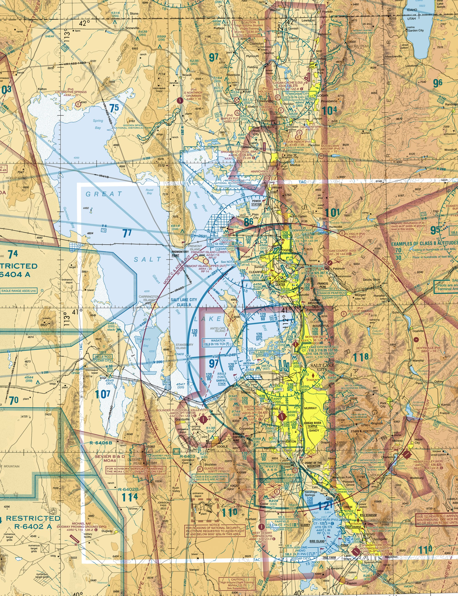

# FAA Part 107 Comprehensive Practice Exam (60 Questions)
## Week 5 — FAA-Level Difficulty

---

## Sectional Chart Reference (Figure 10 — Salt Lake City Area)

---

### Instructions
• Choose the best answer.  
• Refer to Figure 10 for sectional-chart questions.  
• Passing score: 70%.  

---

### Question 1
Refer to Figure 10. The solid blue concentric rings surrounding KSLC indicate:

- (A) Class C airspace
- (B) Class B airspace
- (C) Class D airspace
- (D) Class E airspace

### Question 2
Refer to Figure 10. The number '100/40' within a Class B shelf indicates:

- (A) Ceiling 10,000 MSL / Floor 4,000 MSL
- (B) Floor 10,000 AGL / Ceiling 4,000 AGL
- (C) Visibility 10 SM / Cloud clearance 4 SM
- (D) Surface to 10,000 AGL

### Question 3
Refer to Figure 10. Provo Airport (KPVU) is surrounded by a dashed blue circle. This indicates:

- (A) Class C
- (B) Class D
- (C) Class E surface
- (D) Class G

### Question 4
Refer to Figure 10. West of Salt Lake City is R-6402A. This area is:

- (A) Prohibited
- (B) Warning
- (C) Restricted
- (D) MOA

### Question 5
Refer to Figure 10. The area labeled 'UTTR' west of the lake is:

- (A) Prohibited
- (B) Military Operations Area
- (C) Class E
- (D) Class D

### Question 6
Given METAR: KSLC 121753Z 33012KT 10SM FEW050 SCT120 18/06 A2992 What is the wind?

- (A) 330° at 12 knots
- (B) 330° at 12 mph
- (C) 12° at 330 knots
- (D) Variable at 12 knots

### Question 7
Given METAR: KSLC 121753Z 33012KT 10SM FEW050 SCT120 18/06 A2992 What is the visibility?

- (A) 1 SM
- (B) 10 SM
- (C) 18 SM
- (D) 5 SM

### Question 8
Given METAR: KSLC 121753Z 33012KT 10SM FEW050 SCT120 18/06 A2992 What is the temperature and dewpoint?

- (A) 18°C / 6°C
- (B) 6°C / 18°C
- (C) 18°F / 6°F
- (D) 6°C / -18°C

### Question 9
Given TAF: TAF KSLC 121720Z 1218/1324 32010KT P6SM SCT050 FM130300 35015KT P6SM SKC What change occurs at 0300Z?

- (A) Wind shifts to 350 at 15 knots
- (B) Visibility decreases
- (C) Thunderstorms begin
- (D) Ceiling lowers below 1,000 ft

### Question 10
(Refer to Figure 10) You plan to operate at 350 ft AGL beneath the Class B shelf marked 100/40. What is required?

- (A) ATC authorization required
- (B) No authorization required (below 4,000 MSL floor)
- (C) Waiver required
- (D) Must remain below 200 ft

### Question 11
What is the maximum groundspeed allowed for a small UAS under Part 107?

- (A) 100 mph (87 knots)
- (B) 100 knots (115 mph)
- (C) 80 mph (70 knots)
- (D) 60 mph (52 knots)

### Question 12
According to Part 107, what is the minimum visibility required for flight from the control station?

- (A) 1 statute mile
- (B) 2 statute miles
- (C) 3 statute miles
- (D) 5 statute miles

### Question 13
(Refer to Figure 10) What is the ceiling of the Class D airspace surrounding Provo Airport (KPVU)?

- (A) 2,500 ft MSL
- (B) 4,535 ft MSL
- (C) 7,000 ft MSL
- (D) Surface

### Question 14
Which of the following is a "hazardous attitude" as defined by the FAA?

- (A) Complacency
- (B) Anti-authority
- (C) Professionalism
- (D) Vigilance

### Question 15
Under Part 107, how many days do you have to report an accident that results in serious injury or property damage over $500?

- (A) 5 days
- (B) 10 days
- (C) 30 days
- (D) 48 hours

### Question 16
What mnemonic helps a pilot assess their physical and mental fitness to fly?

- (A) PAVE
- (B) METAR
- (C) IMSAFE
- (D) LAANC

### Question 17
A small UAS must be registered with the FAA if it weighs more than:

- (A) 0.55 lbs
- (B) 1.0 lbs
- (C) 2.0 lbs
- (D) 5.5 lbs

### Question 18
When must a remote pilot yield the right-of-way to all other aircraft?

- (A) Only in controlled airspace
- (B) Only during takeoff and landing
- (C) At all times
- (D) Only when the other aircraft is flying at a lower altitude

### Question 19
What is the "structure exception" to the 400 ft AGL altitude limit?

- (A) You can fly 400 ft above the structure if you stay within 400 ft horizontally
- (B) You can fly 1,000 ft above any structure
- (C) There is no exception for structures
- (D) You can fly twice the height of the structure

### Question 20
Which weather product provides current observed conditions at an airport?

- (A) TAF
- (B) METAR
- (C) SIGMET
- (D) NOTAM

### Question 21
What is "density altitude"?

- (A) Pressure altitude corrected for non-standard temperature
- (B) The altitude shown on the altimeter
- (C) The height above the ground (AGL)
- (D) The altitude above Mean Sea Level (MSL)

### Question 22
How often must a remote pilot complete recurrent training to maintain currency?

- (A) Every 12 months
- (B) Every 24 months
- (C) Every 36 months
- (D) Every 5 years

### Question 23
(Refer to Figure 10) The area marked R-6404 is a:

- (A) Restricted Area
- (B) Prohibited Area
- (C) Warning Area
- (D) Military Operations Area (MOA)

### Question 24
What are the standard cloud clearance requirements for Part 107?

- (A) 500' below, 2,000' horizontal
- (B) 1,000' below, 1,000' horizontal
- (C) Clear of clouds only
- (D) 2,000' below, 500' horizontal

### Question 25
The center of gravity (CG) of an aircraft is:

- (A) The point where it would balance if suspended
- (B) Always at the exact geometric center
- (C) Not important for multi-rotor drones
- (D) Fixed by the manufacturer and cannot be changed

### Question 26
Which of these involves the "PAVE" checklist?

- (A) Pilot, Aircraft, enVironment, External pressures
- (B) Pressure, Altitude, Velocity, Energy
- (C) Plan, Act, Verify, Evaluate
- (D) People, Airspace, Vehicles, Equipment

### Question 27
Under Part 107, night operations are permitted if the drone is equipped with:

- (A) High-definition cameras
- (B) Anti-collision lights visible for 3 statute miles
- (C) Radar altimeters
- (D) Red and green navigation lights only

### Question 28
Which source is used to obtain authorizations for controlled airspace in near-real-time?

- (A) FAA DroneZone
- (B) LAANC
- (C) Calling the tower directly
- (D) 1-800-WX-BRIEF

### Question 29
A "TAF" is typically valid for what period of time?

- (A) 1 hour
- (B) 12 to 24 hours (sometimes 30)
- (C) 5 days
- (D) Indefinitely until updated

### Question 30
What type of fog forms on clear, calm nights when the ground cools rapidly?

- (A) Advection fog
- (B) Steam fog
- (C) Radiation fog
- (D) Upslope fog

### Question 31
What is the primary purpose of a "Visual Observer" (VO)?

- (A) To pilot the aircraft when the PIC is tired
- (B) To maintain situational awareness and scan the area for potential hazards or traffic
- (C) To operate the camera payload
- (D) To record the flight logs

### Question 32
(Refer to Figure 10) The "80/40" label on the Class B shelf east of KSLC indicates a floor of:

- (A) 4,000 ft MSL
- (B) 4,000 ft AGL
- (C) 8,000 ft MSL
- (D) 800 ft AGL

### Question 33
What is the effect of high humidity on sUAS performance?

- (A) It increases lift because water vapor is more dense than dry air
- (B) It decreases performance because moist air is less dense than dry air
- (C) It has no effect on multi-rotor drones
- (D) It improves battery cooling

### Question 34
Which document must be available for inspection upon request by the FAA?

- (A) The remote pilot's birth certificate
- (B) The Remote Pilot Certificate and aircraft registration
- (C) The pilot's high school diploma
- (D) A letter of recommendation from a client

### Question 35
If a remote pilot changes their permanent mailing address, how long do they have to update it with the FAA?

- (A) 10 days
- (B) 30 days
- (C) 60 days
- (D) 90 days

### Question 36
What is the definition of a "Small UAS" under Part 107?

- (A) An unmanned aircraft weighing less than 55 lbs
- (B) An unmanned aircraft weighing exactly 55 lbs
- (C) A drone used only for hobby purposes
- (D) Any aircraft without a cockpit

### Question 37
"Stable air" is typically associated with which of the following?

- (A) Smooth air and poor visibility (fog/haze)
- (B) Turbulent air and good visibility
- (C) Thunderstorms and heavy rain
- (D) Strong vertical development and updrafts

### Question 38
What should a pilot do if they experience a "flyaway" or lost link in controlled airspace?

- (A) Wait for the battery to die
- (B) Immediately notify ATC if the aircraft poses a hazard to other traffic
- (C) Go home and file a report the next day
- (D) Try to shoot the drone down

### Question 39
A "Military Operations Area" (MOA) is depicted on a sectional chart by:

- (A) Solid blue lines
- (B) Hatched magenta lines
- (C) Dashed blue lines
- (D) Solid magenta lines

### Question 40
According to ADM principles, if you feel "impulsive" during a flight, the antidote is:

- (A) "Not so fast—think first"
- (B) "Follow the rules"
- (C) "It could happen to me"
- (D) "I am not helpless"

### Question 41
What is the "standard" lapse rate in the atmosphere?

- (A) 2°C per 1,000 feet
- (B) 5°C per 1,000 feet
- (C) 1°C per 100 feet
- (D) 10°C per mile

### Question 42
Under Part 107, can a remote pilot operate from a moving vehicle?

- (A) Yes, but only in sparsely populated areas and without transporting property for hire
- (B) Yes, at any time
- (C) No, never
- (D) Only if the vehicle is another aircraft

### Question 43
What type of cloud has the most significant vertical development and is associated with thunderstorms?

- (A) Stratus
- (B) Cirrus
- (C) Cumulonimbus
- (D) Altocumulus

### Question 44
(Refer to Figure 10) The blue "tower" symbol with the number (512) next to it represents:

- (A) An obstruction with a height of 512 ft AGL
- (B) A radio frequency
- (C) A runway length
- (D) An airport elevation

### Question 45
What does the "A" in the IMSAFE checklist stand for?

- (A) Airspace
- (B) Altitude
- (C) Alcohol
- (D) Aircraft

### Question 46
A remote pilot must perform a pre-flight inspection of the UAS:

- (A) Once a week
- (B) Once a month
- (C) Before every flight
- (D) Only after a crash

### Question 47
"Load factor" increases during:

- (A) Straight and level flight
- (B) Constant altitude turns
- (C) Descent at a constant speed
- (D) Hovering in no wind

### Question 48
Which of the following is true regarding Remote ID?

- (A) It is optional for commercial pilots
- (B) It allows the drone to broadcast its identity and location in real-time
- (C) It is only required for drones over 55 lbs
- (D) It replaces the need for FAA registration

### Question 49
What is the floor of Class E airspace in most of the United States (unless otherwise marked)?

- (A) Surface
- (B) 700 ft or 1,200 ft AGL
- (C) 14,500 ft MSL
- (D) 18,000 ft MSL

### Question 50
If the temperature and dew point are within 3 degrees of each other, what is likely to form?

- (A) Thunderstorms
- (B) Clear skies
- (C) Fog or low clouds
- (D) High winds

### Question 51
Who is ultimately responsible for the safe operation of a small UAS?

- (A) The drone manufacturer
- (B) The FAA
- (C) The Remote Pilot in Command (PIC)
- (D) The Visual Observer

### Question 52
What is the risk of "spatial disorientation"?

- (A) The drone's GPS failing
- (B) The pilot losing track of the aircraft's orientation or position relative to the horizon
- (C) Running out of battery
- (D) Flying into a cloud

### Question 53
(Refer to Figure 10) The "hatched brown" boundary labeled R-6402A indicates:

- (A) Restricted Airspace
- (B) A National Park
- (C) A Wildlife Refuge
- (D) A State Border

### Question 54
"Thermal plumes" (updrafts) are caused by:

- (A) Uneven heating of the Earth's surface
- (B) High pressure systems
- (C) Low humidity
- (D) The drone's propellers

### Question 55
A "Waiver" from the FAA allows you to:

- (A) Break any rule you want
- (B) Operate in a way that deviates from certain Part 107 regulations if you prove it can be done safely
- (C) Fly without a license
- (D) Avoid registering your drone

### Question 56
Which frequency should a pilot use to announce their position at a non-towered airport?

- (A) CTAF
- (B) 121.5 (Emergency)
- (C) 911
- (D) The local AM radio station

### Question 57
Under Part 107, "Civil Twilight" is defined as:

- (A) 30 minutes before sunrise and 30 minutes after sunset
- (B) 1 hour before sunrise
- (C) Any time it is dark outside
- (D) Between 6:00 PM and 6:00 AM

### Question 58
What is the primary risk of flying with a "Macho" attitude?

- (A) Taking unnecessary risks to impress others or prove yourself
- (B) Following the rules too strictly
- (C) Flying too slowly
- (D) Falling asleep at the controls

### Question 59
In the "PAVE" checklist, the "E" stands for:

- (A) Energy (Battery)
- (B) External Pressures
- (C) Elevation
- (D) Emergency

### Question 60
What should a pilot do if they encounter a manned aircraft while flying their drone?

- (A) Yield the right-of-way immediately and ensure the drone does not interfere with the manned aircraft
- (B) Maintain altitude and course
- (C) Fly closer to get a better look
- (D) Signal the other pilot with a laser

---
# Answer Key

1) B, 2) A, 3) B, 4) C, 5) B, 6) A, 7) B, 8) A, 9) A, 10) B, 
11) A, 12) C, 13) B, 14) B, 15) B, 16) C, 17) A, 18) C, 19) A, 20) B, 
21) A, 22) B, 23) A, 24) A, 25) A, 26) A, 27) B, 28) B, 29) B, 30) C, 
31) B, 32) A, 33) B, 34) B, 35) B, 36) A, 37) A, 38) B, 39) B, 40) A, 
41) A, 42) A, 43) C, 44) A, 45) C, 46) C, 47) B, 48) B, 49) B, 50) C, 
51) C, 52) B, 53) A, 54) A, 55) B, 56) A, 57) A, 58) A, 59) B, 60) A
