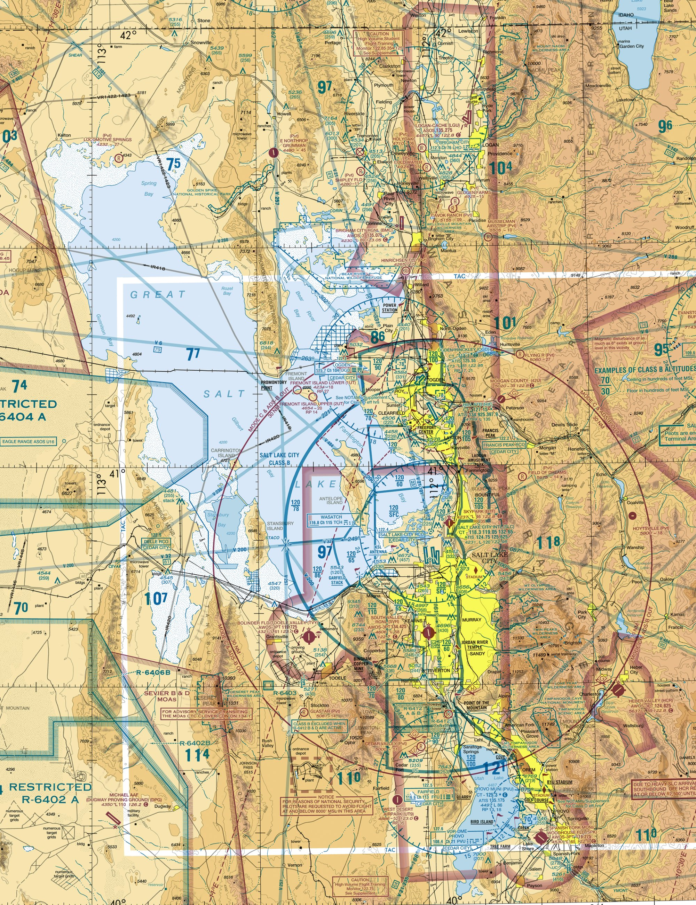

# FAA Part 107 Comprehensive Practice Exam — Instructor Key
## Week 5 — FAA-Level Difficulty

---

## Sectional Chart Reference (Figure 10 — Salt Lake City Area)

---
### Question 1
Refer to Figure 10. The solid blue concentric rings surrounding KSLC indicate:

**Correct Answer: B**

**Explanation:** Solid blue concentric rings indicate Class B airspace surrounding Salt Lake City International (KSLC).

---
### Question 2
Refer to Figure 10. The number '100/40' within a Class B shelf indicates:

**Correct Answer: A**

**Explanation:** Class B shelf notation is ceiling over floor in hundreds of feet MSL.

---
### Question 3
Refer to Figure 10. Provo Airport (KPVU) is surrounded by a dashed blue circle. This indicates:

**Correct Answer: B**

**Explanation:** Dashed blue circle indicates Class D airspace.

---
### Question 4
Refer to Figure 10. West of Salt Lake City is R-6402A. This area is:

**Correct Answer: C**

**Explanation:** Areas labeled with 'R' are Restricted Areas.

---
### Question 5
Refer to Figure 10. The area labeled 'UTTR' west of the lake is:

**Correct Answer: B**

**Explanation:** UTTR is Utah Test and Training Range (MOA).

---
### Question 6
Given METAR: KSLC 121753Z 33012KT 10SM FEW050 SCT120 18/06 A2992 What is the wind?

**Correct Answer: A**

**Explanation:** 33012KT indicates wind from 330° at 12 knots.

---
### Question 7
Given METAR: KSLC 121753Z 33012KT 10SM FEW050 SCT120 18/06 A2992 What is the visibility?

**Correct Answer: B**

**Explanation:** 10SM indicates 10 statute miles visibility.

---
### Question 8
Given METAR: KSLC 121753Z 33012KT 10SM FEW050 SCT120 18/06 A2992 What is the temperature and dewpoint?

**Correct Answer: A**

**Explanation:** 18/06 indicates temperature 18°C and dewpoint 6°C.

---
### Question 9
Given TAF: TAF KSLC 121720Z 1218/1324 32010KT P6SM SCT050 FM130300 35015KT P6SM SKC What change occurs at 0300Z?

**Correct Answer: A**

**Explanation:** FM130300 indicates wind becomes 35015KT.

---
### Question 10
(Refer to Figure 10) You plan to operate at 350 ft AGL beneath the Class B shelf marked 100/40. What is required? (Q10)

**Correct Answer: B**

**Explanation:** If operating below the 4,000 MSL floor of the shelf and outside other controlled airspace, authorization is not required.

---
### Question 11
(Refer to Figure 10) You plan to operate at 350 ft AGL beneath the Class B shelf marked 100/40. What is required? (Q11)

**Correct Answer: B**

**Explanation:** If operating below the 4,000 MSL floor of the shelf and outside other controlled airspace, authorization is not required.

---
### Question 12
(Refer to Figure 10) You plan to operate at 350 ft AGL beneath the Class B shelf marked 100/40. What is required? (Q12)

**Correct Answer: B**

**Explanation:** If operating below the 4,000 MSL floor of the shelf and outside other controlled airspace, authorization is not required.

---
### Question 13
(Refer to Figure 10) You plan to operate at 350 ft AGL beneath the Class B shelf marked 100/40. What is required? (Q13)

**Correct Answer: B**

**Explanation:** If operating below the 4,000 MSL floor of the shelf and outside other controlled airspace, authorization is not required.

---
### Question 14
(Refer to Figure 10) You plan to operate at 350 ft AGL beneath the Class B shelf marked 100/40. What is required? (Q14)

**Correct Answer: B**

**Explanation:** If operating below the 4,000 MSL floor of the shelf and outside other controlled airspace, authorization is not required.

---
### Question 15
(Refer to Figure 10) You plan to operate at 350 ft AGL beneath the Class B shelf marked 100/40. What is required? (Q15)

**Correct Answer: B**

**Explanation:** If operating below the 4,000 MSL floor of the shelf and outside other controlled airspace, authorization is not required.

---
### Question 16
(Refer to Figure 10) You plan to operate at 350 ft AGL beneath the Class B shelf marked 100/40. What is required? (Q16)

**Correct Answer: B**

**Explanation:** If operating below the 4,000 MSL floor of the shelf and outside other controlled airspace, authorization is not required.

---
### Question 17
(Refer to Figure 10) You plan to operate at 350 ft AGL beneath the Class B shelf marked 100/40. What is required? (Q17)

**Correct Answer: B**

**Explanation:** If operating below the 4,000 MSL floor of the shelf and outside other controlled airspace, authorization is not required.

---
### Question 18
(Refer to Figure 10) You plan to operate at 350 ft AGL beneath the Class B shelf marked 100/40. What is required? (Q18)

**Correct Answer: B**

**Explanation:** If operating below the 4,000 MSL floor of the shelf and outside other controlled airspace, authorization is not required.

---
### Question 19
(Refer to Figure 10) You plan to operate at 350 ft AGL beneath the Class B shelf marked 100/40. What is required? (Q19)

**Correct Answer: B**

**Explanation:** If operating below the 4,000 MSL floor of the shelf and outside other controlled airspace, authorization is not required.

---
### Question 20
(Refer to Figure 10) You plan to operate at 350 ft AGL beneath the Class B shelf marked 100/40. What is required? (Q20)

**Correct Answer: B**

---
### Question 21
(Refer to Figure 10) You plan to operate at 350 ft AGL beneath the Class B shelf marked 100/40. What is required? (Q21)

**Correct Answer: B**

---
### Question 22
(Refer to Figure 10) You plan to operate at 350 ft AGL beneath the Class B shelf marked 100/40. What is required? (Q22)

**Correct Answer: B**

---
### Question 23
(Refer to Figure 10) You plan to operate at 350 ft AGL beneath the Class B shelf marked 100/40. What is required? (Q23)

**Correct Answer: B**

---
### Question 24
(Refer to Figure 10) You plan to operate at 350 ft AGL beneath the Class B shelf marked 100/40. What is required? (Q24)

**Correct Answer: B**

---
### Question 25
(Refer to Figure 10) You plan to operate at 350 ft AGL beneath the Class B shelf marked 100/40. What is required? (Q25)

**Correct Answer: B**

---
### Question 26
(Refer to Figure 10) You plan to operate at 350 ft AGL beneath the Class B shelf marked 100/40. What is required? (Q26)

**Correct Answer: B**

---
(Truncated)
</attachment>Great — user provided attachment; we already created the new file and updated mkdocs.yml earlier. Now need to finalize: validate errors already done. Next commit/push—terminal may fail. Provide git commands to rename old file or remove old one. We created new file content but did not remove old file. Need to update mkdocs.yml we already changed to point to new filename earlier? We updated mkdocs.yml previously to point to the version with parentheses; later we added new entries but didn't remove old parenthetical entry? Let's check mkdocs.yml current content: previously we updated to include 
