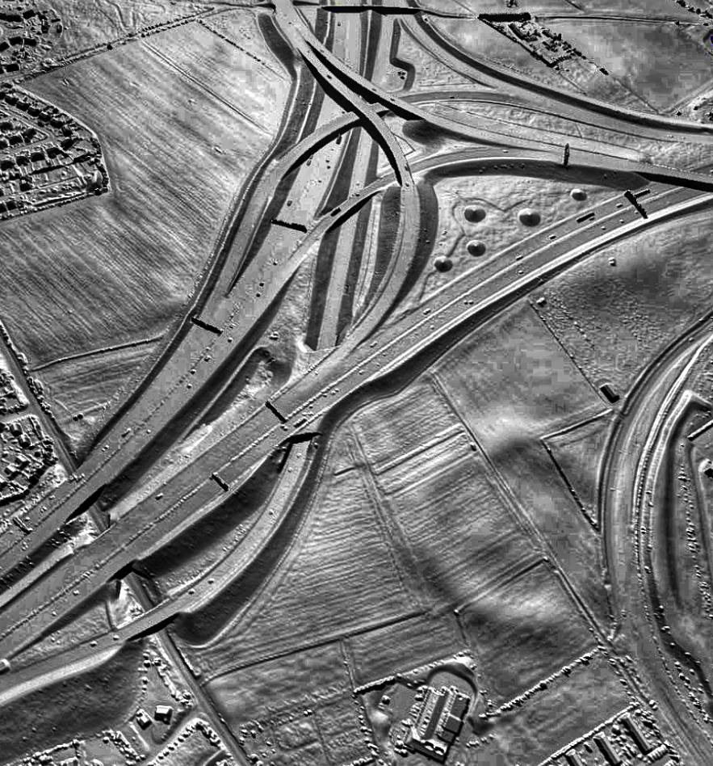
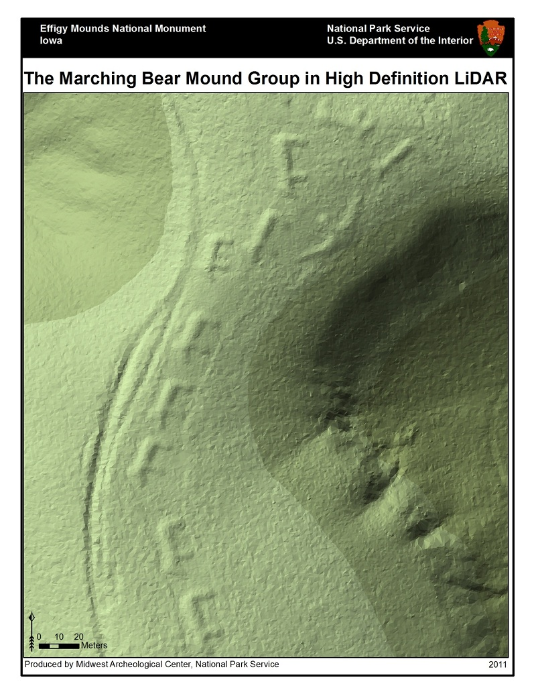
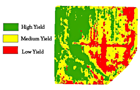
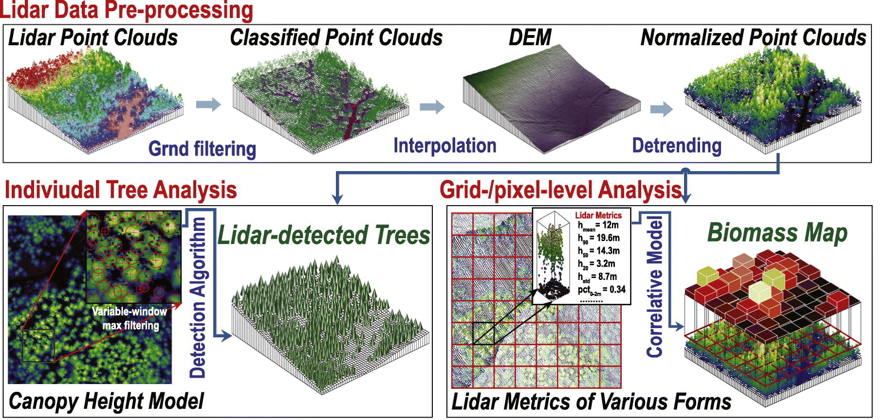

# Week 6 — LiDAR Overview

This page introduces LiDAR sensors on drones: how they work, the primary data products, common use cases, and practical guidance for planning LiDAR flights.

## What is LiDAR?
LiDAR (Light Detection and Ranging) uses rapid pulses of laser light to measure distances to surfaces. A LiDAR sensor records time-of-flight measurements and returns a dense set of 3D points (a point cloud) representing the scanned surfaces.

## How LiDAR works
- The sensor emits laser pulses and measures the time until reflected light returns.
- Each return is georeferenced using GNSS/IMU data; multiple returns per pulse can capture vegetation structure.
- Post-processing filters, classifies, and creates products such as classified point clouds, digital surface models (DSM), digital terrain models (DTM), and intensity rasters.

### Direct example airborne/jungle mapping videos (Wikimedia file pages)
Below are links to Wikimedia/Wikipedia file pages for several LiDAR videos. Open the links to view the media and to read the file-page license and attribution details.

- [50 Kilometers of Brazilian Forest Canopy](https://en.wikipedia.org/wiki/File:50_Kilometers_of_Brazilian_Forest_Canopy.webm)
    - What to look for: airborne LiDAR swath, platform motion, and canopy penetration visible in the scan.

- [Flying Through LIDAR Canopy Data](https://en.wikipedia.org/wiki/File:Flying_Through_LIDAR_Canopy_Data.webm)
    - What to look for: a fly-through of a processed point cloud illustrating canopy and ground structure in 3D.

- [Amazon Canopy Comes to Life through Laser Data](https://en.wikipedia.org/wiki/File:Amazon_Canopy_Comes_to_Life_through_Laser_Data.webm)
    - What to look for: canopy-penetration and ground features revealed beneath dense vegetation.

- [Collecting LIDAR data over the Ganges and Brahmaputra River Basin](https://en.wikipedia.org/wiki/File:Collecting_LIDAR_data_over_the_Ganges_and_Brahmaputra_River_Basin.ogv)
    - What to look for: field and airborne data-collection operations for large-area surveys.

What to notice when watching these clips:
- Platform motion and scanning swath alignment with flight lines.
- Differences between canopy (higher returns) and ground (lower returns).
- Transitions from raw point cloud to derived products (hillshades, DTMs, CHMs) in some visualizations.

### Suggested student activities (videos & examples)
- Identify flight-line patterns and explain how swath overlap affects ground coverage.
- Compare canopy returns vs ground returns and describe which returns are used to build a DTM.
- Note any visualization steps shown (color by height, intensity hillshade) and explain their purpose.

## Common data products
- Raw/processed point cloud (LAS/LAZ)
- Classified returns (ground, vegetation, buildings)
- Digital Surface Model (DSM)
- Digital Terrain Model (DTM)
- Intensity imagery (reflectance-like raster)

## Typical sensors & platforms
- Lightweight scanning LiDAR units suited for small UAVs (Velodyne Puck, RIEGL miniVUX, Livox, etc.)
- Commonly paired with RTK/PPK GNSS and high-rate IMUs for better absolute accuracy

## Use cases
- High-precision topography and elevation mapping
- Vegetation structure and biomass estimation
- Corridor mapping (powerlines, roads)
- Forestry, archaeology, and floodplain modeling

## Flight planning considerations
- Altitude & resolution: lower altitude increases point density but reduces coverage and increases flight time.
- Overlap & swath: LiDAR sensors have swath widths and scan patterns; ensure flight lines provide sufficient overlap for full coverage.
- Sensor settings: scan rate, pulse repetition frequency (PRF), and scan angle affect density and penetration through vegetation.
- Georeferencing: use RTK/PPK or ground control to improve absolute accuracy.

## File formats & tools
- LAS/LAZ for point clouds; many GIS tools (PDAL, LAStools, QGIS) and commercial packages support LiDAR workflows.

## Example: LiDAR point cloud and derived terrain
Below is an illustrative figure that shows a stylized LiDAR point cloud (colored dots) over a terrain profile. The figure highlights how LiDAR returns include ground returns (used to build a Digital Terrain Model, DTM) and higher returns from vegetation or structures (which contribute to the Digital Surface Model, DSM).

Figure interpretation and tips:
- Ground returns (last returns) form the basis of a DTM — these are typically filtered from the full point cloud.
- First or highest returns (or a statistical summary) are used to build the DSM, which includes vegetation and structures.
- Classifying returns (ground, vegetation, building) is an important early processing step to derive useful elevation products.
- Pay attention to point density (points/m^2): higher density improves the ability to resolve small terrain features but increases data size and flight time.

## Example LiDAR images (Wikimedia Commons)

### 1) Ferrybridge Henge — hillshade / archaeology

Description: A LiDAR hillshade highlighting subtle earthworks. Generated by classifying ground returns, interpolating a DTM, and applying hillshade or local-relief rendering to emphasize micro-topography.

How it was generated: ground classification (filtering non-ground returns), DTM interpolation (TIN or gridded), then hillshade rendering (sun angle, azimuth). Sometimes high-pass filters or local relief models are used to enhance archaeological features.

Uses: Archaeology, landscape analysis, site preservation planning.

Attribution: Source — [Wikimedia Commons: File:A_lidar_view_of_Ferrybridge_Henge_in_West_Yorkshire.jpg (public domain)](https://commons.wikimedia.org/wiki/File:A_lidar_view_of_Ferrybridge_Henge_in_West_Yorkshire.jpg).

---

### 2) Effigy Mounds — high-resolution hillshade

Description: LiDAR reveals the outlines of effigy mounds and micro-topography that can be obscured in visible imagery. This image is typically a hillshade or enhanced DTM rendering.

How it was generated: filter to ground returns, interpolate a DTM, and apply visualization techniques (hillshade, local relief models) to make subtle elevation changes visible.

Uses: Archaeological site mapping, conservation planning, and ground-truthing of features that are not visible in aerial photographs.

Attribution: Source — [Wikimedia Commons: File:Effigy_mounds_lidar.jpg (public domain)](https://commons.wikimedia.org/wiki/File:Effigy_mounds_lidar.jpg).

---

### 3) LiDAR and Field Yield — precision agriculture context

Description: This composite shows LiDAR-derived terrain or micro-topography alongside field yield data. LiDAR-derived elevation, slope, and drainage patterns help explain spatial yield variability.

How it was generated: LiDAR point cloud → ground classification → DTM/DEM generation → derivation of slope/aspect/curvature or micro-topography indices. The agricultural yield layer typically comes from combine harvester sensors and is spatially joined to the LiDAR-derived surfaces for analysis.

Uses: Precision agriculture (zoning, drainage planning, yield modeling), soil and water-management decisions, and site-specific variable-rate applications.

Attribution: Source — [Wikimedia Commons: File:LIDAR_field_yield.jpg (public domain)](https://commons.wikimedia.org/wiki/File:LIDAR_field_yield.jpg).

---

### 4) Forestry / Canopy Height Model (CHM)

Description: A visualization of LiDAR returns colored by height showing canopy structure. A Canopy Height Model (CHM) is commonly created by subtracting the DTM (ground surface) from a DSM (first/upper returns) or by gridding the maximum return height per cell.

How it was generated: Classify returns into ground / non-ground; generate DSM (e.g., first-return maximum) and DTM (ground); compute CHM = DSM - DTM. Additional processing (smoothing, filtering) is often applied to reduce noise.

Uses: Forestry inventory (tree height, stand structure), biomass estimation, habitat mapping, and forest health monitoring.

Attribution: Source — [Wikimedia Commons: File:Lidar_forestry.png (public domain)](https://commons.wikimedia.org/wiki/File:Lidar_forestry.png).

---

## Quick note on reproducing these products
Common open-source tools for the steps above include PDAL (point cloud processing pipeline), LAStools (fast classification and filtering), and GDAL/QGIS for raster generation and visualization. Typical workflow:
1. Acquire raw LiDAR LAS/LAZ files.
2. Classify ground vs non-ground returns (and optionally buildings/vegetation).
3. Create DTM and DSM (gridded rasters).
4. Derive secondary products: hillshades, CHM (DSM - DTM), slope/aspect, intensity rasters.
5. Combine with external datasets (yield maps, orthophotos) for analysis.

Note for this class: we will primarily use Bentley software to generate and visualize these LiDAR-derived products (e.g., Bentley iTwin and related Bentley tools). Class demonstrations and example project files will show the specific Bentley workflows and settings used to create hillshades, CHMs, and other visualizations.

## Further reading & resources
- [Lidar — Wikipedia](https://en.wikipedia.org/wiki/Lidar) — A comprehensive encyclopedia entry covering LiDAR's principles (time-of-flight, scanning methods), history, sensor types (airborne, terrestrial, bathymetric), common applications (topographic mapping, forestry, archaeology, autonomous systems), data formats, and processing concepts. The article includes diagrams, references, and links to related topics and standards.
  - Why visit: good quick primer for students who want a broad, well-referenced overview; useful for finding further reading, citations, and links to more specific topics (e.g., LAS format, bathymetric LiDAR, LiDAR processing techniques).

### Tools & sensors (selected links)
- [PDAL (Point Data Abstraction Library)](https://pdal.io/) — Open-source library for translating and processing point cloud data; great for scripting LiDAR workflows.
- [CloudCompare](https://www.cloudcompare.org/) — Open-source 3D point cloud processing and visualization tool (manual analysis, comparisons, segmentation).
- [LAStools](https://rapidlasso.com/lastools/) — Fast tools for LiDAR processing (note licensing for some components).
- [Potree](https://potree.org/) — Web-based point cloud viewer for publishing large point clouds in the browser.

Selected UAV LiDAR sensors / vendors (examples)
- [RIEGL miniVUX series](https://www.riegl.com/products/airborne-laser-scanners/miniature-scanners/miniVUX-1-series/) — Proven small-form-factor LiDAR for UAVs.
- [Velodyne Puck series (and Velodyne sensors)](https://velodynelidar.com/) — Lightweight scanning LiDAR sensors used on many platforms.
- [Livox (Horizon / Avia)](https://www.livoxtech.com/) — Low-cost, high-performance solid-state LiDAR sensors now used in some UAV payloads.
- [YellowScan](https://www.yellowscan-lidar.com/) — UAV-dedicated LiDAR systems and integrated platforms for surveying.
- [DJI Zenmuse L1](https://www.dji.com/zenmuse-l1) — Integrated LiDAR + RGB sensor for DJI platforms (example of an off-the-shelf UAV LiDAR payload).

<!-- End LiDAR.md -->