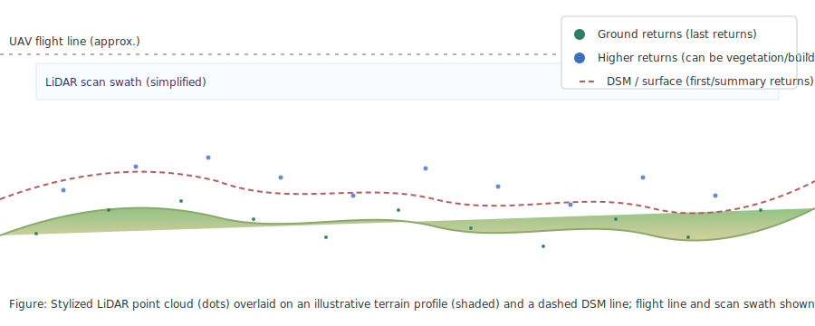

# Week 6 — LiDAR Overview

This page introduces LiDAR sensors on drones: how they work, the primary data products, common use cases, and practical guidance for planning LiDAR flights.

## What is LiDAR?
LiDAR (Light Detection and Ranging) uses rapid pulses of laser light to measure distances to surfaces. A LiDAR sensor records time-of-flight measurements and returns a dense set of 3D points (a point cloud) representing the scanned surfaces.

## How LiDAR works
- The sensor emits laser pulses and measures the time until reflected light returns.
- Each return is georeferenced using GNSS/IMU data; multiple returns per pulse can capture vegetation structure.
- Post-processing filters, classifies, and creates products such as classified point clouds, digital surface models (DSM), digital terrain models (DTM), and intensity rasters.

### Direct example airborne/jungle mapping videos (Wikimedia file pages)
Below are links to Wikimedia/Wikipedia file pages for several LiDAR videos. Open the links to view the media and to read the file-page license and attribution details.

- 50 Kilometers of Brazilian Forest Canopy — https://en.wikipedia.org/wiki/File:50_Kilometers_of_Brazilian_Forest_Canopy.webm
  - What to look for: airborne LiDAR swath, platform motion, and canopy penetration visible in the scan.

- Flying Through LIDAR Canopy Data — https://en.wikipedia.org/wiki/File:Flying_Through_LIDAR_Canopy_Data.webm
  - What to look for: a fly-through of a processed point cloud illustrating canopy and ground structure in 3D.

- Amazon Canopy Comes to Life through Laser Data — https://en.wikipedia.org/wiki/File:Amazon_Canopy_Comes_to_Life_through_Laser_Data.webm
  - What to look for: canopy-penetration and ground features revealed beneath dense vegetation.

- Collecting LIDAR data over the Ganges and Brahmaputra River Basin — https://en.wikipedia.org/wiki/File:Collecting_LIDAR_data_over_the_Ganges_and_Brahmaputra_River_Basin.ogv
  - What to look for: field and airborne data-collection operations for large-area surveys.

What to notice when watching these clips:
- Platform motion and scanning swath alignment with flight lines.
- Differences between canopy (higher returns) and ground (lower returns).
- Transitions from raw point cloud to derived products (hillshades, DTMs, CHMs) in some visualizations.

## Suggested student activities (videos & examples)
- Identify flight-line patterns and explain how swath overlap affects ground coverage.
- Compare canopy returns vs ground returns and describe which returns are used to build a DTM.
- Note any visualization steps shown (color by height, intensity hillshade) and explain their purpose.

## Common data products
- Raw/processed point cloud (LAS/LAZ)
- Classified returns (ground, vegetation, buildings)
- Digital Surface Model (DSM)
- Digital Terrain Model (DTM)
- Intensity imagery (reflectance-like raster)

## Typical sensors & platforms
- Lightweight scanning LiDAR units suited for small UAVs (Velodyne Puck, RIEGL miniVUX, Livox, etc.)
- Commonly paired with RTK/PPK GNSS and high-rate IMUs for better absolute accuracy

## Use cases
- High-precision topography and elevation mapping
- Vegetation structure and biomass estimation
- Corridor mapping (powerlines, roads)
- Forestry, archaeology, and floodplain modeling

## Flight planning considerations
- Altitude & resolution: lower altitude increases point density but reduces coverage and increases flight time.
- Overlap & swath: LiDAR sensors have swath widths and scan patterns; ensure flight lines provide sufficient overlap for full coverage.
- Sensor settings: scan rate, pulse repetition frequency (PRF), and scan angle affect density and penetration through vegetation.
- Georeferencing: use RTK/PPK or ground control to improve absolute accuracy.

## File formats & tools
- LAS/LAZ for point clouds; many GIS tools (PDAL, LAStools, QGIS) and commercial packages support LiDAR workflows.

## Example: LiDAR point cloud and derived terrain
Below is an illustrative figure that shows a stylized LiDAR point cloud (colored dots) over a terrain profile. The figure highlights how LiDAR returns include ground returns (used to build a Digital Terrain Model, DTM) and higher returns from vegetation or structures (which contribute to the Digital Surface Model, DSM).

Figure: Stylized LiDAR point cloud and terrain model — ground returns (used to build DTMs) and higher returns (vegetation/structures) are shown. Review the figure to understand return classification and how DSM/DTM are derived.

Figure interpretation and practical tips:
- Ground returns (last returns) form the basis of a DTM — these are typically filtered from the full point cloud.
- First or highest returns (or a statistical summary) are used to build the DSM, which includes vegetation and structures.
- Classifying returns (ground, vegetation, building) is an important early processing step to derive useful elevation products.
- Pay attention to point density (points/m^2): higher density improves the ability to resolve small terrain features but increases data size and flight time.

## Further reading & resources
- [Lidar — Wikipedia](https://en.wikipedia.org/wiki/Lidar) — A comprehensive overview covering LiDAR principles (time-of-flight, scanning methods), sensor types, applications, data formats, and processing concepts. Read this for background and references to more specific topics (LAS format, bathymetric LiDAR, LiDAR processing).

### Tools & sensors (selected)
- PDAL (Point Data Abstraction Library) — https://pdal.io/ — Open-source library for translating and processing point cloud data; useful for scripting LiDAR workflows.
- CloudCompare — https://www.cloudcompare.org/ — Open-source 3D point cloud processing and visualization tool.
- LAStools — https://rapidlasso.com/lastools/ — Fast tools for LiDAR processing (some components have licensing restrictions).
- Potree — https://potree.org/ — Web-based point cloud viewer for publishing large point clouds in the browser.

### Example UAV LiDAR sensors (for reference)
- RIEGL miniVUX series — https://www.riegl.com/products/airborne-laser-scanners/miniature-scanners/miniVUX-1-series/
- Velodyne Puck series — https://velodynelidar.com/
- Livox (Horizon / Avia) — https://www.livoxtech.com/
- YellowScan — https://www.yellowscan-lidar.com/
- DJI Zenmuse L1 — https://www.dji.com/zenmuse-l1

<!-- End LiDAR.md -->
