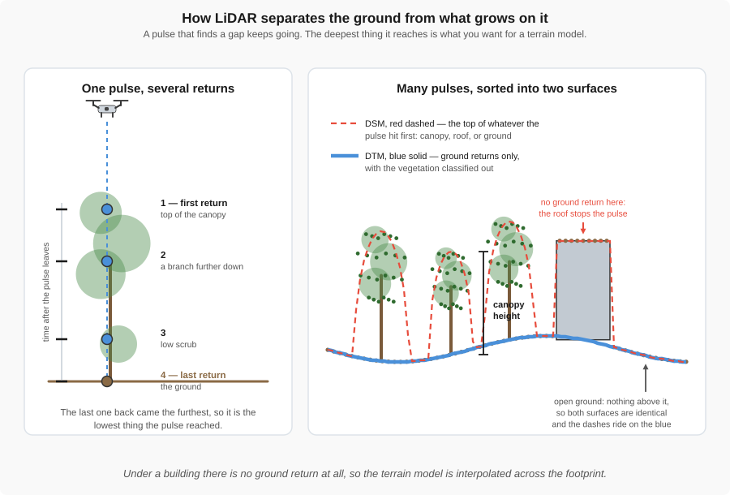
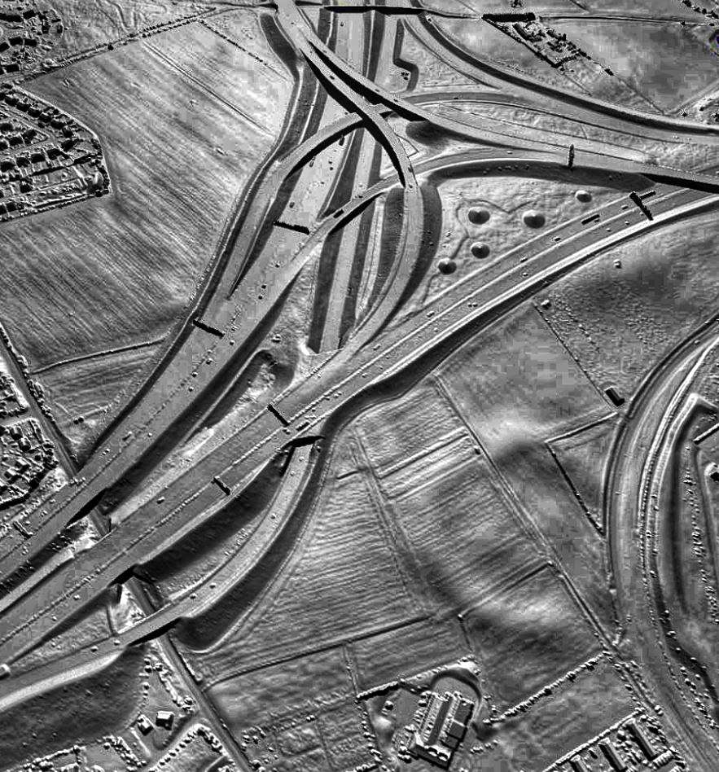
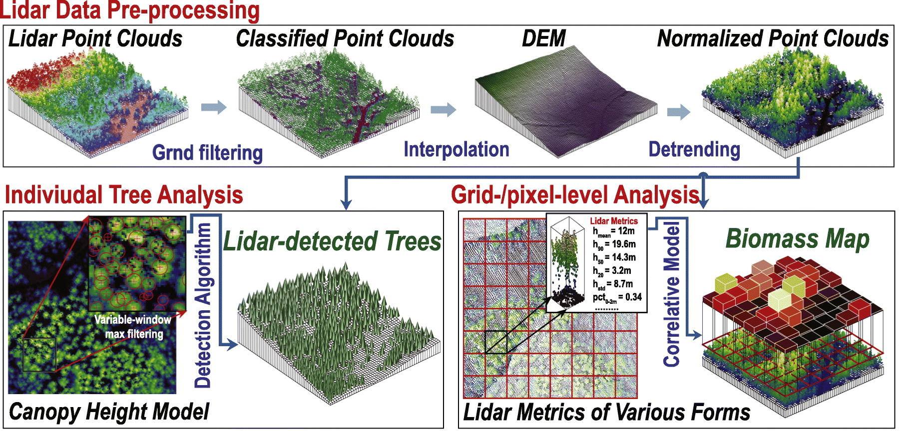

# LiDAR

This page introduces LiDAR sensors on drones: how they work, the primary data products, common use cases, and practical guidance for planning LiDAR flights.

## Key Takeaways
- **Direct Measurement:** LiDAR measures distance directly using laser pulses, unlike SfM which estimates it from photos.
- **Vegetation Penetration:** LiDAR can see through gaps in leaves to map the ground (DTM) even in dense forests.
- **Point Clouds:** The primary output is a 3D point cloud, where each point has an X, Y, Z coordinate and often an "intensity" value.
- **Classification:** Processing involves labeling points as "ground," "vegetation," or "building" to create terrain models.

---

## What is LiDAR?
LiDAR (Light Detection and Ranging) uses rapid pulses of laser light to measure distances to surfaces. A LiDAR sensor records time-of-flight measurements and returns a dense set of 3D points (a point cloud) representing the scanned surfaces.

## How LiDAR works
- **Laser Pulses:** The sensor emits thousands of laser pulses per second and measures the time until the reflected light returns.
- **Georeferencing:** Each point is positioned in space using high-precision GNSS (GPS) and an IMU (Inertial Measurement Unit) that tracks the drone's tilt and rotation.
- **Multiple Returns:** A single laser pulse can hit a leaf, pass through, and then hit the ground. This results in "multiple returns," allowing us to map both the tree canopy and the floor beneath.

### Multimedia: LiDAR in action
Below are links to several LiDAR visualizations. Notice the platform motion and how the laser "paints" the 3D scene.

- [50 Kilometers of Brazilian Forest Canopy](https://en.wikipedia.org/wiki/File:50_Kilometers_of_Brazilian_Forest_Canopy.webm){target='_blank'}
- [Flying Through LIDAR Canopy Data](https://en.wikipedia.org/wiki/File:Flying_Through_LIDAR_Canopy_Data.webm){target='_blank'}
- [Amazon Canopy Comes to Life](https://en.wikipedia.org/wiki/File:Amazon_Canopy_Comes_to_Life_through_Laser_Data.webm){target='_blank'}

## Common data products
- **Point Cloud (LAS/LAZ):** The raw 3D data.
- **Digital Terrain Model (DTM):** A map of the bare ground surface (vegetation removed).
- **Digital Surface Model (DSM):** A map of the top surfaces, including trees and buildings.
- **Canopy Height Model (CHM):** The difference between DSM and DTM, showing actual tree heights.
- **Intensity Imagery:** A raster showing how strongly different materials reflected the laser.

## Where it earns its place on a project

Neither sensor is simply better, faster, or cheaper. The trades run in different directions at once,
and which one wins depends on the site and on what is actually scarce.

| | Photogrammetry | LiDAR |
|---|---|---|
| **Equipment** | The camera is already on the aircraft | A dedicated sensor, and a heavier aircraft to carry it |
| **Collection** | Needs daylight, texture, and high overlap | Fewer constraints, so it can fly faster and after dark |
| **Processing** | Hours of matching and solving before you have anything | Points come out almost directly, with far less compute |
| **Vegetation** | Sees the top of the canopy | Reaches the ground through it |
| **Thin features** | Meshed away | Survive |
| **Color** | Photo-realistic | Limited, unless a camera flies alongside |

The sticker price is higher and the time cost is lower. On a project where staff hours or the
schedule are the binding constraint rather than the equipment budget, LiDAR can be the **cheaper**
answer, not just the more capable one.

| Use case | What you produce | Why LiDAR rather than photos |
|----------|------------------|------------------------------|
| **Existing conditions for design** | A bare-earth DTM of the site before anything is built | Brush and trees hide the ground. LiDAR gets ground returns through roughly 90% vegetation cover; photogrammetry manages closer to 60% |
| **Earthwork cut and fill** | Volumes between a baseline surface and today's surface | Repeat flights give weekly quantities for progress and payment, and the vertical accuracy holds up when the site is partly vegetated |
| **Drainage and floodplain modeling** | A DTM the hydraulic model runs on | Water flows over the ground, not over the tree canopy. A DSM gives confidently wrong answers here |
| **As-built verification** | The built surface compared against the design surface | Documents what was actually constructed, including areas a camera cannot see into |
| **Corridor mapping: road, rail, utility** | Classified point cloud of pavement, drainage, right of way, poles and wires | Thin features survive. Photogrammetry meshes wires and railings away because too few points define them |
| **Slope and embankment monitoring** | Repeat surfaces, differenced over time | Millimeter-to-centimeter change detection through vegetation, which is where slope movement usually hides |

!!! tip "Stockpiles are the honest case"
    Both methods measure a clean, open stockpile to within a couple of centimeters, so the choice is
    not about accuracy. If you own a camera drone and the pile is clear, photographs get you there
    with no extra hardware. If you own LiDAR, or you need the number before the end of the day
    rather than after an overnight processing run, LiDAR gets you there sooner.

    "Which do we already have, and what is short this week: money or time?" is a legitimate
    engineering question, and it will not always have the same answer.

Other fields use LiDAR heavily for their own reasons: archaeology to find earthworks under forest,
forestry to measure canopy height and biomass. Both rest on the same trick you need for drainage,
which is stripping the vegetation away to get at the ground.

## Flight planning & best practices
- **Point Density:** This is the number of points per square meter. Flying lower or slower increases density, allowing you to see smaller details (like thin powerlines).
- **Overlap & Swath:** Ensure laser swaths overlap sufficiently to avoid "gaps" in the point cloud.
- **Georeferencing:** Use RTK (Real-Time Kinematic) or PPK to ensure the point cloud is accurately positioned on the Earth's surface.
- **Sensor Settings:** Adjust the Pulse Repetition Frequency (PRF) based on the required range and density.

## Tools & software
- **Processing:** PDAL, LAStools, CloudCompare.
- **Visualization:** Bentley iTwin, QGIS.
- **Format:** LAS is the industry standard; LAZ is the compressed version.

## Example outputs & images

### 1) How the ground gets separated from what grows on it

{ width="100%" }

*Figure 1: A single pulse returns several times on its way down. The first return builds the surface
model, the last one that reached the ground builds the terrain model, and the gap between them is the
height of whatever is growing there.*

**Activity:**
- If you were looking for an old stone wall buried under a forest, which data product would you use: the DSM or the DTM? Why?

---

### 2) Seeing the ground through vegetation

*Figure 2: A "hillshade" rendering of a DTM: the vegetation has been stripped out and the bare
ground lit from one side to reveal its shape. Archaeologists use this to find earthworks, but it is
the same operation you need to find an old ditch, a buried foundation, or the fall of the land
across a brushy site.*

**Activity:**
- These features are invisible in an ordinary aerial photograph. Why?
- You are asked to model drainage across a site covered in scrub. Explain, in one sentence, why a
  DSM would give you the wrong answer.

---

### 3) Forestry — Canopy Heights

*Figure 3: Points colored by height. Foresters use this to estimate timber volume; the same canopy
height model tells you how much clearing a site needs.*

**Activity:**
- Explain the calculation for a Canopy Height Model (CHM). If the DSM value at a point is 45 meters and the DTM value is 32 meters, how tall is the tree?

---

## Further reading & resources
- [Wikipedia — Lidar](https://en.wikipedia.org/wiki/Lidar){target='_blank'}
- [USGS — What is Lidar?](https://www.usgs.gov/faqs/what-lidar){target='_blank'}

<!-- End LiDAR.md -->