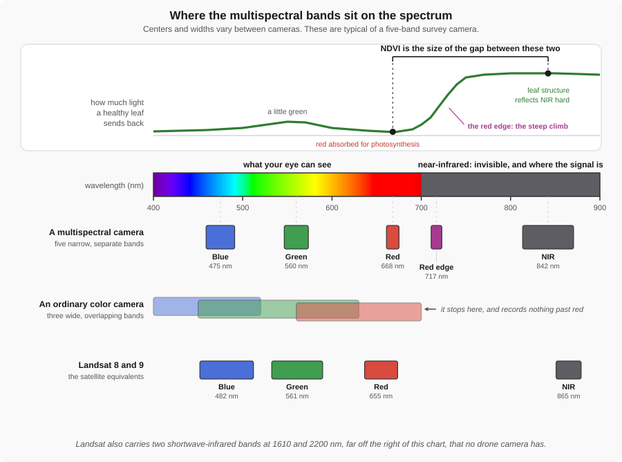

# Multispectral Imaging

This page introduces multispectral sensors on drones, explains common spectral bands and indices, and provides practical guidance for planning flights and producing quantitative products.

!!! abstract "Key Takeaways"
    - **Beyond visible.** Multispectral sensors capture light outside the visible range, usually
      near-infrared and red-edge.
    - **Ratios, not values.** Almost nothing useful comes from a single band's number. The analysis
      is done on **normalized band ratios**, such as NDVI, because a ratio survives changes in
      lighting that a raw value does not.
    - **Plant health.** Healthy vegetation absorbs red light and reflects near-infrared strongly.
      The gap between those two bands is the signal.
    - **Calibration.** Reflectance panels and a light sensor are what make index values comparable
      between flights, not just within one.
    - **The same bands as the satellites.** Drone cameras are built to line up with Landsat and
      Sentinel-2, so the published methods for land cover, change detection, and water quality
      carry across.

---

## What is multispectral imaging?
The term "multispectral imagery" refers to images captured across multiple bands of light. Whereas traditional RGB imagery records three primary bands (red, green, and blue), multispectral sensors also record light outside the visible range — for example near-infrared (NIR) and "red-edge" bands. More bands means more information about the scene, enabling enhanced analysis of natural resources and built environments.

What the human eye can see is only a small portion of the electromagnetic spectrum. Capturing
reflected light beyond visible wavelengths reveals information about plant health, moisture, soil
properties, and material composition that we cannot perceive with RGB alone.

{ width="100%" }

*Figure 10: An ordinary camera has three wide bands and stops at red. A multispectral camera has five
narrow ones, and the two that matter most sit at and beyond the red edge, where the eye cannot
follow.*

Two things in that figure do most of the work in this topic. The **red** band is where chlorophyll
absorbs light, so a healthy leaf sends almost none of it back. The **NIR** band is where leaf
structure reflects light hard, so a healthy leaf sends most of it back. Between them is the **red
edge**, the steep climb, which moves as a plant comes under stress.

### How does multispectral imaging work?
Multispectral sensors mount multiple detectors (or use filter arrays) that each record radiance in a narrow band of wavelengths. By measuring the relative reflectance in several bands, we can compute indices and extract features that map to physical properties — for example, chlorophyll content, water stress, or soil brightness.

### What do the common bands do?
- **Blue (visible):** Useful for detecting water, haze, and some soil/leaf properties.
- **Green (visible):** Correlated with green vegetation; useful for true-color rendering.
- **Red (visible):** Absorbed strongly by chlorophyll; key for many vegetation indices.
- **Near-Infrared (NIR):** Plants reflect strongly in the NIR when healthy; critical for NDVI.
- **Red-edge:** Transition zone between red and NIR; sensitive to canopy structure and stress.

When chlorophyll-rich leaves are illuminated, they absorb much of the blue and red light for photosynthesis and reflect green. They also reflect a large amount of NIR — a region invisible to humans — which is a powerful signal for assessing plant health.

## Common data products
- **Multispectral orthomosaics:** Per-band or multi-band GeoTIFFs.
- **Vegetation index maps:** NDVI (vigor), NDRE (dense canopy stress).
- **Classified maps:** Vigor classes, stressed areas, or material types.
- **Time-series change maps:** Monitoring growth or stress over a season.

## Key bands & indices

### Why ratios rather than band values

The number a sensor records for one band is not a property of the plant. It also depends on how
bright the sun was, the angle it struck the leaf at, haze, and the sensor itself. Fly the same field
an hour later and every band value has changed, without a single plant changing.

A **ratio between bands** cancels most of that out, because whatever scaled one band scaled the
others in the same image at the same instant. Two flights that disagree completely on raw values can
agree closely on the ratio.

### Why *normalized* ratios

In practice the ratios used are **normalized differences**, of the form:

`index = (A − B) / (A + B)`

Dividing by the sum bounds the result between −1 and +1 however bright the scene was. That is what
lets a legend mean the same thing on every map you produce, and lets you compare this week's field
against last week's.

| Index | Formula | Use it for |
|-------|---------|------------|
| **NDVI** | (NIR − Red) / (NIR + Red) | General vigor and biomass. The default starting point |
| **NDRE** | (NIR − RedEdge) / (NIR + RedEdge) | Dense canopy, where NDVI saturates and stops discriminating |
| **NDWI** | (Green − NIR) / (Green + NIR) | Open water and moisture, rather than vegetation |

Healthy vegetation absorbs red light for photosynthesis and reflects near-infrared strongly, so those
two bands pull far apart and NDVI runs high. A stressed plant loses chlorophyll, absorbs less red,
and the gap closes before anything is visible to the eye.

!!! tip "The same idea as the thermal page"
    On [the thermal page](Thermal.md) the useful reading was the **difference between things that
    should match**, not an absolute temperature. Here it is the **ratio between bands in the same
    image**. Both work for the same reason: what you compare against carries the same errors, so the
    errors largely cancel.

    Ratios do not remove the need for calibration. They make one flight internally consistent;
    reflectance panels and a downwelling light sensor are what make **this** flight comparable with
    **last month's**.

## The same bands the satellites use

Look again at the bottom row of Figure 10. A drone multispectral camera is not a one-off design: its
bands were chosen to sit in roughly the same places as **Landsat** and **Sentinel-2**, the two
long-running earth observation satellite programs. That is more useful than it sounds.

- **The methods carry across.** Decades of published work on land cover, vegetation, and water
  quality were developed on satellite bands. The same indices and rules of thumb apply to your data.
- **The scales complement each other.** Satellites give you the whole watershed, repeatedly, for
  free. The drone gives you one site in centimeters, on the day you choose. Use the satellite for
  context and history, and the drone for detail and timing.
- **The history already exists.** Landsat has imaged continuously since 1972 and Sentinel-2 since
  2015. You can look at your site *before* the project started, which no drone can do.

| | Landsat 8 and 9 | Sentinel-2 | Drone multispectral |
|---|---|---|---|
| **Pixel size** | 30 m (98 ft) | 10 to 20 m (33 to 66 ft) | 2 to 8 cm (about 1 to 3 in) |
| **Revisit** | 16 days | about 5 days | whenever you fly |
| **Cost of the imagery** | free | free | your time |
| **You pick the day** | no | no | yes |
| **Clouds** | ruin the scene | ruin the scene | fly underneath them |

!!! warning "Similar is not identical"
    The bands line up closely, but they are not the same instrument. Band edges differ, and a drone
    camera is calibrated differently from a satellite. Compare **patterns and trends** between the
    two freely. Do not treat a drone NDVI of 0.62 and a Sentinel-2 NDVI of 0.62 as the same
    measurement.

---

## Use cases & applications

Most published multispectral work is agricultural, but the technique reaches well into civil and
construction work, and it is usually the same few indices being applied to a different question.

- **Land cover and impervious area.** Classify roof, pavement, soil, vegetation, and water to
  estimate runoff coefficients for drainage design, or to check what is actually built against what
  was permitted.
- **Change detection.** Compare the same index on two dates: how far a clearing and grading
  operation has advanced, encroachment into a right of way, or whether a finished slope is
  revegetating on schedule.
- **Erosion and site stabilization.** Find where bare soil remains before a storm, and confirm that
  seeding took on a cut slope, rather than guessing from a windshield survey.
- **Water quality and stormwater compliance.** Sediment plumes, turbidity after a rain event, and
  algal blooms. A common question is whether a site is discharging sediment into the receiving
  stream, which is an SWPPP concern on nearly every project.
- **Corridor and right-of-way monitoring.** Vegetation stress in a line over a buried pipeline can
  be the first visible sign of a leak.
- **Precision agriculture and forestry.** The original application, and still the largest: crop
  vigor zones for targeted fertilizer and irrigation, and canopy dieback or pest outbreaks.

## Flight planning & best practices
- **Overlap:** Use high overlap (~75% forward / 70% side) to support radiometric consistency and mosaicking in complex vegetation.
- **Altitude & GSD:** Flying lower gives finer ground sample distance (GSD) but increases flight time.
- **Flight Timing:** Fly near solar noon (high sun angle) for consistent illumination and to reduce long shadows.
- **Environmental Conditions:** Aim for uniform sky conditions (either clear or completely overcast) to avoid changing shadows.

## Radiometric calibration
- **Reflectance panels:** Capture images of a calibrated panel before and after the flight to convert digital numbers to reflectance.
- **Downwelling Light Sensors (DLS):** Records illumination for per-image correction.
- **Why calibrate:** Without it, index values can vary between flights and are not comparable over time.

## Processing workflow
1. **Ingest images and metadata:** GPS tags, camera model, band wavelengths.
2. **Apply radiometric calibration:** Using panel or DLS readings.
3. **Align and stitch:** Create per-band orthomosaics via bundle adjustment.
4. **Generate indices:** Compute NDVI, NDRE, etc., from the stitched bands.

## Tools & software
- **Commercial:** Pix4D, Agisoft Metashape, DJI Terra.
- **Open Source:** OpenDroneMap, QGIS.
- **Manufacturer Resources:** [MicaSense (AgEagle)](https://micasense.com/){target='_blank'} - useful for sensor-specific guides.

## Example outputs & images

### 1) NDVI / crop health map

*Description: An NDVI (Normalized Difference Vegetation Index) map. By calculating the ratio between Red and NIR reflectance, we can create a "heat map" of plant vigor. Greener areas indicate high biomass and healthy chlorophyll levels.*

**Activity:**
- Find the areas of the field with the lowest NDVI values (red/yellow). What are three possible real-world reasons (e.g., water, soil, pests) that might cause this?

---

### 2) Orchard disease detection

*Description: This example shows how multispectral indices can "see" disease before it is visible to the human eye. The colored overlays highlight specific trees that are under stress, allowing for targeted treatment.*

**Activity:**
- Compare this to a standard RGB photo in your mind. Why is it more efficient for a farmer to use this map than to walk every row of the orchard?

---

## Further reading & resources
- [Wikipedia — Vegetation Index](https://en.wikipedia.org/wiki/Vegetation_index){target='_blank'}
- [NASA — Measuring Vegetation (NDVI)](https://earthobservatory.nasa.gov/features/MeasuringVegetation){target='_blank'}

<!-- End Multispectral.md -->
