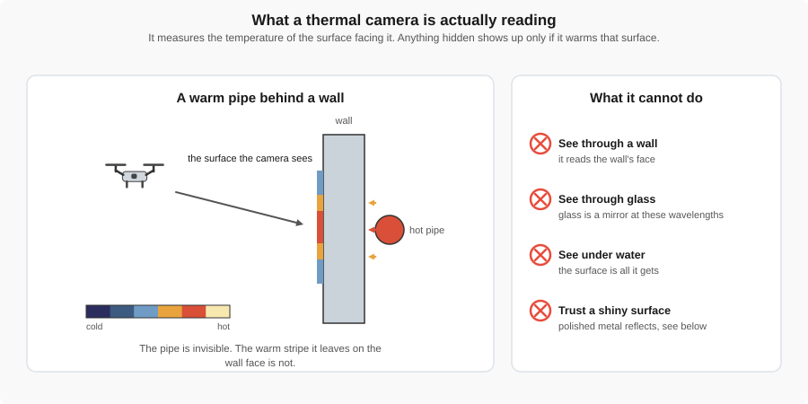
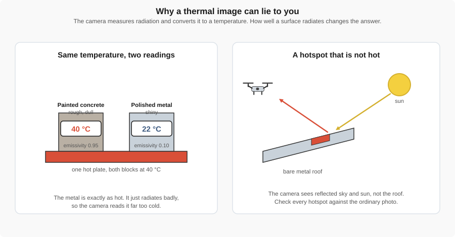
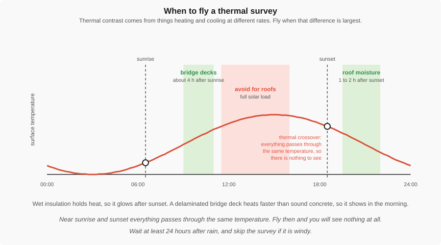

# Thermal Imaging

This page outlines thermal (infrared) sensors on drones: how they capture thermal information, typical data products, use cases, and practical flight considerations.

!!! abstract "Key Takeaways"
    - **Heat, not light.** A thermal camera measures infrared radiation emitted by a surface, not
      reflected visible light.
    - **It reads surfaces only.** It does not see through walls, glass, or water. Hidden things
      appear only when they change the temperature of the surface you can see.
    - **Shiny surfaces lie.** Polished metal radiates poorly and reflects its surroundings, so it
      reads far too cold, or shows a hotspot that is just the sun.
    - **Timing decides everything.** Contrast comes from materials heating and cooling at different
      rates. Fly at the wrong hour and there is nothing to see.

---

**Key resource:** [DJI — Thermal Drone Basics](https://enterprise-insights.dji.com/blog/thermal-drone-basics){target='_blank'} — A concise, practical overview of thermal sensor types, common payloads, basic flight-planning tips, calibration and emissivity considerations, and typical operational use-cases.

---

## What is thermal imaging?

Thermal sensors measure long-wave infrared radiation emitted by objects, producing images of
**surface temperature differences** rather than reflected light.

{ width="100%" }

*Figure 4: The camera reads the face of whatever is pointed at it. A pipe behind a wall is invisible;
the warm stripe it leaves on the wall is not.*

That distinction matters on site. You are never seeing the defect itself. You are seeing the
**thermal pattern it produces on a surface**, and your job is to work backwards from the pattern to
a cause.

## How thermal sensors work
- **Infrared Detection:** Sensors detect emitted infrared radiation and convert it to temperature values, either as scaled pixel values or calibrated temperature measurements.
- **Radiometric vs. Non-radiometric:** Some cameras provide relative thermal imagery (for visual inspection), while higher-end units provide radiometrically calibrated images for quantitative temperature analysis.
- **Emissivity:** Surfaces radiate heat with different efficiency. A rough, dull surface radiates
  well; polished metal barely radiates at all and mirrors its surroundings instead.

{ width="100%" }

*Figure 5: Two blocks at the same temperature can read twenty degrees apart, and a cold metal roof
can show a hotspot that is only the reflected sun.*

!!! warning "Check every hotspot against the ordinary photograph"
    This is why thermal payloads almost always carry a visible camera alongside. A bright patch in
    the thermal image might be a failing connection, or it might be a puddle, a skylight, or a sheet
    of flashing pointed at the sun. The RGB image is what tells you which.

## Common data products
- **Radiometric TIFFs:** Temperature-stamped images where each pixel contains a temperature value.
- **Thermal Mosaics:** Stitched orthomosaics showing temperature distribution over a large area.
- **Time-series datasets:** Comparisons of thermal maps over time to monitor changes.
- **File Formats:** Radiometric JPEG/TIFF, FLIR-specific formats.

## Use cases & applications

On a construction or facilities project these inspections are often run by the civil or construction
management team rather than by a specialist, simply because the drone is already on site and already
flying.

### 1) Building envelope and insulation
Missing or settled insulation, thermal bridges at slab edges and steel framing, and air leaking
around windows and doors all show as temperature patterns on a wall face. It is a survey of a whole
elevation in one flight, and it needs no scaffold.

- **Examples:** Missing insulation in a cavity, cold bridges at balcony slabs, leaking window seals,
  HVAC duct losses in a ceiling void.
- **Needs:** A real temperature difference across the wall, so fly in the heating season, overnight.

### 2) Flat roof moisture surveys
Wet insulation holds heat longer than dry insulation, so after a sunny day it glows for hours after
the surrounding roof has cooled. A drone maps a whole roof in one flight instead of a crew walking it
with a hand-held camera, and the result is a repair area you can mark out rather than a full
tear-off.

- **Examples:** Locating trapped moisture, checking a roof before purchase, verifying a repair.

### 3) Concrete deck delamination
A void just under the surface of a bridge deck or parking structure insulates the concrete above it,
so that patch heats faster in the morning sun than the sound concrete around it. This is a standard
non-destructive inspection method, and it finds damage before a chain drag would.

- **Examples:** Bridge decks, parking structures, post-tensioned slabs.

### 4) Plant and equipment
Anything that carries current or has moving parts turns some of its energy into heat, and a
component about to fail almost always runs hotter than it should first. Thermal inspection catches
that while the plant is still running, which is the whole point: no shutdown, no dismantling, and no
one standing next to energized gear.

| What you inspect | What a fault looks like |
|------------------|-------------------------|
| Transformers and switchgear | A hot bushing, a hot cable termination, one phase warmer than the other two |
| Distribution panels and breakers | A single breaker or connection glowing against its neighbors |
| Motors and pumps | A hot bearing housing, a misaligned coupling, an overloaded motor |
| Belt drives and gearboxes | Friction heat at a slipping belt or a failing bearing |
| Solar arrays | Hot cells, hot strings, and bypass diode failures |
| Steam and hot water plant | Failed traps, missing lagging, valves passing when shut |

!!! tip "Compare like with like, not against a number"
    On plant, the useful reading is almost never the absolute temperature. It is the **difference
    between things that should match**: three phases of the same feeder, a row of identical motors,
    the two ends of the same bearing. A 60 °C motor may be perfectly normal. A 60 °C motor sitting
    beside four identical motors running at 40 °C is a work order.

    This also sidesteps the emissivity problem in Figure 5, because if two surfaces are the same
    material, whatever error emissivity introduces applies equally to both.

### 5) Underground and concealed services
Buried heating mains, hot water lines, and leaks change the surface temperature above them.

- **Examples:** District heating leaks, in-slab heating layouts, tracing services before you dig.

## When to fly

Thermal contrast exists only because different materials heat and cool at different rates. Fly when
that difference is at its largest, and you will see the defect. Fly at the wrong hour and the image
will be flat and useless, no matter how good the sensor is.

{ width="100%" }

*Figure 6: The same roof, surveyed at different hours, gives completely different results.*

| Target | Fly | Why |
|--------|-----|-----|
| **Roof moisture** | 1 to 2 hours after sunset, following a clear sunny day | The dry roof cools quickly; the wet patches are still releasing heat |
| **Concrete delamination** | Mid-morning, roughly 4 hours after sunrise | The insulated patch above a void heats faster than sound concrete |
| **Plant and equipment** | Any time, under load, ideally at night | The heat comes from the fault itself, not from the sun |
| **Building envelope** | Overnight in the heating season | You need a real temperature difference across the wall |

!!! warning "Two hours that will waste your battery"
    Around **sunrise and sunset** everything on site passes through roughly the same temperature.
    This is called **thermal crossover**, and during it a thermal image shows almost nothing. It is
    the single most common reason a survey comes back useless.

    Also avoid flying a roof under **full solar load**. Everything is hot, and the contrast you need
    is buried.

## Other flight planning notes
- **Overlap:** Use high overlap, around 80% forward and side. Thermal images have few sharp features,
  so the mosaicking software has less to work with than it does with RGB.
- **Resolution:** Thermal sensors have far coarser resolution than the RGB camera beside them. You
  will fly lower than you would for a photo survey to reach the same detail.
- **Weather:** Wait at least 24 hours after rain, and do not fly in wind. Both wash out the
  temperature differences you came for.

## Tools & software
- **Processing:** FLIR Tools, QGIS (with plugins), Agisoft Metashape, Pix4D, and UAV-specific inspection tools.

## Example images & student activities

Below are representative thermal images. Use these examples for the suggested activities.

### 1) Lakeshore Geyser — thermal image

*Figure 7: This image captures the dramatic temperature difference between boiling geothermal water and the cooler surrounding soil. Notice how the steam also carries heat, creating a "soft" glow around the water. In thermal imaging, the bright white areas represent the highest temperatures, while dark purple/black areas are the coolest.*

**Activity:**
- **Emissivity Exploration:** Water and soil have different "emissivity" (how efficiently they emit heat). If the water and the soil were exactly the same temperature, would they look the same in this thermal image? Why or why not?
- **Timing:** This was taken in the early evening. How would the contrast change if it were taken at 2:00 PM on a sunny day?

---

### 2) Coronation Reserve — paired visual + thermal

*Figure 8: This side-by-side view demonstrates why "co-registration" (matching the two images) is so important. A thermal "hotspot" might look like a fire or a leak, but when compared to the RGB image, you might realize it's just a metal roof reflecting the sun. Notice how the paved paths and buildings retain more heat than the grass.*

**Activity:**
- **Thermal Inertia:** Look at the large building in both images. Metals and concrete have high "thermal inertia," meaning they hold onto heat long after the sun goes down. Based on the thermal signatures, which materials in this park seem to be cooling down the fastest?
- **Feature Matching:** Identify three specific objects (e.g., a tree, a path, a building corner) that are clearly visible in both sensors.

---

### 3) Large temperature-differential example

*Figure 9: This example shows a massive 29°C (84°F) difference within a single scene. Thermal cameras use "palettes" (like Ironbow, Rainbow, or White Hot) to map these temperature ranges to colors. Choosing the right palette can make a subtle leak look obvious or a dangerous hotspot stand out.*

**Activity:**
- **Palette Choice:** The current palette uses "White Hot" for the highest temperatures. If you were searching for a lost hiker in a cold forest, would you prefer "White Hot" or a rainbow-colored palette? Why?
- **Metadata:** To know that the difference is exactly 29°C, we need a "radiometric" sensor. What kind of metadata must the drone record for every pixel to give us an actual temperature instead of just a pretty picture?

---

## Further reading & resources
- [FLIR — How Do Thermal Cameras Work?](https://www.flir.com/discover/otm-ii/how-do-thermal-cameras-work/){target='_blank'}
- [NASA — Infrared Waves](https://science.nasa.gov/ems/07_infraredwaves){target='_blank'}

<!-- End Thermal.md -->
